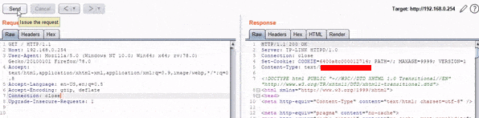

#  Use of Insufficiently Random Values (CWE-330) on TP-Link Wi-Fi Range Extender

TP-Link Wi-Fi Range Extender v6 sets highly predictable Session IDs which lets attackers gaining administrative router access.

HTTPd server used in Wi-Fi Range Extenders sets session ids which are sequential and timely increasing value. After rebooting, it also starts from beginning. An attacker can easily detect currently logged in admin user's session id by only trying the values below he has got.

Some sample of the session ids generated by Burp Sequencer is given below:
```
...
6400a8c000000004
6400a8c000000005
6400a8c000000006
6400a8c000000007
6400a8c000000008
6400a8c000000009
6400a8c00000000a
6400a8c00000000b
6400a8c00000000c
...
```
### POC:



### Affected Products:
```
Hardware: TL-WA850RE Wi-Fi Range Extender v6
Software: up to and including Firmware 1.0.1 Build 20200403 Rel 72167
```

### History:
- 25.08.2020 Vulnerability reported to Vendor.
- 15.09.2020 Vendor responded with a test firmware, but it was still vulnerable.
- 23.09.2020 Vendor responded with a second firmware, it was resolved.
- 27.10.2020 Vendor published new firmware. https://www.tp-link.com/us/support/download/tl-wa850re/v6/#Firmware
- 08.01.2022 Reported to MITRE.
- 18.02.2022 CVE-2022-22922 is assigned. https://cve.mitre.org/cgi-bin/cvename.cgi?name=CVE-2022-22922
