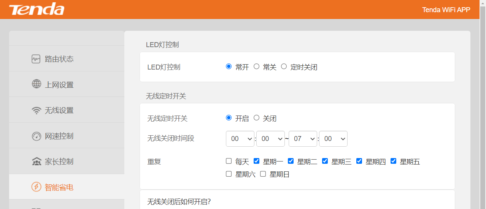
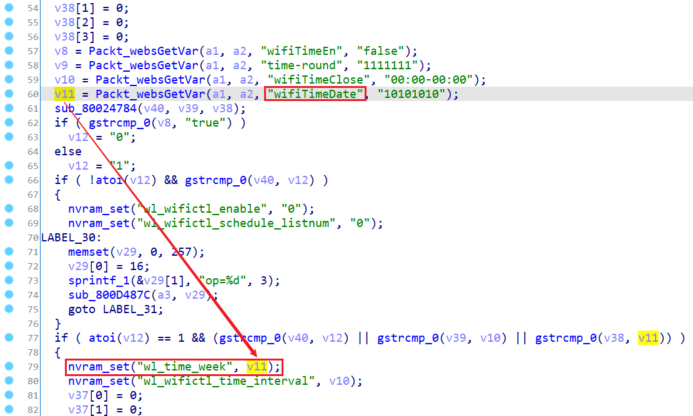
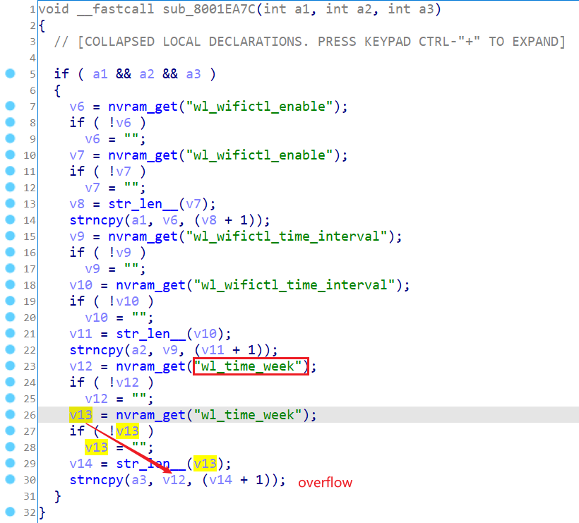
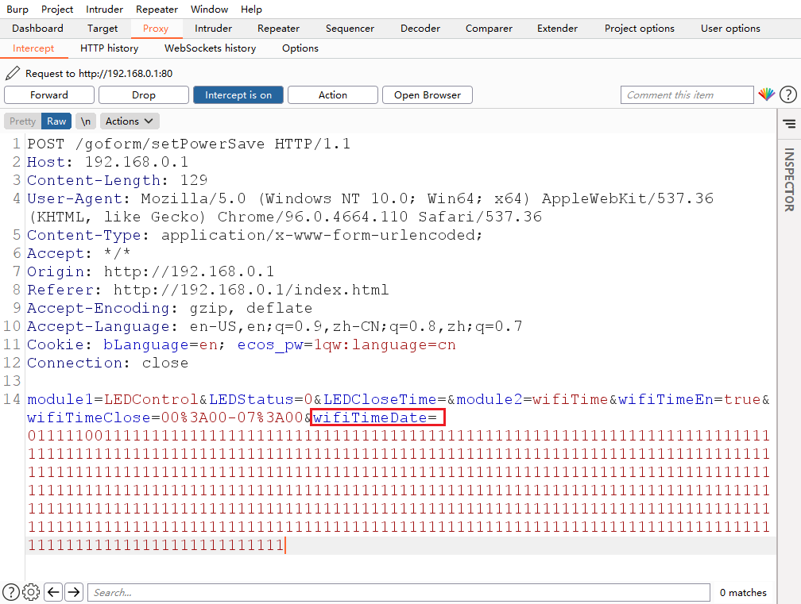

# Tenda Router AC Series Vulnerability

This vulnerability lies in the `/goform/setPowerSave` page which influences the lastest version of Tenda Router AC11. ([AC11_V02.03.01.104_CN](https://www.tenda.com.cn/download/detail-3163.html))

## Vulnerability description

There is a stack buffer overflow vulnerability in the `wifiTime` module.

the program reads user input `wifiTimeDate` into variable `v11` and uses `nvram_set` function to set the nvram variable `wl_time_week`, without porper length check. 

the prograrm will then use `nvram_get` function to put that input into variable `v12` and copy to the parameter `a3`, which will cause a stack overflow.

So by POSTing the page `/goform/setPowerSave` with proper `wifiTimeDate`, the attacker can easily perform a **Deny of Service Attack** or **Remote Code Execution** with carefully crafted overflow data.

## POC

## Timeline

- 2022.01.09 report to CVE & CNVD

## Acknowledgment

Credit to [@cpegg](https://github.com/cpeggg), [@leonW7](https://github.com/leonW7) and [@peanuts](https://github.com/peanuts62) from Shanghai Jiao Tong University and TIANGONG Team of Legendsec at Qi'anxin Group.
