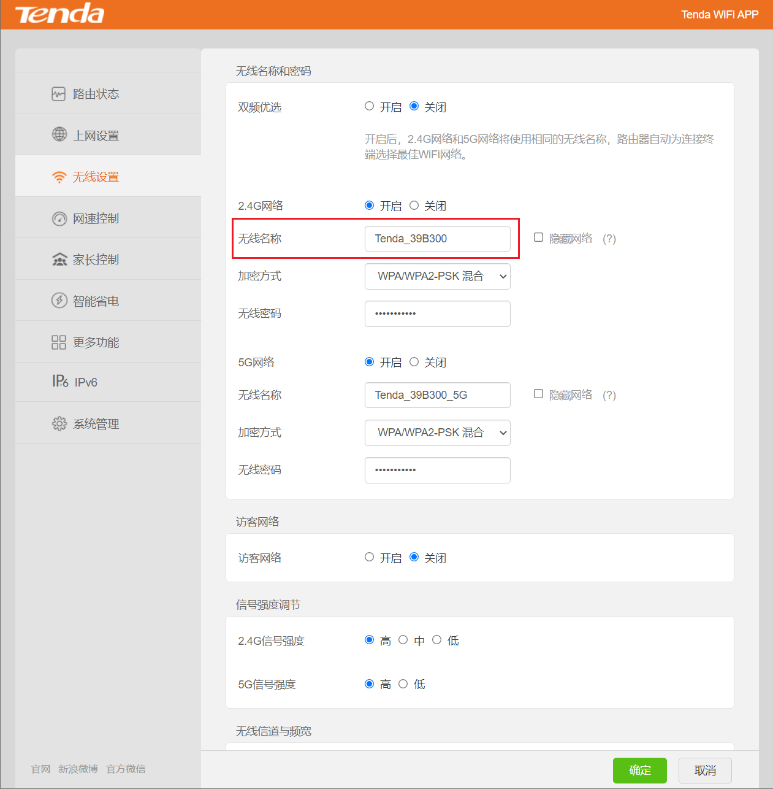
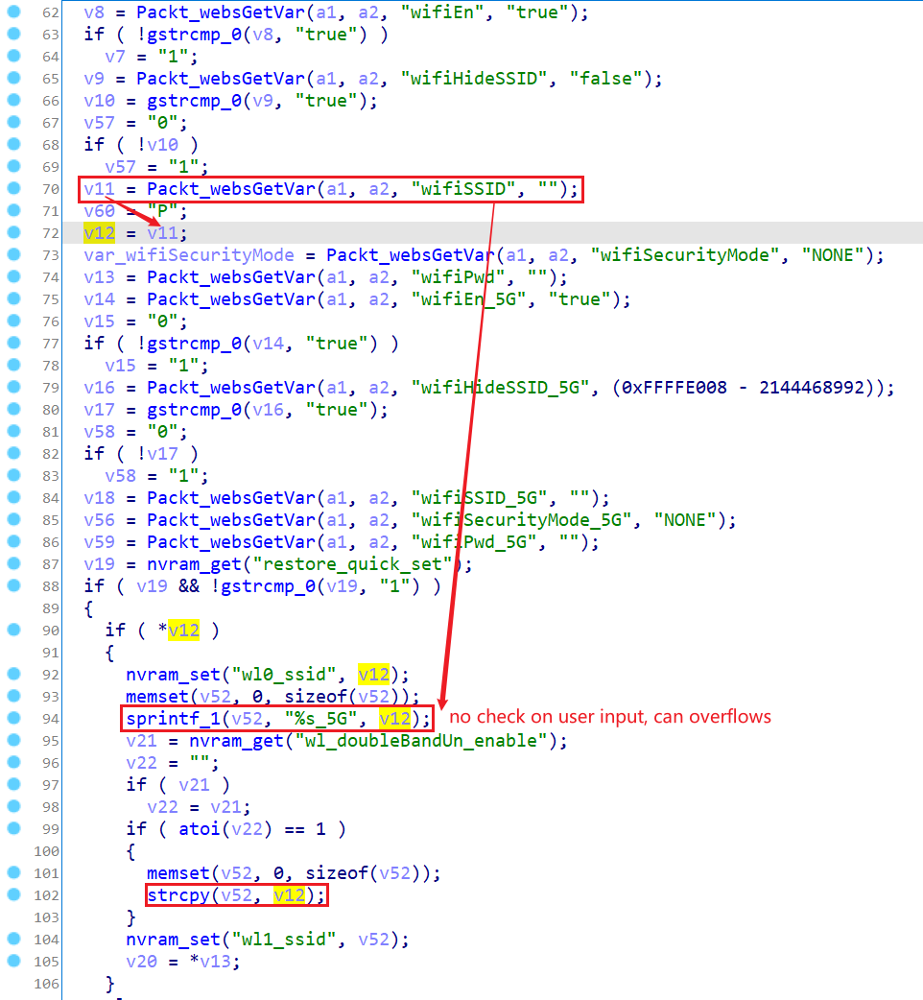
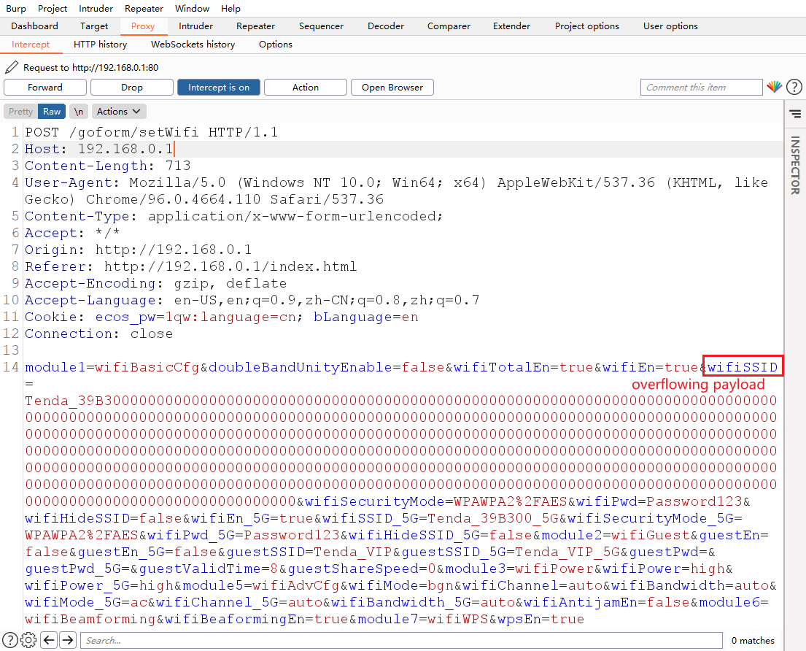

# Tenda Router AC Series Vulnerability

This vulnerability lies in the `/goform/setWifi` page which influences the lastest version of Tenda Router AC11. ([AC11_V02.03.01.104_CN](https://www.tenda.com.cn/download/detail-3163.html))

## Vulnerability description

There is a stack buffer overflow vulnerability in the `wifiBasicCfg` module.

The program reads in a user input named `wifiSSID` in user's POST request and directly uses the input immediately, without checking its length, which can lead to buffer overflows bugs in the following `sprintf` or `strcpy` functions.

So by POSTing the page `/goform/setWifi` with proper `WifiSSID`, the attacker can easily perform a **Deny of Service Attack** or **Remote Code Execution** with carefully crafted overflow data.

## POC

## Timeline

- 2022.01.11 report to CVE & CNVD

## Acknowledgment

Credit to [@cpegg](https://github.com/cpeggg), [@leonW7](https://github.com/leonW7) and [@peanuts](https://github.com/peanuts62) from Shanghai Jiao Tong University and TIANGONG Team of Legendsec at Qi'anxin Group.
