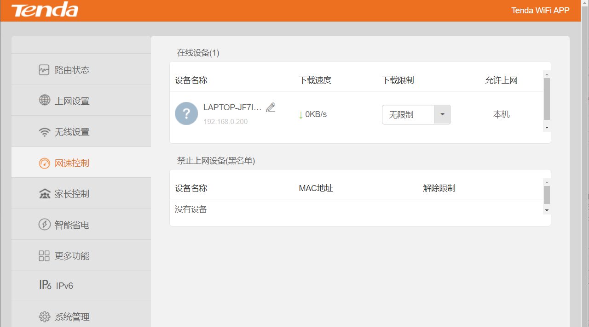
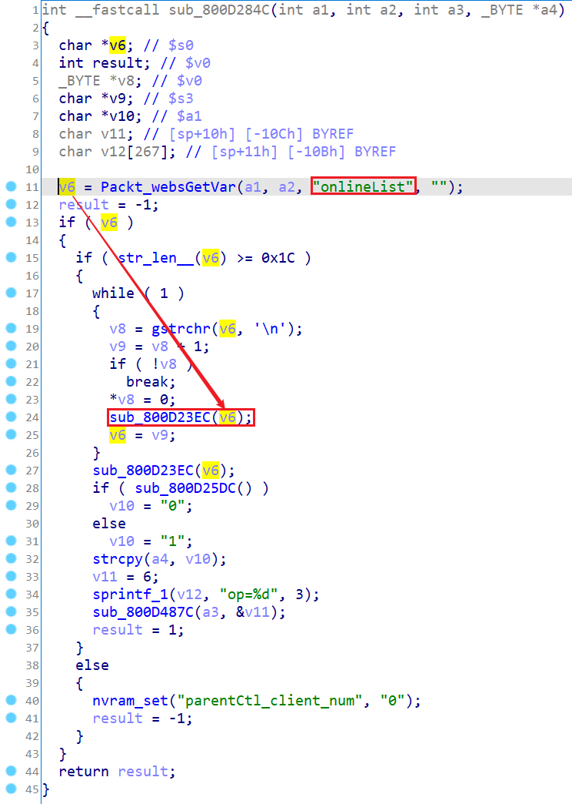
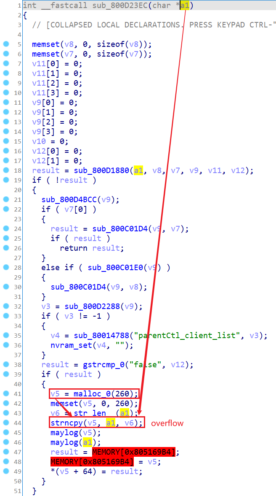
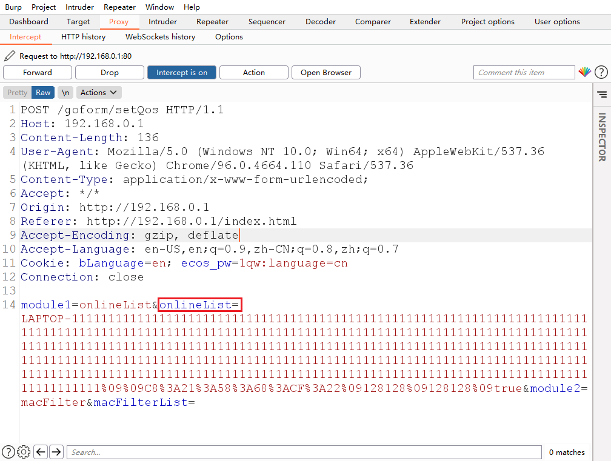

# Tenda Router AC Series Vulnerability

This vulnerability lies in the `/goform/setQos` page which influences the lastest version of Tenda Router AC11. ([AC11_V02.03.01.104_CN](https://www.tenda.com.cn/download/detail-3163.html))

## Vulnerability description

There is a stack buffer overflow vulnerability in the `onlineList` module.

the program reads user input `onlineList` into variable `v6` and pass it to the function `sub_800D23EC` as the first parameter. 

the prograrm will then use `strncpy` function to copy that input into into a fixed malloced chunk of size `260`, which can cause a overflow.

So by POSTing the page `/goform/setQos` with proper `onlineList`, the attacker can easily perform a **Deny of Service Attack** or **Remote Code Execution** with carefully crafted overflow data.

## POC

## Timeline

- 2022.01.09 report to CVE & CNVD

## Acknowledgment

Credit to [@cpegg](https://github.com/cpeggg), [@leonW7](https://github.com/leonW7) and [@peanuts](https://github.com/peanuts62) from Shanghai Jiao Tong University and TIANGONG Team of Legendsec at Qi'anxin Group.
