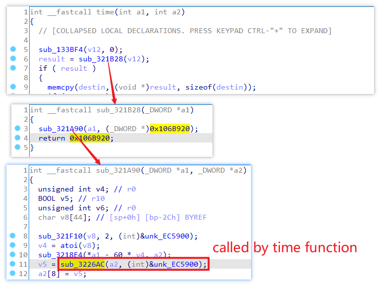
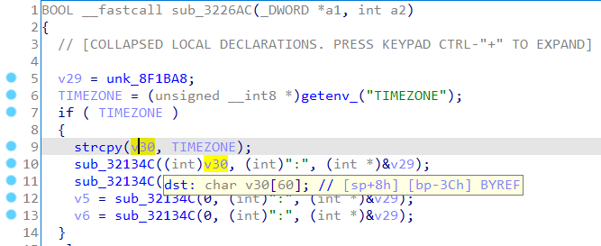
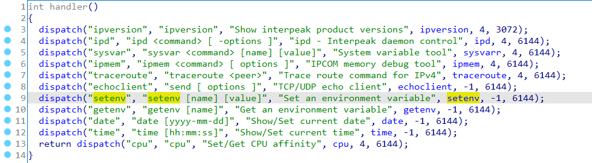
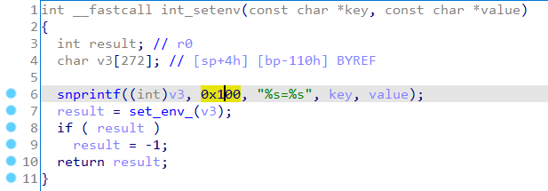

# Xerox Phaser 4622 Vulnerability

This vulnerability lies in the `time` utility which influences the lastest version of Xerox Phaser 4622. The lastest version of this product is [Phaser 4622 Firmware Release V35.013.01.000](https://www.support.xerox.com/en-us/product/phaser-4622/content/127527), according to their official website.

## Vulnerability description

There is a stack buffer overflow vulnerability in function `sub_3226AC`, which is call by `time` function, as show in the figure below.



The function `sub_3226AC` uses `strcpy` to copy the string pointed by `TIMEZONE` into a stack buffer pointed by `v30`. The `TIMEZONE` variable is a environment vaiable of the same name, which is accuired by function `getenv_`.



Any user can set any environment variable using the provided `setenv` to set any variable to any value, given that the `<key>=<value>` does not exceed `0x100`, according the the function logic. See some decompiled code snippet below.




A string of length `0x100` can of course smash the stack of `sub_3226AC`.

So by first setting the `TIMEZONE` and then invoking the command line utility `time`, the attacker can easily perform a **Deny of Service Attack** or **Remote Code Execution** with carefully crafted overflow data.

## POC

```plain
TIMEZONE=zzzzzzzzzzzzzzzzzzzzzzzzzzzzzzzzzzzzzzzzzzzzzzzzzzzzzzzzzzzzzzzzzzzzzzzzzzzzzzzzzzzzzzzzzzzzzzzzzzzzzzzzzzzzzzzzzzzzzzzzzzzzzzzzzzzzzzzzzzzzzzzzzzzzzzzzzzzzzzzzzzzzzzzzzzzzzzzzzzzzzzzzzzzzzzzzzzzzzzzzzzzzzzzzzzzzzzzzzzzzzzzzzzzzzzzzzzzzzzzzzzzzzzz
```

## Timeline

- 2021.07.18 report to Xerox, CVE and CNVD
- 2021.08.31 CNVD ID assigned: CNVD-2021-57348

## Acknowledgment

Credit to [@Ainevsia](https://github.com/Ainevsia), [@peanuts](https://github.com/peanuts62) and [@cpegg](https://github.com/cpeggg) from Shanghai Jiao Tong University and TIANGONG Team of Legendsec at Qi'anxin Group.
