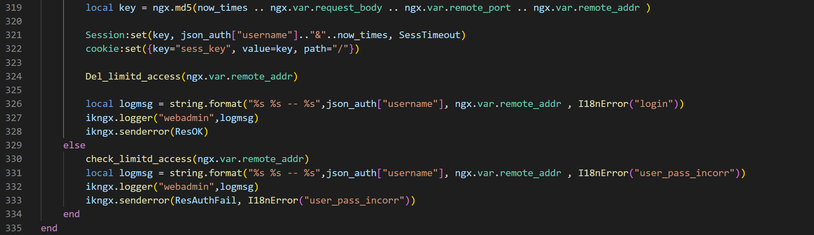
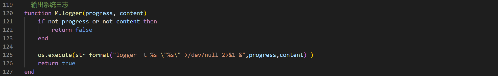
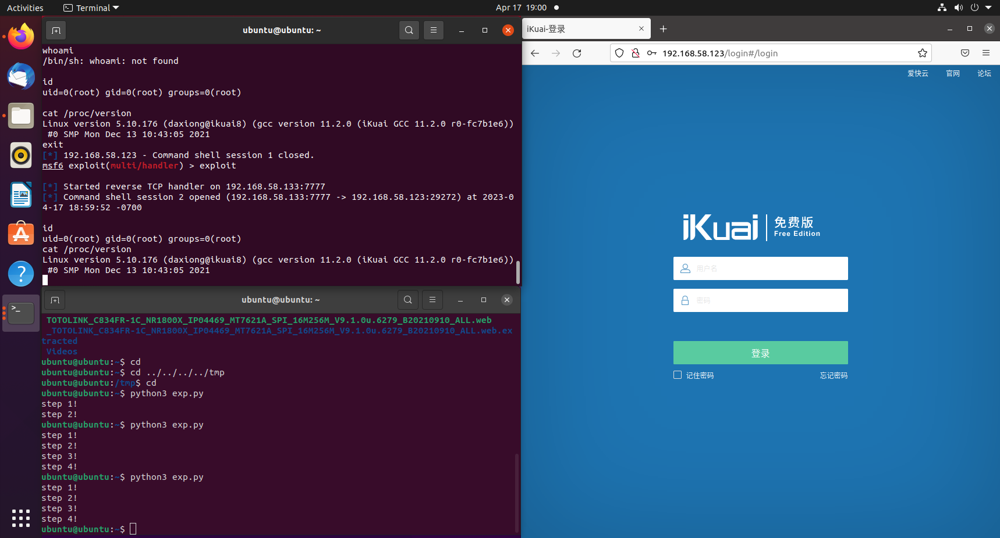

# Ikuai OS unauthorized cmd injection vulnerability
An unauthorized command injection vulnerability exists in the ActionLogin function of the webman.lua file. Due to its lax filtering of the username parameter passed during login, it is directly spliced and submitted to the logger function for execution, resulting in command injection.

The shell reverse attack is as below.

The vendor has patched the vulnerability in version 3.7.2. 
