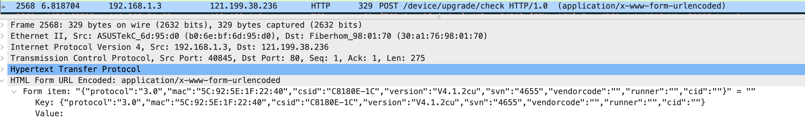
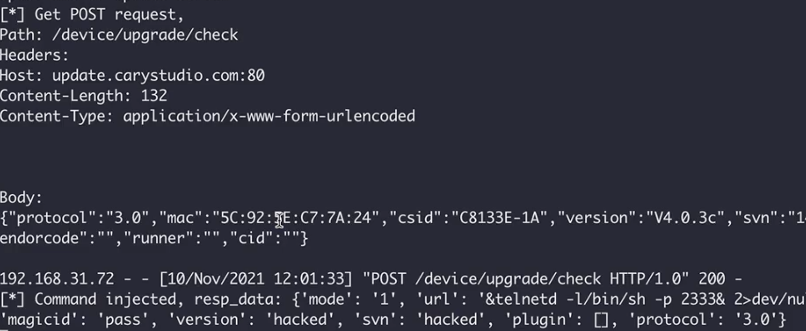

### Affected device

production: EX300_v2   
version: V4.0.3c.140_B20210429  

### Vulnerability description

Vulnerability Type: RCE

A command injection was found in EX300_v2, V4.0.3c.140_B20210429. The update process `cloudupdate_check `of the router allows adjacent unauthenticated  attackers to achieve remote code execution as root via a MitM attack. 

`cloudupdate_check` will check whether there is new version from firmware server, and update config file `/var/cloudupg.ini`.  Here we can perform a MITM attack and return malicious response to `cloudupdate_check`  , and inject command in value  `magicid` and `url` .

- post to firmware server to check new firmware



​	Since device requests by HTTP, so we can hijack dns request ,and the repeater will connect to the attacker server instead of legal one.  




- cloudupdate_check

```c
 if ( !strncmp(Var, &a30, 3)
    && (v3 = websGetVar(a1, "mode", "0"), v4 = atoi(v3), (v5 = v4) != 0)
    && (inifile_set_int("/var/cloudupg.ini", "INFO", "mode", v4), url = (const char *)websGetVar(a1, &aUrl, ""), *url) )
  {
    inifile_set("/var/cloudupg.ini", "INFO", &aUrl, url);
    magicid = (const char *)websGetVar(a1, "magicid", "");
    v8 = (const char *)websGetVar(a1, "version", "");
    v9 = (const char *)websGetVar(a1, "svn", "");
    snprintf(buf, 256, "echo %s > /tmp/ActionMd5", magicid); //命令注入
    system(buf);
    snprintf(buf, 256, "echo %s > /tmp/DlFileUrl", url);//命令注入
    system(buf);
```

