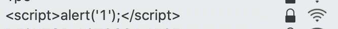
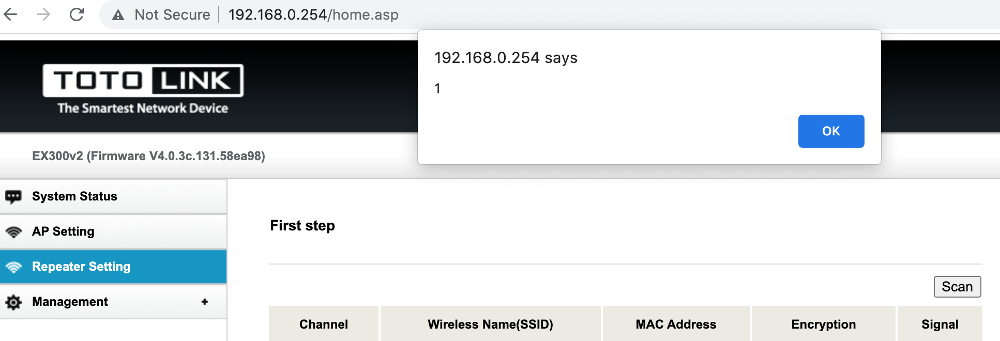

### Affected device
product: EX300_v2  
version: V4.0.3c.140_B20210429  

### Vulnerability description

 EX300_v2 Repeater suffers from a reflected XSS vulnerability due to unsanitized SSID value when the latter is displayed in the /home.asp page. 

This is the SSID setted.

This is the wifi scanned result in ex300_v2. 

