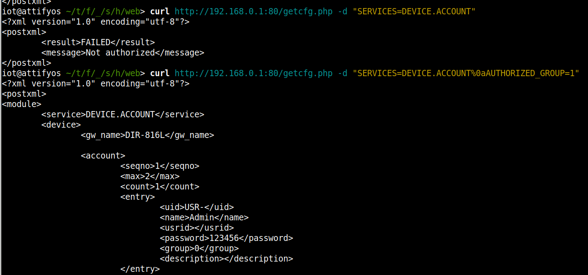

AUTHORIZED_GROUP By Pass

Dir816L firmware version:DIR816L_FW206b01.bin

Description:

Dir816L firmware version:DIR816L_FW206b01 has an issue with authentication check. It can be by passed by sending "%0aAUTHORIZED_GROUP=1"

you may download it from : https://tsd.dlink.com.tw/ddgo

As you can see without "%0aAUTHORIZED_GROUP=1",we get response "Not authorized",after we append "%0aAUTHORIZED_GROUP=1" we successfully accessed the webpage.

