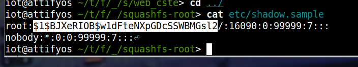

# hard code password for root

## A3100R_Firmware	 
version:V4.1.2cu.5050_B20200504，V4.1.2cu.5247_B20211129

## Description:
There is a hard code password for root in /etc/shadow.sample

## Source:
you may download it from : https://www.totolink.net/home/menu/detail/menu_listtpl/download/id/170/ids/36.html

## Analyse:
after decrypt the passwd we got cs2012

