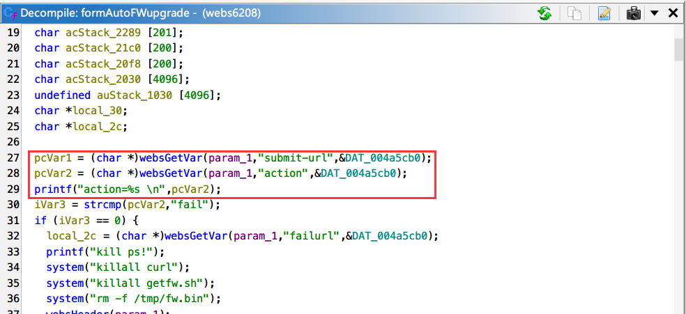
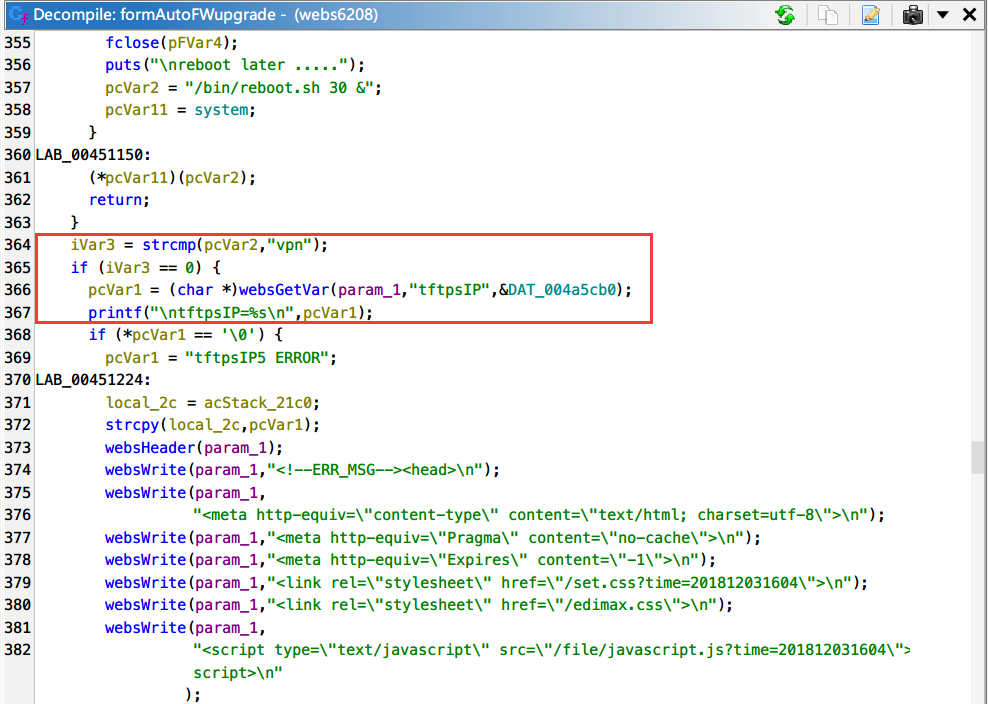
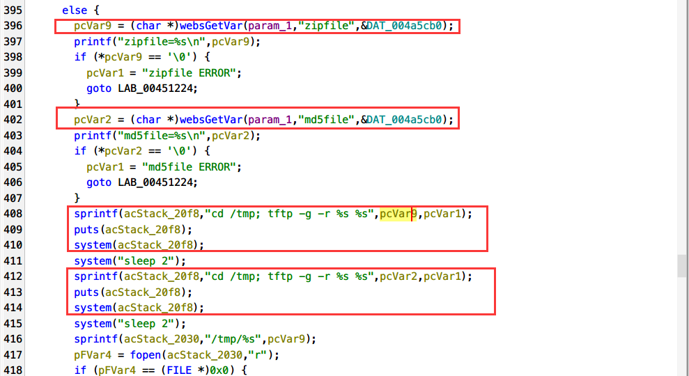
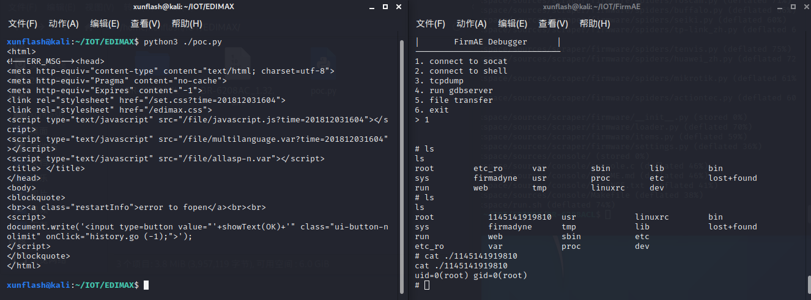

# EDIMAX BR-6208AC_1.32 formAutoFWupgrade Command Injection

## Affected version:

```
EDIMAX BR-6208AC_1.32
```

To download the firmware: https://www.edimax.com/edimax/mw/cufiles/files/download/Firmware/BR-6208AC_1.32.zip

You can use FirmAE to simulate the router environment.

## Description

There is a dangerous function in EDIMAX BR-6208AC_1.32 that allows command injection attacks without login. By controlling the "zipfile" parameter in the /goform/formAutoFWupgrade API within EDIMAX BR-6208AC_1.32, a command injection attack can be caused. Attackers can exploit this vulnerability by sending carefully crafted requests to the web-based management interface. A successful exploitation of the vulnerability can allow the attacker to attack the device's /bin/webs service, resulting in a command injection attack. Users can create a sustained and stable attack effect by using command injection to execute actions such as bouncing a shell with "sh".

In the formAutoFWupgrade function, the "submit-url" and "action" parameters are first received, with the "action" parameter used to determine which branch of code to execute next. 



When the "action" request receives the value "vpn," it will continue to accept the "tftpsIP" parameter and enter that branch. 



It then continues to extract the values of the "zipfile" and "md5file" parameters from the request. The vulnerability is located at lines 408-415, and since the function does not filter the "pcVar9" and "pcVar2" parameters at all, it directly formats them into "acStack_20f8" and calls the system to execute them. As a result, we can use common command injection symbols such as ``|&$;` to perform a command injection operation.



## Poc&&Exp

The content of this part is placed in the additional information


