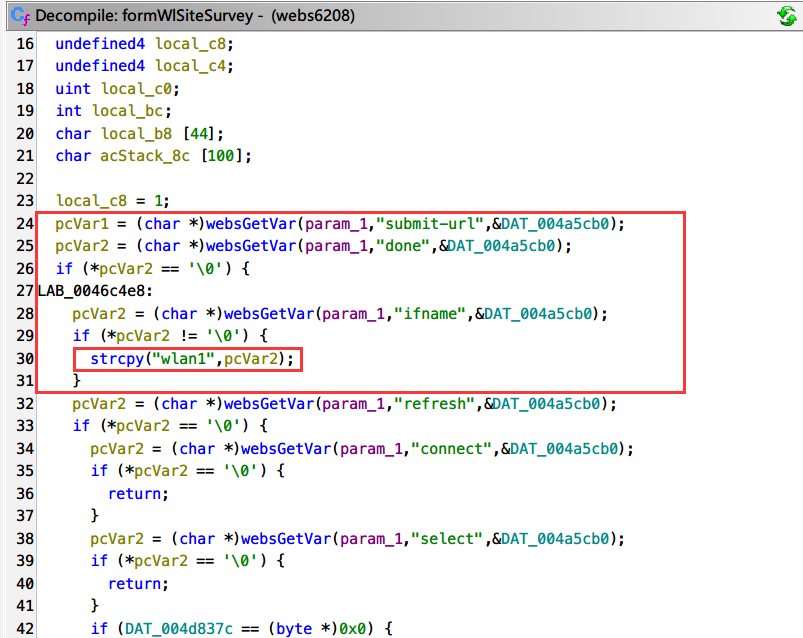
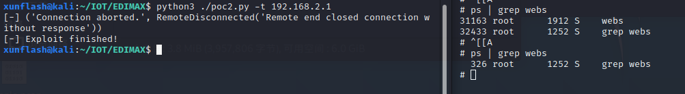

# EDIMAX BR-6208AC_1.32 formWlSiteSurvey Out-of-bounds Write

## Affected version:

```
EDIMAX BR-6208AC_1.32
```

To download the firmware: https://www.edimax.com/edimax/mw/cufiles/files/download/Firmware/BR-6208AC_1.32.zip

You can use FirmAE to simulate the router environment.

## Description

An incorrect out-of-bounds write operation was performed in the /goform/formWlSiteSurvey API in EDIMAX BR-6208AC_1.32.

By controlling the "done" and "ifname" parameters, the program can be led into an incorrect code fragment that performs an out-of-bounds write.

Attackers can exploit this vulnerability by sending carefully crafted requests to the web-based management interface. A successful exploitation of the vulnerability can allow the attacker to attack the device's /bin/webs service, resulting in a serious denial of service attack.

In the function formWlSiteSurvey, the program extracts the "done" and "ifname" parameters from the request. When the "ifname" parameter is present, it enters a strange strcpy instruction. This instruction attempts to write data into the .rodata segment, performing an incorrect out-of-bounds write operation. This leads to abnormal program behavior and termination at this point.



## Poc&&Exp

The content of this part is placed in the additional information


