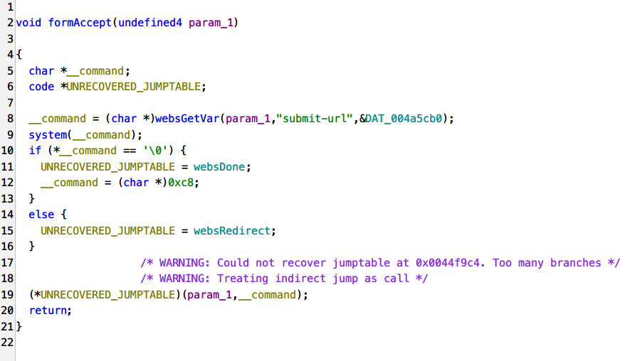
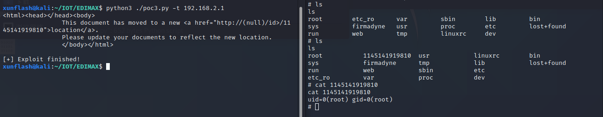

# EDIMAX BR-6208AC_1.32 formAccept Command Injection

## Affected version:

```
EDIMAX BR-6208AC_1.32
```

To download the firmware: https://www.edimax.com/edimax/mw/cufiles/files/download/Firmware/BR-6208AC_1.32.zip

You can use FirmAE to simulate the router environment.

## Description

In EDIMAX BR-6208AC_1.32, the /goform/formAccept API does not filter input parameters, leading to the possibility of command injection.

By controlling the "submit-url" parameter, the program can be made to execute system commands.

Attackers can exploit this vulnerability by sending carefully crafted requests to the web-based management interface. A successful exploitation of the vulnerability can allow the attacker to attack the device's /bin/webs service, resulting in a command injection attack. Users can create a sustained and stable attack effect by using command injection to execute actions such as bouncing a shell with "sh".

By examining the formAccept function, it can be seen that the program retrieves the "submit-url" from the request and reads it into the "__command" variable, then passes it directly to the system function for execution without filtering. This could lead to a serious command injection vulnerability. It may even be a backdoor program left in the firmware.



## Poc&&Exp

The content of this part is placed in the additional information


