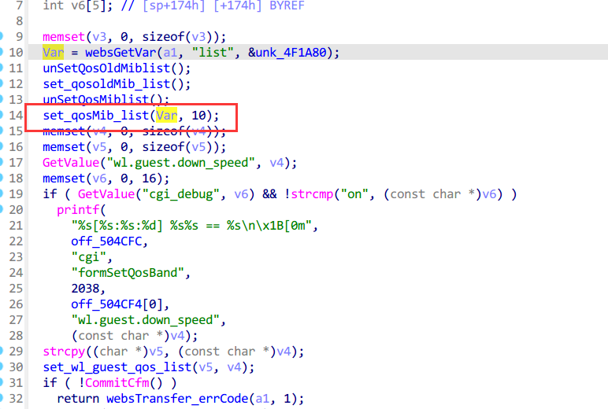
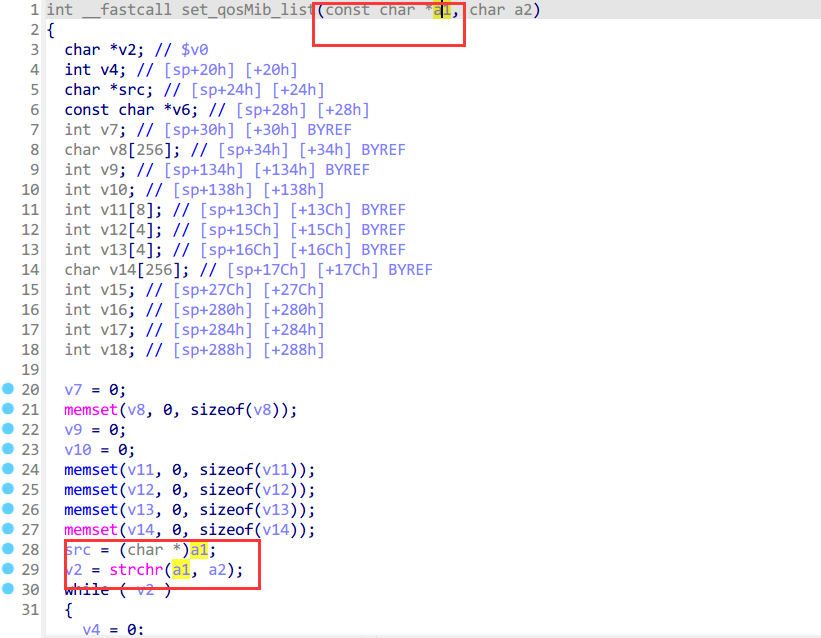
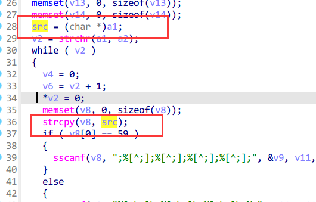
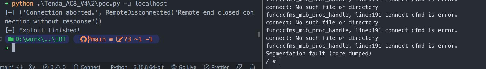

# Tenda_AC8V4 stack overflow vulnerability

## Version:

```
US_AC8V4.0si_V16.03.34.06_cn
```

Firmware Link: https://www.tenda.com.cn/download/detail-3518.html

## Description

In the firmware of Tenda AC8V4 V16.03.34.06, the route /goform/SetNetControlList can cause a stack overflow, thereby achieving a denial of service attack


The "list" parameter is passed to Var through websGetVar, and then entered into the `set_qosMib_list` function as the second parameter



Then passed the first parameter `a1` to the `src` variable, and then entered the dangerous function strcpy through `src`, resulting in stack overflow





## Poc&&Exp

The content of this part is placed in the additional information


