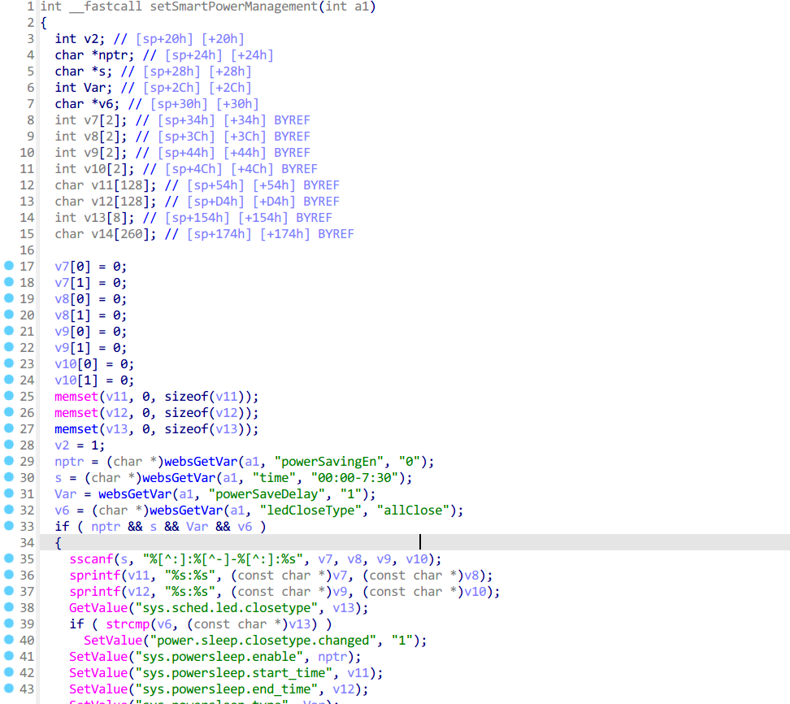
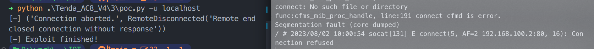

# Tenda_AC8V4 stack overflow vulnerability

## Version:

```
US_AC8V4.0si_V16.03.34.06_cn
```

Firmware Link: https://www.tenda.com.cn/download/detail-3518.html

## Description

In the firmware of Tenda AC8V4 V16.03.34.06, the route /goform/PowerSaveSet can cause a stack overflow, thereby achieving a denial of service attack


The `time` parameter is passed to `s` through `websGetVar`, and then it is passed to the dangerous function `sscanf` for formatting, which will cause the stack overflow of the parameters `v7, v8, v9, v10`



## Poc&&Exp

The content of this part is placed in the additional information

