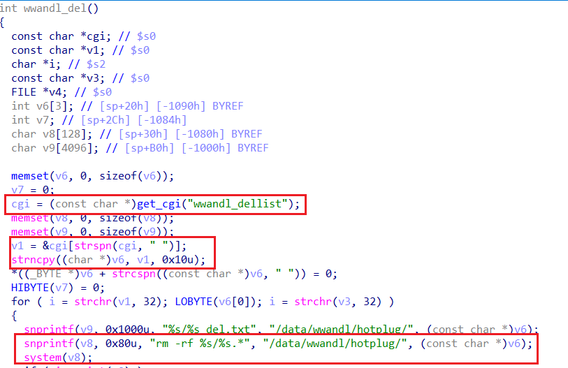
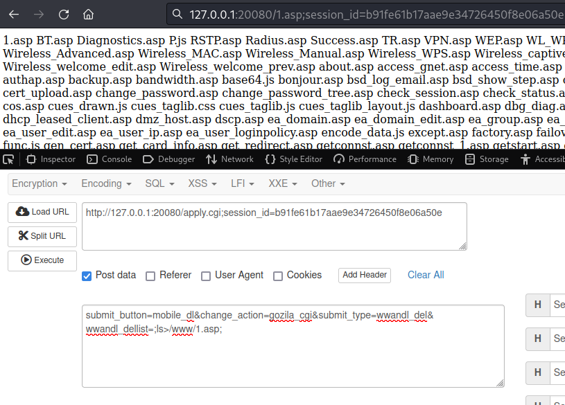

# Vendor's disclosure and acknowledgement

[https://bst.cloudapps.cisco.com/bugsearch/bug/CSCwe08299](https://bst.cloudapps.cisco.com/bugsearch/bug/CSCwe08299 "https://bst.cloudapps.cisco.com/bugsearch/bug/CSCwe08299")

Emmm... I don't know why this RCE vulnerability only has a score of 3.8, which is in the low severity range. : (

# Information

**Vendor of the products:**    Cisco

**Vendor's website:**    [https://www.cisco.com](https://www.cisco.com "https://www.cisco.com")

**Reported by:**    WangJincheng(<wjcwinmt@outlook.com>)

**Affected products:**	Cisco RV215W Wireless-N VPN Router

**Affected firmware version:**	1.3.1.7 (the latest release version)

**Firmware download address:** 	[https://software.cisco.com/download/home/284436489/type/282487380/release/1.3.1.7](https://software.cisco.com/download/home/284436489/type/282487380/release/1.3.1.7 "https://software.cisco.com/download/home/284436489/type/282487380/release/1.3.1.7")

# Overview

`Cisco RV215W Wireless-N VPN Router` was detected with `a command injection vulnerability`. This vulnerability is caused by lax verification of the requested `wwandl_dellist` field in the `USB Device Update` function. An authenticated attacker can send a crafted request to the web-based management interface. A successful exploit could allow the attacker to execute arbitrary commands on a remote device.

# Vulnerability details

The vulnerability was detected in the `/usr/sbin/httpd` binary.

In the `apply_cgi` function which handles requests sent to `/apply.cgi`, the `gozila_cgi` function is entered when the `change_action` field of the POST request is `gozila_cgi`.

Then, in the `gozila_cgi` function, the `handle_gozila_action` function matches the file name corresponding to the `submit_button` field and the function name corresponding to the `submit_type` field, and finally enters the the related function.

Therefore, we can successfully access the vulnerable function `wwandl_del` with the above analysis.

In the `wwandl_del` function, the `wwandl_dellist` field content obtained by `POST` request is directly spliced into `v8` through a series of variable passing without any verification, and executed as the parameter of `system` function. Therefore, there is `an arbitrary command injection vulnerability`.



To sum up, an authenticated attacker can control remote devices by injecting malicious directives into the `wwandl_dellist` field.

# Poc

Send the following as a `POST` request to the URL `/apply.cgi;session_id=xxx` and we can inject malicious directives (no more than 16 bytes and no spaces) into the `wwandl_dellist` field.

```
submit_button=mobile_dl&change_action=gozila_cgi&submit_type=wwandl_del&wwandl_dellist=;ls>/www/1.asp;
```

# Attack Demo

## Case 1
I emulated the firmware of `RV215W` in some ways, and successfully wrote the result of `ls` command to `/www/1.asp` through the above `POC`, and can be directly accessed through the front end.



We completed the testing and proved that the device did indeed have `a command injection vulnerability`.

## Case 2

We can write content in `wwandl_dellist` to cause `directory traversal` and delete important files. For example, we can let `wwandl_dellist` = `../../../etc/*;` Then, we can delete the entire etc directory (contains important files such as init script). Finally, we can let `wwandl_dellist` = `;reboot;` to restart the device to cause `permanent denial of service`.

# Supplement

I compared `RV215W` with the similar `RV110W` and `RV130` series.

I found that `RV110W` does not exist `mobile_dl.asp`, and the firmware of `RV130` series execute system commands through `eval` here which similars to `execve` instead of `system`.

Therefore, `RV110W` and `RV130` series do not have this vulnerability, only `RV215W` exists.
